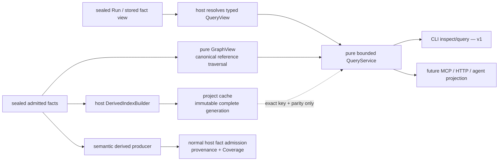

# NEXT OpenSIP CLI — implementer blueprint

**Status:** PHASE-3 DRAFT — NOT AN ARCHITECTURE FREEZE  
**Consumer:** B — build this  
**Scope:** the first implementation milestone in [`v1-slice.md`](v1-slice.md)  
**Companion:** [`IMPLEMENTATION-FREEZE.md`](IMPLEMENTATION-FREEZE.md)

This is the short path from the binding contracts to a Rust workspace. It fixes
the week-one component boundaries, dependency direction, process ownership, and
test-port order. It does not replace a binding JSON artifact. If this blueprint
and a binding artifact conflict, stop and record a design delta; do not choose the
easier implementation.

The exact V10 evaluation proof and retention/custody default are intentionally
absent. Phase 1A is in flight. Every location affected by that decision is marked
**`[PHASE-1A / V10 BLOCKER]`**. No implementer may fill those markers from local
preference.

## Reader route — non-normative, added 2026-08-04

**This document calls itself the short path and then puts several thousand words
of lineage history before the first authoritative flow.** That history is
deliberate — this corpus records withdrawals rather than erasing them (freeze
§4.4) — but it means the document does not read front-to-back as the short path
it claims to be. **This section binds nothing and is safe to skip; it exists so
you do not have to already know which later sections matter.**

**Route:** start at **§9** (week-one start point) → **§2** (the one authoritative
data flow) → **§4** (workspace map) → **§7.2** (port order, and where you will
actually meet the gaps).

**At every named stop in §7.2, consult §5.1.** That is the escalate-don't-invent
list, and §7.2 steps 3 and 5 both run straight into it.

**Consult §1.1's notes only for the surface you are porting.** They are per-surface
lineage records, not sequential reading.

**Two things to know before you start, both by pointer rather than restated here.**
§5.1 names **ten** identity/contract gaps — **and the count is not the boundary**:
freeze §7.1 states the park as a **property**, so a digest-typed field with no
stated producing rule is escalable **whether or not it is listed**. And **two
surfaces carry `UNSET — BLOCKS FREEZE` dispositions** in freeze §3 (EVIDENCE and
TM); read the **disposition** column, not the verdict column, and read it at the
time you build.

**If this document and a binding artifact disagree, the artifact wins and you
record a design delta.** That rule outranks this route.

There **was** a second marker. **`[C-2 BLOCKER — IR-C2V4-01]`** marked every
location affected by the C-2 blocking adjudication of 2026-08-03. **It is
retired, and C-2 is a week-one port again.** C-2 converged on
`c2-plan-stage-schema.v11.json`, **applied 2026-08-05**, which
`IMPLEMENTATION-FREEZE.md` §3 records as **PASSED — 0 blockers** with the draft
freeze disposition **`SEAL` candidate**. Build the closed `PlanIntent` /
`ExecutionPlan` schema against **v11** — which binds as a **derivation**, so you
**resolve** v11 → `c2-plan-stage-schema.v10.json` → `v9` → `v4` for the effective
contract rather than reading v11 alone — and validate with **`check-c2-v12.py`**,
named in §1.1 in full knowledge that it is **UNREVIEWED**. `check-c2-v9.py`
cannot validate these bytes: it hardcodes `BINDING = "c2-plan-stage-schema.v9.json"`.
`IR-C2V4-01` is **superseded, not withdrawn** — §1.1 note **N-1** is the full
record of what that distinction still costs you, and of what about the v3/v4
lineage remains dangerous. **N-1 predates this application and still opens by
naming `v9` as the head; the §1.1 row is the head, not N-1.**

If you hold a copy of this package that still carries a `[C-2 BLOCKER —
IR-C2V4-01]` marker, or that names `c2-plan-stage-schema.v4` as the C-2 head, it
predates the v9 repoint and its C-2 instruction is wrong. §1.1 and freeze §3
govern; recompute the digest and build what they name.

Escalating the **`[PHASE-1A / V10 BLOCKER]`** marker is compliant under
`IMPLEMENTATION-FREEZE.md` §8; filling it from local preference is not. §8's
*enumerated* named set lists those markers explicitly. It also carries a second
limb — *"a detected conflict with a binding artifact"* — which is what covered
`IR-C2V4-01` while the enumeration did not, and which covers any surface whose
freeze §3 disposition column withholds a seal whatever its review verdict column
says. Two do today: **EVIDENCE** and **TM**, both `UNSET — BLOCKS FREEZE`.

## 1. Authority and settled product choices

Use authority in this order:

1. the exact binding JSON bytes pinned in §1.1, their retained checker, and the
   per-claim status in
   [`claim-register.v1.json`](artifacts/claim-register.v1.json);
2. the accepted product boundary in [`v1-slice.md`](v1-slice.md) — SHA-256
   `6b8717fef545fe73f0de5879a7389fbc0c7c499c70e06b344789e5150478bee3`, pinned in
   [`IMPLEMENTATION-FREEZE.md`](IMPLEMENTATION-FREEZE.md) §2 — and the decided
   rows in
   [`product-dispositions.v1.json`](artifacts/product-dispositions.v1.json);
3. this implementation mapping;
4. narrative architecture for rationale.

Level 2 outranks level 3, so `v1-slice.md` outranks this blueprint. It carries a
digest for that reason: under freeze §2 rule 1 an undigested link is *a pointer,
not authority*, and until 2026-08-04 the package's number-two authority carried no
digest anywhere. Recompute it (`shasum -a 256 docs/coop/v1-slice.md`) before you
treat it as binding; freeze §2 records what enforces the pin and what it costs.

The product packet removes these implementation choices:

- v1 has no marketplace/ecosystem lifecycle depth;
- contributions are narrow producers or data-only rules/profiles and never own
  commands, policy, persistence, rendering, termination, or host lifecycle;
- CI/non-interactive mode **does not load or resolve layer 4** — the *untracked
  local override* layer, one of six configuration precedence layers defined in
  [`IMPLEMENTATION-FREEZE.md`](IMPLEMENTATION-FREEZE.md) §5; local interactive
  mode may use it only when its values and provenance enter `PlanId` and explain;
- detector pivot runs only for an explicitly requested comparison when the
  detector major changed; ordinary analysis never runs it, and unavailable is
  `INDETERMINATE`;
- no public rule-IR compatibility promise is frozen for v1;
- support windows remain visibly provisional/GUESSED, not SLAs; and
- DELIVERY v2 is the substrate: Rust host/core, bundled TypeScript provider,
  exactly pinned `rustc_driver` sidecar, full default profile, finite platform
  matrix, and offline assets.

`CD-RT-5`, the retention default, remains blocked on Phase 1A. A product-signoff
assertion inside a solo candidate retention artifact does not amend the binding
product packet; explicit product authority must accept or replace the candidate.

### 1.1 Normative byte set — the only versions you may build against

Build against exactly the bytes below. Any **binding artifact** link elsewhere in
this blueprint, in [`IMPLEMENTATION-FREEZE.md`](IMPLEMENTATION-FREEZE.md), or in
narrative [`architecture/`](architecture/) that is not in this table is a
pointer, not authority.

**Scope of that sentence, corrected 2026-08-04.** This table holds binding **JSON
contract artifacts and their retained checkers** — nothing else belongs in it. Read
unqualified, the sentence above also demoted [`v1-slice.md`](v1-slice.md), which §1
directly above ranks **authority level 2**, one rank *above* this blueprint. That was
a contradiction inside one section. The rule is about binding artifacts. The `.md`
members of the signed payload are governed by freeze §2 instead, which now pins
`v1-slice.md` by digest and records the standing of the other two. Do not add
`v1-slice.md` to this table: it is not a contract, has no retained checker, and is
not a surface.

Six reading rules, in order:

1. **The digest is the contract.** Recompute `shasum -a 256` before porting any
   vector. If a file's digest differs from the value below, stop and record a
   design delta; do not build the bytes you found.
2. **An artifact's own `status` / `reviewStatus` field is the author's
   self-declaration, written before review.** Every candidate below self-declares
   some form of `CANDIDATE-NOT-APPLIED` / `AWAITING-INDEPENDENT-REVIEW`. That is
   not the review verdict. The verdict is the "Independent review" column and its
   evidence is the named review artifact.
3. **`PASSED` means one independent reviewer reproduced these exact bytes and
   recorded zero blocking findings.** It does not mean applied, sealed, frozen,
   `QUALIFIED`, or `DEMONSTRATED` — see §8.3. `REJECTED` means the head bytes
   carry live blocking findings and are not implementable.
4. **A superseded version is not a fallback.** Where this table names a head, the
   older version is history. Do not build a lower version because it is easier to
   read or because another document links it.
5. **Rules 3 and 4 govern which *contract* you implement. They do not govern
   which files a retained checker internally executes.** A retained checker may
   hash-verify and then execute its own superseded predecessors in order to expose
   a derivation it inherits unchanged. Those predecessors are runtime inputs of the
   instrument, not contracts you build against, and their presence in a verified
   execution closure does not make them normative and does not put the successor's
   `PASSED` verdict in doubt — the verdict covers the closure. Obtaining a value by
   *running* the pinned checker is therefore always compliant; transcribing a
   predecessor contract's bytes into your implementation is not. The one live case
   is D9, recorded in full in note **N-5**.
6. **A `PASSED` verdict in this table can be overridden after the fact, and this
   table does not carry the override.** The "Independent review" column records
   what *that review* found on those bytes. A finding inside a passing review may
   later be **adjudicated** to a different grade by a separate adjudication
   artifact, and when it is regraded BLOCKING the surface stops being seal-ready
   while every word of its review row stays literally true. The verdict column is
   therefore necessary and not sufficient. **Before you build a surface, read its
   "Draft freeze disposition" and "Blocking work before signature" columns in
   [`IMPLEMENTATION-FREEZE.md`](IMPLEMENTATION-FREEZE.md) §3.**

   The case that taught this rule was **C-2**, whose `IR-C2V4-01` was adjudicated
   **BLOCKING** on 2026-08-03 against `c2-plan-stage-schema.v4` after a review had
   passed those same bytes at zero blockers. **That override has since been
   discharged by convergence, not by argument:** the head is now
   `c2-plan-stage-schema.v11.json` (**applied 2026-08-05**), freeze §3 records it
   **PASSED — 0 blockers** with disposition **`SEAL` candidate**, and note
   **N-1** is the full record.
   **There is no live override in this table today** — the two surfaces whose §3
   disposition withholds a seal, EVIDENCE and TM, both announce it in the
   disposition column itself as `UNSET — BLOCKS FREEZE`.

   Read the columns anyway. This rule exists precisely because the interval
   between a regrade and this table catching up is invisible from inside the
   table, and the sentence you are reading is the one that will be stale next
   time. The freeze's disposition column, not this blueprint's verdict column, is
   the thing that binds.

| Binding surface | Head artifact — build these bytes | SHA-256 | Independent review | Retained checker |
|---|---|---|---|---|
| D9 | [`d9-exit-contract.v1.14.json`](artifacts/d9-exit-contract.v1.14.json) | `8dd3303855f49bfdbb2751ee65f54a906405f0654159ebe815472f73cdf7da31` | **PASSED**, 0 blocking — [review](artifacts/d9-exit-contract.v1.14.review-independent-prefreeze.json); 2 advisories `R-V114-F1` / `R-V114-F2` are tabled as verifier residuals in [`IMPLEMENTATION-FREEZE.md`](IMPLEMENTATION-FREEZE.md) §7 | `check-d9-v1.14.py` |
| C-2 | [`c2-plan-stage-schema.v11.json`](artifacts/c2-plan-stage-schema.v11.json) | `d35b677d6726a8f9b9fc70e2e0f3307af909eca876cd6670d238829ba95a81f8` | **PASSED — 0 blockers**, 8 non-blocking — [review](artifacts/c2-plan-stage-schema.v11.review-independent.json), verdict *"PASS WITH NON-BLOCKING OBSERVATIONS"*. **Applied 2026-08-05**, from `c2-plan-stage-schema.v9` (`321faeaa…`). Port against **v11**, which binds as a **derivation** — resolve v11 → `c2-plan-stage-schema.v10.json` → `v9` → `v4` for the effective contract; none of the three is a binding artifact of its own. Note **N-1** below still opens by naming `v9` as the head: it predates this application, its lineage record stands, and **this row is the head** | **`check-c2-v12.py` — UNREVIEWED**, and named here in full knowledge of that. `check-c2-v9.py` cannot validate these bytes (`BINDING = "c2-plan-stage-schema.v9.json"`). It was chosen over the reviewed `check-c2-v11.py`, whose own review answered *can I make the checker pass on a wrong artifact?* with **yes, twelve times**. Freeze **§7.8** grades either instrument the same way regardless: a green run is **author-side evidence** — *"this artifact says what it says, consistently, and drift will be caught"* — never *"this artifact is right."* The resolved effective contract's `checkerModeContract.checker` still names `check-c2-v9.py` |
| FACT-PLANE / C-1 | [`fact-plane.v1.json`](artifacts/fact-plane.v1.json) | `9057200822c5be59bcf8e691e3755cfa1acf2c89f0b1c2bc89237afaa0925b4d` | **PASSED with changes** — post-adjudication `SEAL-WITH-CHANGES` ([adjudication](artifacts/fact-plane.adjudication-agent-c.json)) | `check-fact-plane.py` |
| RESOLVED-INPUTS | [`resolved-inputs.v2.json`](artifacts/resolved-inputs.v2.json) | `0114205aaa5d3f7c0aecc58c10522711aacaa6aa404a41563245627b27b88f43` | **PASSED with changes** — post-adjudication `SEAL-WITH-CHANGES` ([adjudication](artifacts/resolved-inputs.adjudication-agent-c.json)) | `check-resolved-inputs.py` |
| FACT-IDENTITY | [`fact-identity-policy.v2.json`](artifacts/fact-identity-policy.v2.json) | `10055004e6919a55b29c38d9c474857280fbbb6f561dfff6ed88b7e54efbd110` | **PASSED with changes** — reviewer-2 `DO-NOT-SEAL` ([review](artifacts/fact-identity-policy.v2.review-reviewer2.json)) adjudicated to `SEAL-WITH-CHANGES` by the [freeze closure](artifacts/fact-identity-policy.freeze-closure-coordinator.v1.json) | `check-fact-identity.py` |
| FACT-IDENTITY closure | [`fact-identity-policy.freeze-closure-coordinator.v1.json`](artifacts/fact-identity-policy.freeze-closure-coordinator.v1.json) | `2aee126e78b5d709a6d64028b502bd0199383561d43fc7cf5ec7fe2c69ac16d7` | adjudication record | — |
| R-1 | [`r1-lifetime-neutrality.conformance.v1.6.json`](artifacts/r1-lifetime-neutrality.conformance.v1.6.json) | `14c46b6582b573c1ac253d891e4813bcc436117adacaa5fc74ede0ab5ae23d3c` | **PASSED** — 0 blockers, 8 non-blocking — [review](artifacts/r1-lifetime-neutrality.conformance.v1.6.review-independent.json), verdict *"ACCEPT-AS-CANDIDATE — 0 BLOCKERS"*. **Applied 2026-08-05**, from `r1-lifetime-neutrality.conformance.v1.5` (`557b9f97…`, [its review](artifacts/r1-lifetime-neutrality.conformance.v1.5.review-independent-prefreeze.json)). Not a derivation — v1.6 is a whole document and pins v1.5 at `predecessor` only, so there is no chain to resolve | **`check-r1-v1.7.py` — UNREVIEWED**, and named here in full knowledge of that. It was chosen over the reviewed `check-r1-v1.6.py`, which carries blocker **`CIR-B1`**: its seventeen published vectors are never required to differ, and ten collapse into digest-identical duplicates of `PDD-01` at **0 findings**. v1.7 anchors **17 of 17** vectors externally where the predecessor anchored 6. Freeze **§7.8** grades either instrument the same way regardless: a green run is **author-side evidence** — *"this artifact says what it says, consistently, and drift will be caught"* — never *"this artifact is right."* |
| R-1 closure | [`r1-lifetime-neutrality.freeze-closure-coordinator.v1.json`](artifacts/r1-lifetime-neutrality.freeze-closure-coordinator.v1.json) | `6bf90f21178007a2df2313a18d230cf0d3b8f309dd2937c5668603b27a11569d` | adjudication record | — |
| OPERABILITY | [`operability.v10.json`](artifacts/operability.v10.json) | `9bacbbf43dfb941a0d87330f79844d395b3ac838ae5bf54026ef4d69681696be` | **PASSED** — [review](artifacts/operability.v10.review-independent-prefreeze.json) | `check-operability-v10.py` |
| TRUSTED-REQUEST-CONTEXT | [`trusted-request-context.v3.json`](artifacts/trusted-request-context.v3.json) | `bc53c2679a977fd2c2c8369ec9d5794f2295b0df5100b1e360a42c155d04008a` | **PASSED** — [review](artifacts/trusted-request-context.v3.review-independent-prefreeze.json) | `check-trusted-request-context-v3.py` |
| VERSIONING | [`versioning-policy.v8.json`](artifacts/versioning-policy.v8.json) | `ea4b52b5a4d187ec35ad994d8ffcd888db287566c8fb53f3df17e5203d84ae2e` | **PASSED** — [review](artifacts/versioning-policy.v8.review-independent-cold-rejoin.json). **Still the head.** `versioning-policy.v9`–`v13` all exist on disk and were **all independently rejected**; v9–v13 were standalone re-authors that carried the contract forward by transcription and then built machinery to prove the transcription faithful, and **every one of those blockers is against that machinery, not against the contract** — v9's own review says so verbatim (*"no byte of the contract is wrong"*). **COUNT CORRECTED 2026-08-06: there are NINE, not eleven.** Recomputed from the five reviews' own bytes: `blockingFindingCount` is **1, 1, 1, 3, 3** and the blocker arrays agree — `B-VER9R-01`, `B-VER10R-01`, `B-VER11R-01`, `B-VER12R-01/02/03`, `B-VER13R-01/02/03`. "Eleven" was asserted by `versioning-policy.v14` in three places, **repeated eight times by v14's own independent review — which claimed to have verified "eleven blocker titles verbatim" against a block carrying nine** — and then repeated here by the coordinator. The *enumeration* was always right; only the count was wrong, and it ran toward **more** prior failure than existed, which is why nobody challenged it. Caught by the lane authoring `versioning-policy.v15` and confirmed independently. **A figure that flatters the reader's expectation is the least likely to be checked.** A `versioning-policy.v14.json` candidate now exists as a **derivation** (8 operations, exactly one substantive) recording the `CD-RT-5` decision; it builds no self-evidence apparatus at all, which is how it avoids being the sixth rejection. **UNREVIEWED** | `check-versioning-v8.py` — **now exit 1** on `RC-14`, because it hard-pins `CD-RT-5` as `BLOCKED_ON_PHASE_1A` and the authority decided it (§7.10). Freeze §9.1 still asserts this instrument "exits 0"; that assertion is **stale**. **⚠ NAME COLLISION — read this before running anything.** `check-versioning-v14.py` exists and **binds `versioning-policy.v8.json`, NOT `versioning-policy.v14.json`.** Two lanes independently chose "v14" for unrelated things on the same day; the instrument is the RC-14 successor to `check-versioning-v8.py`, and the artifact is a successor to `versioning-policy.v8.json`. **Matching version numbers here mean nothing.** Both authors documented the hazard in their own bytes; it is repeated here because the blueprint is where a reader looks first |
| DELIVERY | [`delivery.v4.json`](artifacts/delivery.v4.json) | `3cffece076289a4e62f3e0680cb8cc7c6a134b3190a6b39b7ec14b007704a121` | **PASSED** — 0 blockers on these exact bytes, 9 non-blocking — [review](artifacts/delivery.v4.review-independent.json), verdict *"ACCEPT AS A CANDIDATE — NO BLOCKERS AGAINST THE ARTIFACT"*. **Applied 2026-08-05**, from `delivery.v2` (`47b6cfd1…`, whose own `PASSED with changes` record — reviewer-2 `DO-NOT-SEAL` ([review](artifacts/delivery.v2.review-reviewer2.json)) adjudicated to `SEAL-WITH-CHANGES` ([adjudication](artifacts/delivery.adjudication-agent-b.json)) — is the verdict on **those** bytes and not on these; the Rust substrate fork it names is closed by RUST-PROVIDER-PROTOCOL below, not by DELIVERY). Binds as a **derivation**: the effective contract is verified `delivery.v2` with 21 operations applied and nothing else. **Carry the review's `OBS-1`** — the artifact's `capabilityManifestSchema.valueDomains.censusIsEXHAUSTIVE` claims its retained checker recomputes the fourteen-position scalar census and fails the run on any position in neither list, and that was **measured false** of the checker the artifact names; the reviewer graded it non-blocking **for calibration consistency only** and said so expressly so a later reader can overrule it | **`check-delivery-v5.py` — UNREVIEWED**, and named here in full knowledge of that. `check-delivery.py` cannot validate these bytes (`BINDING = "delivery.v2.json"`), and the reviewed alternative `check-delivery-v4.py` — the instrument `delivery.v4.json#retainedChecker.path` itself names — was graded **`REJECT FOR REPAIR`** at blocker `IR-V4-INSTR-B1`, having exited 0 with 0 findings on an artifact carrying `delivery.v3`'s faulted `DL-CLOSED-1` text. Freeze **§7.8** grades either instrument the same way regardless: a green run is **author-side evidence** — *"this artifact says what it says, consistently, and drift will be caught"* — never *"this artifact is right."* |
| RUST-PROVIDER-PROTOCOL (overlay) | [`rust-provider-protocol.v4.json`](artifacts/rust-provider-protocol.v4.json) | `3e34934720a78f823d3d4c7ceb73735d444f09a4a1ec964a894bd1ac5daf2909` | **PASSED** — [review](artifacts/rust-provider-protocol.v4.review-independent-prefreeze.json) over five **v4-lineage** subjects: this overlay, `check-rust-provider-protocol-v4.py`, `rust-provider-protocol.v4.adjudication-v3-rejection-response.json`, and the two joins below. Two of the five are an instrument and an adjudication, so "five files" is **not** four artifacts plus the base — the base is not a review subject at all. See freeze §3 "Five-file precision" | `check-rust-provider-protocol-v4.py` |
| RUST-PROVIDER-PROTOCOL (base) | [`rust-provider-protocol.v2.json`](artifacts/rust-provider-protocol.v2.json) | `6308a98c1183d75d671655b2a351334b62f4f2c00316983731ceabb86e90793b` | **`REJECT`, 2 blocking, on these exact bytes** — [review](artifacts/rust-provider-protocol.v2.review-independent-prefreeze.json), which binds this digest with `sha256AtStart == sha256AtEnd` and `stable: true`, and whose `effect` is that the five-file **v2** set *"must not … be used as implementation authority."* Both blockers are adjudicated **`DISCHARGED-BY-V4`** — [adjudication](artifacts/rust-provider-protocol.v2-blockers.adjudication.json) — **by deletion**: `RPPV2-PF-01`'s defective `#/orderingAndStateMachine/transitionAstV2` dies with `/orderingAndStateMachine`, and `RPPV2-PF-02`'s `#/hostFinalizerContextV2`, `#/hostFinalizerProjection` and `#/exhaustivenessRule` are the delivery join's *entire* `replacedSelectors` list. **Not one of the 18 inherited selectors was ever a blocking surface.** What you implement is the **merged** contract, which carries neither blocker — never these bytes alone. Merged per v4 `retainedV2SemanticProjection.mergeAlgorithm`; see note **N-2** and the base-rejection record in [`IMPLEMENTATION-FREEZE.md`](IMPLEMENTATION-FREEZE.md) §3 and §3.2 item 5 | `check-rust-provider-protocol-v2.py` |
| RUST-PROVIDER-PROTOCOL DELIVERY join | [`delivery-rust-provider-join.v4.json`](artifacts/delivery-rust-provider-join.v4.json) | `02d7c925eceedceafdf70073b6d8e19dfde046b830b25d9187b776e533456146` | **PASSED** — same five-file review | `check-rust-provider-protocol-v4.py` |
| RUST-PROVIDER-PROTOCOL RI join | [`resolved-inputs-rust-provider-join.v4.json`](artifacts/resolved-inputs-rust-provider-join.v4.json) | `4ce77f694df56edbe60a673e6c3c24c916bffe14ec09b4457d943cdc2aa6763e` | **PASSED** — same five-file review | `check-rust-provider-protocol-v4.py` |
| TM | [`threat-model.v3.json`](artifacts/threat-model.v3.json) | `56734a4047b61e1fc702f75ccb21e8721b334adb449093d266756d0b08adc499` | **PARTIAL** — reviewer-1 `SEAL-WITH-CHANGES`, reviewer-2 `DO-NOT-SEAL`, adjudicated `DO-NOT-SEAL` on V10 only ([adjudication](artifacts/threat-model.adjudication-agent-b.json)). Read-set, secrets-as-handles and the **lexical** namespace are buildable; durable-authoritative retention is not. **CORRECTED 2026-08-04 — an earlier revision of this cell said "Storage/namespace/read-set surfaces are buildable" without qualification, and that is withdrawn.** An independent re-review of `$.storageNamespace` returned [`REJECT` at 3 blockers](artifacts/threat-model.v3.storage-namespace.review-independent.json): the physical namespace is a pair `(admitted root, ProjectId)` and **only the `ProjectId` half is buildable**. The **root** half is not — root selection, root identity validation, authority-record creation and the purge rename's same-device precondition would each have to be **invented**, which §5.1 forbids. See §5.1's new escalation item **E-NS-1**. **UPDATED 2026-08-05 — the row immediately below now binds the `$.storageNamespace` half.** `threat-model-storage-namespace.v4.json` was applied as a derivation over that subtree and states `SN-P1`–`SN-P5` as properties: root identity is dispositive via `activeRootId`, uniqueness is a function-invariant of the authority-record set, and the purge rename's one-device precondition is stated at `pathSafety.resolution` — and its independent review verified that the three routes by which a root is admissible outside the unary resolver are all closed. Everything outside `$.storageNamespace` is unchanged; whether that discharges `E-NS-1` is **not** decided here, §5.1 is untouched by this application, and TM's freeze §3 disposition remains **`UNSET — BLOCKS FREEZE`** | `check-threat-claims.py` |
| TM — `$.storageNamespace` derivation | [`threat-model-storage-namespace.v4.json`](artifacts/threat-model-storage-namespace.v4.json) | `94b68f6d504967b61c9daf4884cad90d2e5de63af3b40aeda99d28b59513b5be` | **PASSED** — `ACCEPT`, 0 blockers, 5 non-blocking — [review](artifacts/threat-model-storage-namespace.v4.review-independent.json). **Applied 2026-08-05.** It binds as a **derivation covering `$.storageNamespace` and nothing else**, so you resolve it: 13 operations — 12 `set`, 1 `add`, every one of the thirteen paths under `storageNamespace` — against the verified `threat-model.v3.json` bytes in the row above. **Applying it does not clear TM**: the freeze §3 disposition stays **`UNSET — BLOCKS FREEZE`**, and TM's other two conditions — reconcile V10/custody and G19, preserve the publication block until demonstrated — are untouched | **`check-threat-model-storage-namespace-v5.py` — UNREVIEWED**, and named here in full knowledge of that. It was chosen over the reviewed `check-threat-model-storage-namespace-v4.py`, which carries blocker **`CIR-B2`**: its substring binding is defeated by keeping every required needle and appending a reversal — **13 of 13** hand-written negations escaped and 280 swept prose leaves yielded **63** defeatable positions, including all five property statements. v5 catches **13 of 13** and takes 63 → **0**. Freeze **§7.8** grades either instrument the same way regardless: a green run is **author-side evidence** — *"this artifact says what it says, consistently, and drift will be caught"* — never *"this artifact is right."* `rootBinding` remains unenforced by `check-threat-claims.py`; the whole 13-operation derivation leaves that instrument byte-identical |
| PRODUCT | [`product-dispositions.v1.json`](artifacts/product-dispositions.v1.json) | `bbe24527f732f9c265f9cf71b988303a326e45fec0c6adb0d934536d515d6017` | binding product packet. **`CD-RT-5` DECIDED 2026-08-05 by `sfbreen`** — retention bounded on **time, size and count** with the three bounds **independent by construction** (the shipping product's size bound is parasitic on its count bound; that defect is expressly not adopted); a bound firing transitions to the existing **PURGED** state, which is **degradation, not deletion** — the record stays addressable, `recordCasRef` is retained, and **tombstones survive**, so "purged under policy" is never indistinguishable from "never existed". Default posture **`DURABLE_RETAINED`** / `implicitDurableRetention: YES`: **a project with no configured policy retains durably and unboundedly, and a durable-authoritative request with no policy proceeds and writes rather than refusing.** You may implement bounded retention against the accepted retention artifact once one exists; **you may still not choose a retention default.** No accepted artifact exists yet — `retention-tiers.v25` was independently **REJECTED** (4 blockers) | **`check-product-dispositions-v6.py` — UNREVIEWED**, named in full knowledge of that, and **it MUST be invoked as `python3 -I -B`** — see the environment note at the end of this cell. v3 is superseded: independently reviewed `ACCEPT_WITH_BLOCKERS` ×3 ([review](artifacts/check-product-dispositions-v3.review-independent.json)), and v4 repairs all three. **The corroboration gate was the one that mattered**: v3 treated *"the `decidedBy` string appears as a whole word in some other leaf"* as corroboration, so `decidedBy: "retention"`, `"PURGED"`, `"tombstone"`, `"bounds"`, `"Phase"` all exited **0** — an attribution naming NOBODY, §4.4's exact shape, and **caught nowhere else in the corpus**. Verified independently by the coordinator: all five escape v3 and are caught by v4, while the genuine `sfbreen` still passes. v4's derivation is better than the one commissioned — a coordinator proposed excluding tokens that recur in the packet's other decisions, and the lane **measured that idea vacuous on these bytes** (`retention`/`PURGED`/`tombstone` occur 0 times in the other seven rows, exactly as `sfbreen` does) and reported it rather than the version that worked. What it built instead: **an attribution ties an identity to a decision MOMENT, so a leaf corroborates only if it names the authority AND the decision date.** Measured discrimination: **327 of 327** non-authority tokens satisfy v3's corroboration limb alone — it discriminates nothing — **312 of 328** survive v3's whole decision lane, and **5 of 328** survive v4's, one being the real authority. Matrices: blocker-1 **21/21** (v3 10/21, v2 1/21); reviewer's exact 30 **26/30** (v3 25, v2 10); substance **9/9**; reversion **3/3**; **46/46** no-regression with 0 regressions. Forgery routes stay **0/5, deliberately** — R1–R5 are the standing lane and R3 is load-bearing under §7.9; narrowing a reviewed demotion predicate inside a decision-lane repair is how a reviewed semantic changes without a verdict. The offending artifact is still **named in full** in all five; the sixth route that bought *silence* is closed.<br>**⚠ ENVIRONMENT — this is a §7.2 dependency and it decides whether the checker runs at all.** Dropping a file named after a stdlib module (e.g. `artifacts/hashlib.py`) into the run directory made v3 return **exit 0, zero findings, and the offending artifact absent from the output entirely** — 81 lines where a real run prints 167. v4 refuses that at **exit 2** with `PD4-UNSUPPORTED-INVOCATION … THE CHECK DID NOT RUN`, the shape 38 sibling checkers already use. **A green run of this instrument outside `-I -B` is not evidence of anything.** | `check-product-dispositions.py` cannot validate a decided `CD-RT-5` at all: it encodes "CD-RT-5 is the sole pending Phase-2 decision" as an invariant, so *any* decision trips it. **v2 is superseded because an independent review measured it 19 escapes in 30 attempts against a published residual count of four**, and two of those escapes went to the heart of what this row records: its `[UNSET]` guard was **type-blind** (`is_unfilled` returned `False` for every non-string, so the identical placeholder wrapped in a list passed), and the decision's **substance was entirely unbound** — `durableDefault` could be flipped to `EPHEMERAL_DISCARDED` and `decidedBy` rewritten from the authority's name to `the coordinator`, both at exit 0. **The guard descended from §4.4 refused a blank attribution but accepted a substituted one — it protected the ceremony, not the decision.** **INDEPENDENTLY REVIEWED 2026-08-10 — `ACCEPT_WITH_BLOCKERS`, 3 blockers, 9 non-blocking** ([review](artifacts/check-product-dispositions-v3.review-independent.json)), and the reviewer's numbers supersede the author's. Measured by the reviewer against a **green** baseline (so finding-delta and exit-code scoring agree): **25/30** on the prior reviewer's exact set — not the 26/30 the author published — against v2's **10/30**; type variants **9/9**; substance **8/8**; no-regression **17/17**; and **forgery routes 0 of 5 caught**, all five reproducing exactly as disclosed. **Still the strongest available instrument for this row, and still not sufficient.** Three blockers a reader must know:<br>**(1) The corroboration gate accepts any word already present in the decision row.** `decidedBy: "retention"`, `"PURGED"`, `"tombstone"` all exit **0** — an attribution naming **nobody**, which is §4.4's exact shape. Verified independently by the coordinator; controls `sfbreens` and `SFBREEN` are caught, so the gate is live but wrong. This makes the file's own published residual **D1** understate itself *in the flattering direction*: D1 claims an attacker must substitute the authority **and** rewrite every naming leaf, and the `and` is unnecessary. `check-versioning-v14.py` exits 0 on it too — **caught nowhere in the corpus.**<br>**(2) Silent reversion of the decided row back to `pendingDecisions` exits 0**, and the banner then reports that authority, date and posture were checked when **no gate ran**. §7.10 names silent reversion explicitly. v2's reviewer recorded this as CAUGHT — but that catch never came from the decision lane; it came from `retention-tiers.v26` having standing, and an unreviewed `retention-tiers.v27` has since demoted it under **R3**. `check-versioning-v14.py` does catch it (`VER14-CDRT5-REVERTED`), which bounds the severity.<br>**(3) The pinned closure is defeated by one file in the run directory, and it buys SILENCE.** Gutting the predecessor alone gives exit 3 — the pin works. Adding an `artifacts/hashlib.py` shim gives **exit 0, zero findings, and the offending artifact vanishes from the output entirely.** `python3 -I -B` defeats it and **38 of 112 checkers already carry that guard**; this one has zero `sys.path` references. **Always invoke it as `python3 -I -B`.** This also answers the monkey-patch question: the in-process wrapper closing `PDV2-N4` is sound *conditional on the pin*, and `PDV2-N4` itself is genuinely closed — stdout is SHA-256-identical across six `PYTHONHASHSEED` values where v2 gives six different digests |
| CLAIMS | [`claim-register.v1.json`](artifacts/claim-register.v1.json) | `95097b3fbb8986fc1761511059cfb8210dd2a2bc80b409f604fb1809405453d0` | per-claim status register. **RECONCILED 2026-08-05** to follow the four applications above: C-2 → `v11`, R-1 → `v1.6`, DELIVERY → `v4`, **and each binding's `validator` moved with it** (`check-c2-v12.py`, `check-r1-v1.7.py`, `check-delivery-v5.py`) because the predecessors hardcode their old bindings and cannot validate the new heads. Applying the successors *without* this repoint left three `PC-6-REGISTER-STALE-BINDING`; repointing then exposed **eleven `CHK-5`** stale citations in `architecture/*.md`, which were updated in the same act. Freeze **§7.9** is the record of that cascade | `check-claims.py` |
| EVIDENCE | [`evidence.v10.json`](artifacts/evidence.v10.json) | `62a3a07194062c8499f6e943b4986d7a77bdecc0c4ec499851ac078fd548e9b4` | **PASSED**, 0 blocking — [review](artifacts/evidence.v10.review-independent-prefreeze.json), which is nonetheless `DO-NOT-SEAL` / `CANDIDATE-NOT-APPLIED`. Shape is portable; **no identity recipe is unparked.** See note **N-3** | `check-evidence-v10.py` |
| EVIDENCE **head — APPLIED 2026-08-13** | [`evidence.v15.json`](artifacts/evidence.v15.json) | `28dc3c1aaa97f723afa8c079682a43999ca5c79686e7cde0f11e38421a179b29` | **PASSED — ACCEPT, 0 blockers**, one record-only advisory — [review](artifacts/evidence.v15.review-independent.json), which is itself `DO-NOT-SEAL` / `integrationAuthorized: false`. **Applied 2026-08-13** under coordinator decision D-014. **Build against the RESOLVED value, not these bytes**: v15 is a derivation resolving FULL-CHAIN v15->v14->v13->v12->v11->v10 (terminus) — 20 operations, five links, **0 errors under both resolvers**, resolved canonical `4976151e6ccfd6fd25487e2ebf9e20af3b971e5bc4879b66f11b11c43ba3c573`. A one-hop application over v10 refuses at 3 errors; §7.3's terminus rule is retention-v28's shape and this lineage is its inverse. **What this does NOT give you**: no §3.1 Phase-1A packet, no identity recipe unparked, no claim-register motion — `EVIDENCE` remains `CANDIDATE` bound to v10. See note **N-3** | **`check-evidence-resolved-head-28dc3c1a.py` — REVIEWED, REJECT at 1 blocker** (`IR-EVRH-B1`, hostile-input totality); acceptance property NOT MET, a repaired successor is commissioned, and no instrument carries standing for this head today. Freeze **§7.8**: a green run is author-side evidence, never that the artifact is right |
| V10 / retention **head — APPLIED 2026-08-12** | [`retention-tiers.v28.json`](artifacts/retention-tiers.v28.json) | `e622b3cc19ba6a550348d849eedf5867e27a0302800b5b705a57e3bb611f9de2` | **PASSED — `ACCEPT AS A CANDIDATE`, 0 blocking, 6 non-blocking** — [review](artifacts/retention-tiers.v28.review-independent.json). **Applied 2026-08-12** at the product authority's instruction, superseding `retention-tiers.v24` (`ba29c115…`), which was never applied and selected no default. **This implements the decided `CD-RT-5` posture** — retention bounded on time, size and count with the three bounds **independent by construction** (the shipping product's size bound is parasitic on its count bound; that defect is expressly not adopted); a bound firing transitions to the existing **PURGED** state, which is **degradation, not deletion** — the record stays addressable, `recordCasRef` is retained, and **tombstones survive**. Default posture **`DURABLE_RETAINED`**. **Build against the RESOLVED value, not these bytes**: v28 is a derivation declaring under both resolvers and applying **8/8 operations at 0 errors**, resolved canonical `4241f87b…`. §7.3/`CMP-IR-01` — resolve it; this corpus has read a derivation as a document five times. **Lineage you should know**: v25 was **REJECTED** at 4 blockers because its eviction demands evicted everything at their disable values, and `0/0/0` is every unconfigured project; v26 repaired all four **inside the algebra** at 0 blockers; v27 and v28 repaired stale self-measurements and derivation form. **Silent demotion is verified unreachable** across all 6 `DURABLE_AUTHORITATIVE` cells and 7 outcomes — law 14 holds. **What this does NOT give you**: no §3.1 Phase-1A insertion, no EVIDENCE/D9 join. Register row `DR-008` stays open on integration. See note **N-4** | **`check-retention-custody-v28.py` — UNREVIEWED**, named in full knowledge of that: 20/20 vectors, 24/24 invariants, 160/160 mutations, 966 type respellings 0 admitted, and it resolves the derivation rather than reading the delta. `check-retention-custody-v23/v24.py` are permanently **exit 2 `RT23-PIN-REFUSED`** — they hard-pin the product packet, which legitimately advanced when `CD-RT-5` was decided; retained and immutable, so §7.6/§7.10 and not repairable. `check-retention-custody-v25/-v26/-v27.py` bind their own subjects by name and digest and correctly refuse v28. Freeze **§7.8**: a green run is author-side evidence — *"this artifact says what it says, consistently"* — never that it is right |
| evaluation-proof (provenance lineage head; **NOT the V10 item-1 artifact** — that is `evaluation-proof.v8`, see freeze §3) | [`evaluation-proof.v13.json`](artifacts/evaluation-proof.v13.json) | `1497e8872217e7f2b196888483d2e443d25d554a3023c3bcede9e5722d0c5abe` | **PASSED** — `PASS-WITH-RESIDUALS`, 0 blockers — [review](artifacts/ep13.review-independent.json). **NOT APPLIED.** See note **N-4** | `check-evaluation-proof-v13.py` |

**N-1 — C-2 is buildable. Port `c2-plan-stage-schema.v11.json`, resolved.**
**HEAD UPDATED 2026-08-05.** This note's title read *"Port
`c2-plan-stage-schema.v9.json` and nothing else"* until that date, and the §1.1
row above — not this note — is the head. The C-2 head is now
`c2-plan-stage-schema.v11.json`, applied 2026-08-05, and it binds **as a
derivation**: you **resolve** v11 → `c2-plan-stage-schema.v10.json` → `v9` → `v4`
for the effective contract rather than reading v11 alone. Freeze **§7.3 /
`CMP-IR-01`** is emphatic about this and the corpus has got it wrong five times:
**a derivation must be resolved, not read.** Validate with
**`check-c2-v12.py`**, named in the row above in full knowledge that it is
**UNREVIEWED** — `check-c2-v9.py` hardcodes
`BINDING = "c2-plan-stage-schema.v9.json"` and cannot validate the current head at
all. The resolved effective contract's own `checkerModeContract.checker` still
names `check-c2-v9.py`; that is a property of the resolved text, not an
instruction to you.

An earlier revision of this note named `v4` as the head and told you not to build
the surface; that is **withdrawn in full**. Freeze §3's C-2 row records the
independent review of the head's exact bytes as **PASSED — 0 blockers** with its
"Draft freeze disposition" column reading **`SEAL` candidate**. Write
`crates/plan` against the **resolved** contract.

This note is long because the lineage behind that one-line answer is the most
expensive in the corpus, and three parts of it still bind your port.

**What converged, and how.** Freeze §3's C-2 row records it in its own words:
*"**Converged after seven rounds** — v3 `REJECTED`, v4 adjudicated **BLOCKING**,
v5 `REJECT`(4), v6 `REJECT`(1), v7 `REJECT`(1), v8 `REJECT`(1), v9 **PASS**."*
Each round closed a strictly different layer of a single defect rather than
re-arguing the previous one — the wire comparison, the census counters, a
set-subset test, the JSON **parse**, the **type** dimension, and finally the
**identity** dimension, where `document_skeleton` hashed a `/`-join with no
escaping so `{"a":{"b":1}}` and `{"a":{},"a/b":1}` shared a skeleton. v9's repair
is one line — hash `jx_canon(steps)`, which is length-framed and invertible, so
injectivity is proved by the existence of the inverse and re-executed on every
run. The independent reviewer re-implemented `jx_canon` from its docstring, got
byte-for-byte agreement across all 1124 paths, and could not break it over
**440,495** distinct step lists at 0 collisions and 0 round-trip failures.

`c2-plan-stage-schema.v9` is a **derivation**, and this changes how you read it.
Its `derivedFrom.rule` states that the effective contract is the verified
predecessor with thirteen listed operations applied *"and nothing else. No byte of
the predecessor is transcribed into this file."* The thirteen are: `version`,
`supersedes`, `checkerModeContract.checker`, one added
`planIntent.integerConstantRegisterV8`, and nine `hostileScalarLeafTotality.contractRoot.*`
counters. **Nothing else moved.** So the closed `PlanIntent` / `ExecutionPlan`
schemas, `stageSchemas`, and all five fixture arrays are the predecessor's,
unchanged, and reaching them means resolving the derivation — not opening the v9
file and reading it as a whole document. `check-c2-v9.py` performs that resolution
and refuses the derivation if the verified predecessor does not hold the value
each operation claims to replace; run it rather than assembling the effective
contract by hand. Two consequences follow. First, a `c2-plan-stage-schema.v4`
citation elsewhere in this package that is scoped to a section the thirteen
operations do not touch is describing the **effective v9 contract** and is not
stale; a citation that names v4 as *the head* is. Second, `check-completeness.py`
scores C-2 **2/4** on contract shape for exactly this reason — the delta file
presents no top-level key its name-based predicate can match — which
`IMPLEMENTATION-FREEZE.md` §7 records as `CMP-IR-01` and which no widening of that
predicate can reach. That 2/4 is an instrument artifact, not a finding against the
contract.

**`IR-C2V4-01` is superseded, not withdrawn, and the difference is operational.**
Freeze §3 states it in those words: *"**`IR-C2V4-01` is thereby superseded, not
withdrawn**."* Withdrawn would mean the finding was wrong. It was not. It was
adjudicated `BLOCKING` on 2026-08-03 by an independent adjudicator with no
authorship of the contract, the checker, or the review that raised it
([adjudication](artifacts/c2-plan-stage-schema.v4.adjudication-ir-c2v4-01.json)),
and everything it established by execution remains true of the bytes it was
established against:

- `check-c2-v4.py` at `54ff764d155f5582bc66fd7bf8138b7eaed5f90f46b92975c4bc7a85ffb3df17`
  — the digest the adjudication ran against and the digest on disk today —
  compares an unpinned wire value against a **computed** int with a bare `!=` at
  three sites in `_census_findings`, reading **48 wire-sourced integer positions**
  through them, all inside the scan's own declared 69-function reachable closure.
- One JSON edit to its subject —
  `hostileScalarLeafTotality.contractRoot.scalarLeafPaths: 2538 → 2538.0`, no
  source change, no compensation — makes `check-c2-v4.py` exit **0 with the full
  green banner**, including the line certifying **`0 type-distinct constant
  admissions`**. Reproduced independently by the coordinator.

What changed is not the finding's truth but its **reach**: `check-c2-v4.py` is no
longer the retained C-2 checker and `c2-plan-stage-schema.v4` is no longer the
head, so a live blocking defect became a falsifiable property of superseded bytes.
Freeze §7.2 forbids repairing those bytes in place — a verdict binds bytes, and
editing them would void the adjudication that is now the evidence trail. **Do not
run `check-c2-v4.py` as a differential oracle against your Rust port.** Freeze
§7.4 measures it as the corpus's worst float admitter at **57 of 136** integer
leaves admitted to a fully green run. Use `check-c2-v9.py`, whose float/bool sweep
freeze §3 records as **257 cases, 0 admitted, 0 collateral, 0 hand overrides** —
the best in the lineage.

**The v3 pointer remains dangerous, and this part is unchanged by the
convergence.** Do not build `c2-plan-stage-schema.v3.json` and do not read
`check-c2.py` (`4f31d57cd1cd252d47eeb520aa31b5fe8c4fd3b0f0f067a6840b008b1fe176f3`)
as the admission reference. Three facts an implementer needs:

- **The live v3 bytes are `REJECTED`.** `c2-plan-stage-schema.v3.json`
  (`3c488ff6…`) was independently reviewed at its live byte state and rejected
  with two blockers
  ([review](artifacts/c2-plan-stage-schema.v3.review-independent-livebytes.json)).
  The earlier post-adjudication `SEAL` and the storage-lane `PASS`
  ([rereview2](artifacts/c2-storage.rereview2-reviewer7.json)) bound an *earlier*
  byte state of the same version number (`fbba5d0a…`) that no longer exists on
  disk — the `IMPLEMENTATION-FREEZE.md` §7.2 case. A version number binds
  nothing; only a digest does.
- **The blocker is `LB-C2-01`, and it forks plan identity.** `check-c2.py:555`
  compares `intent.get("schemaVersion") != 1` with no `isinstance` guard. Python
  evaluates `True == 1` and `1.0 == 1` as true, so a `PlanIntent` whose
  `schemaVersion` is JSON `true` is **admitted** with zero findings and mints a
  *different* `planIntentCommitment`; the JSON `1.0` spelling is admitted and then
  raises an unguarded `ValueError` inside the encoder. 20 admitted-mistyped cases,
  both `schemaVersion` positions, all seven valid fixtures. `LB-C2-02` is the
  companion: `validate_coverage` raises on seven hostile roots and silently
  conforms six falsy relation values. v4 repaired both — verified by an
  independent reviewer's from-scratch encoder and a 13-variant evasion battery —
  and v9 inherits that repair through the derivation.
- **v9 does not un-pin the defect downstream, and the population is growing.**
  `retention-tiers.v22.json` and `evaluation-proof.v8.json` pin `3c488ff6…` and
  `check-c2.py` as frozen dependency inputs, and they are not the only ones: every
  successor that pins its predecessors inherits the citation. Freeze §3 states the
  rule for counting them — the population **"drifts upward and must be
  re-measured, never quoted"** — and freeze §7.4 is the record of why. If you need
  the figure, run
  `grep -rl 3c488ff66a1ec9ab746e99e0701d59460aff3e1d66cd072d9d564a1382b9d285 docs/coop | wc -l`
  yourself and treat the answer as valid only for the moment you ran it; freeze §3
  records two readings on 2026-08-03 alone, **84** early and **89** later the same
  day. §7.2 forbids re-pinning them in place, so the `LB-C2-01` equivalence class
  is still live inside the evaluation-proof chain — that is exactly the
  `check-evaluation-proof-v8.py` defect record in
  [`IMPLEMENTATION-FREEZE.md`](IMPLEMENTATION-FREEZE.md) §3. Re-pinning is
  successor work. **Do not reproduce a v3-era admission comparison in Rust because
  a pinned candidate still contains one.**

**What you may build, and what is still owned elsewhere.** Build the closed
`PlanIntent` and `ExecutionPlan` schemas, stored-read zero-attempt behaviour, and
the pre-/post-admission substitution fixtures, against the effective v9 contract
resolved through `check-c2-v9.py`. The conformance set is: exact intent vectors;
pre-attempt exclusions; commitment/equality/substitution; stored-read
zero-attempt; Plan and Coverage fixtures. Two items carry over unchanged from the
blocked period because they were verified independently of the blocked instrument
and are still the same values — the seven pinned `planIntentCommitment` vectors
are **unmoved** and were reproduced 7/7 under two independent encoders, and the
law-18 exact-type admission discipline (freeze §6 law 18) holds at all four
`schemaVersion` / major positions over 904 executed scalar-leaf cases with **0**
admissions and 0 admit-then-raise. One item is **not** yours: freeze §3's C-2 row
ends by recording that *"`subjectScopeCommitment` computation stays owned by the
retention/evidence surface (§7.1)"*. Bind its wire type from the contract;
computing it is a §5.1 escalation.

**One class the lineage established and no version closes.**
`check-c2-v4.py`'s `_integer_guard_scan` was syntactic, so a reintroduced
`LB-C2-01` behind an alias or dispatch table was invisible to it — 7 of 8
source-indirection variants evaded the scan, while the behavioural census layer
caught all 7. On its own that would have been `NON-BLOCKING-REQUIRED-HARDENING`,
and it is not why v4 was blocked; v4 was blocked because the census layer that
caught those was itself carrying the gap, with nothing behind it. v9 closes the
census gap by construction — it derives the measured position set from the live
run and requires the declared and measured sets to be equal in both directions, so
a register that is merely declared can be quietly narrowed but one that must equal
a measurement cannot. The syntactic limit of source scanning is not thereby
repealed. **Build your own behavioural mutation suite and assert on finding
identity, not on exit code** (§7.1).

**N-2 — how to read the Rust protocol.** `rust-provider-protocol.v4.json` is an
overlay, not a whole document. Its `retainedV2SemanticProjection` names the
eighteen top-level selectors inherited verbatim from
`rust-provider-protocol.v2.json` — including `framing`, `canonicalCbor`,
`limits`, `commitments`, `wireSchema`, `requestProjection`, `responseProjection`
and `conformanceCorpus` — and replaces exactly eight selectors, of which
`orderingAndStateMachine`, `d9Join` and `narrowJoinReferences` are load-bearing.
Apply the artifact's own `mergeAlgorithm`: start from the exact parsed v2 object,
remove the replaced selectors, retain every inherited value by exact recursive
type/value/order equality, then overlay the v4 sections. Any absent, extra,
reordered, or retyped value rejects the merge. Both digests are pinned above
because you need both files.

**N-3 — EVIDENCE is now reviewed, and its *shape* is portable; its identity
recipes are still parked.** The head is `evidence.v10.json`, which passed
independent adversarial review with **zero** blocking findings. That replaces the
old blanket prohibition — `evidence.v8` was `REJECTED`, `evidence.v9` was
`REJECTED`, and both statements are now history. It does **not** unpark anything.
Read the two halves separately, because a version bump does not close an identity
recipe and this note exists to stop that inference.

**What v10 makes portable.** Its `canonicalWireGrammar` is a mechanically
consumed table, not prose: a tag registry, scalar and record encoding rules, the
`DomainEnvelopeV1` framing (`0x8e || blob(0x8c, domain ASCII) || blob(0x8d,
payload)`), and exactly five record types — `RawProofInventoryItemV1`,
`RawProofInventoryV1`, `SemanticEvidenceV1`, `RunIdentityPreimageV1`,
`TerminalRunV1`. Alongside those it binds the opaque-type and port boundary
(`apiContract`, `storeContract`, `importedAuthorityContract`,
`durableRecoveryContract`, `recoveryMatrixContract`, `runAuthorityIndexContract`),
the `admissionAndSealOrdering` sequence, and a `d9Mapping` whose 21 rows are
derived live from a pinned D9 reference derivation. You may lay out `crates/evidence`
against that boundary and that grammar.

**What v10 does not make portable, and why the §7.1 parks stand.**

- **It defines no `EvidenceBundle`, no `EvaluationEvidence`, no
  `SubjectSetCommitment`, no `outcomeSetDigest`, and no subject-set Merkle
  framing.** Each of those four identifiers occurs **zero** times in
  `evidence.v10.json`, as does any spelling of "merkle". The old prohibition on
  inventing them is unchanged and is now simply literal: there is nothing to port
  them from.
- **`universeCommitment` and `outcomeSetCommitment` are imported, not derived.**
  v10 binds them *by equality* to `bundle.requiredUniverse.universeCommitment` and
  `bundle.verdictProof.outcomeSetCommitment` of one accepted `evaluation-proof`
  vector. v10 supplies no recipe of its own for either, and the EVALUATION-PROOF
  surface it imports from is **not seal-ready** — see the
  `check-evaluation-proof-v8.py` defect record in
  [`IMPLEMENTATION-FREEZE.md`](IMPLEMENTATION-FREEZE.md) §3.
- **`EvidenceDigest` and `RunId` have a framing here, but not a binding recipe.**
  v10 publishes `EvidenceDigest = sha256:<SHA-256(DomainEnvelopeV1(
  'opensip.semantic-evidence.v1', exact SemanticEvidenceV1 bytes))>` and
  `RunId = run1:<SHA-256(DomainEnvelopeV1('opensip.run-id.v1', exact
  RunIdentityPreimageV1 bytes))>`, and its checker recomputes both. That is a
  framing over an input set which is itself supplied by two **unapplied** Phase-1A
  candidates (`evaluation-proof.v8`, `retention-tiers.v22`). v10 says so in its own
  words, at `retainedResiduals[2]`, quoted in full: *“All Evidence v5/v6/v8/v9
  SemanticEvidence, EvidenceDigest, RunId, TerminalRun and runSeal identities are
  unchanged. This successor changes neither what those identities are nor how they
  are proved; it repairs the totality of the checking layers over hostile input and
  the honesty of the measurement that quantifies it.”* (An earlier revision of this
  note ended the quotation at *“…nor how they are proved.”*, substituting a terminal
  period for the artifact's semicolon and dropping the remainder with no ellipsis.
  The words quoted were verbatim and the punctuation was not — and the dropped
  clause is the one that states what v10 *did* repair, which is exactly this note's
  point.) v10 is a verifier-totality repair, not an identity closure. Every row of
  [`IMPLEMENTATION-FREEZE.md`](IMPLEMENTATION-FREEZE.md) §7.1 therefore stands
  exactly as written, and each must still be closed by a binding artifact.
- **It claims no authority.** `authority.authorityClaim` is `NONE`,
  `candidateState` is `NOT-APPLIED`, assurance is `SPECIFIED` /
  `IMPLEMENTABLE_UNEXECUTED`, and the independent review that passed it records
  `sealRecommendation: DO-NOT-SEAL`, `integrationAuthorized: false` and
  `architectureFreezeAuthorized: false`. EVIDENCE stays inside the
  **`[PHASE-1A / V10 BLOCKER]`** marker and its §3 freeze disposition is unchanged.
- **Its D9 join is one version behind this table.** v10 deliberately pins
  `d9-exit-contract.v1.13` and `check-d9-v1.13.py`, stating that a v1.14 successor
  under concurrent authorship was not yet independently reviewed when v10 was
  written. Re-pinning is successor work; see note **N-5** and
  [`IMPLEMENTATION-FREEZE.md`](IMPLEMENTATION-FREEZE.md) §3.2.

Three non-blocking reviewer findings, `EV10-IR-01` / `EV10-IR-02` / `EV10-IR-03`,
are tabled as verifier residuals in
[`IMPLEMENTATION-FREEZE.md`](IMPLEMENTATION-FREEZE.md) §7. `EV10-IR-01` is
`REQUIRED-HARDENING`: v10's path-consumer guard scan is syntactic, so a consumer
reached through an alias or `getattr` is invisible to it. The reviewer showed the
blind spot is empty on the frozen bytes.

**N-4 — the V10 candidates are candidates, and the evaluation-proof lineage has
two live heads that are not interchangeable.** Everything named in this note is
`CANDIDATE-NOT-APPLIED`. None of it is the Phase-1A insertion required by
`IMPLEMENTATION-FREEZE.md` §3.1, none of it closes `CD-RT-5`, and none of it
closes a product decision. They are pinned so an implementer can see what exists
and escalate against it. **Do not implement a retention default, proof,
degradation record, or purge transition from any of them.**

- **`retention-tiers.v22.json`** — independently **`PASSED`**, zero blockers.
  `CANDIDATE-NOT-APPLIED`. Does not select a retention default or unblock G19.
  Its checker `check-retention-custody-v22.py` admits nothing on either arm of the
  freeze §7.4 sweep, which makes it a sound oracle and *not* an applied contract.
- **`evaluation-proof.v13.json`** — the **head of the provenance lineage**,
  reviewed 2026-08-03: **`PASS-WITH-RESIDUALS`, 0 blockers**, 7 non-blocking
  observations ([review](artifacts/ep13.review-independent.json)), after a
  five-round convergence — v9 `REJECT`(2), v10 `REJECT`(1), v11 `REJECT`(2),
  v12 `REJECT`(1), v13 **PASS**. Its own `sealRecommendation` is `DO-NOT-SEAL`,
  its `assurance.candidateState` is `NOT-APPLIED`, and its `cdRt5` block records
  `CD-RT-5` as `BLOCKED_ON_PHASE_1A`, unsigned, *"unchanged by this candidate; no
  lane here may move it."* One non-blocking residual is load-bearing to read
  correctly: `IR-EP13-NB-01` discloses a live means of routing the accept/reject
  gate itself, and the disclosure is **enforced, not intended** — a declared
  escape that is ever caught raises a finding.
- **`evaluation-proof.v8.json`** — **still the artifact discharging V10
  `requiredResolution` item 1, and v13 does not replace it.** Verified on the live
  bytes: `proofObligationsByClaimShape` and the six claim shapes (`local-match`,
  `relationship-match`, `aggregate-match`, `no-match`, `indeterminate`, `error`)
  are present through `v9` and **drop at `v10`** — `no-match` and `relationship`
  occur **zero** times in v10, v11, v12 and v13 — while each of v10..v13 declares
  `supersedesProofObligationsOf` its predecessor. The v10..v13 chain repairs C-2
  join answer-provenance; it does not carry the claim-shape proof obligations. The
  corpus resolved this on its own: `evidence.v10#dependencies.evaluationProof`
  pins `evaluation-proof.v8.json` and `check-evaluation-proof-v8.py`, **not** the
  chain head. Freeze §3 states the rule — neither is stale and *"a signer must not
  read one as replacing the other."*

  **`evaluation-proof.v8`'s companion checker carries a standing defect record in
  `IMPLEMENTATION-FREEZE.md` §3.** `check-evaluation-proof-v8.py`
  (`c80ac50e…`) admits a candidate whose `frozenPlanIntent.schemaVersion` is JSON
  `true` and mints a durable, cold-reconstructible authority over the **wrong plan
  identity** — `sha256:5d748405…` in place of `sha256:7c3174f6…` — under a
  byte-identical seal ref. C-2 v4 rejects that same `PlanIntent` with `C2I-02`.
  Its `authorize_evaluation` is the reference realization of admission, so an
  implementer reading it for the admission shape reproduces the defect. **Do not
  read it as an admission reference.** The architecture gap is closed by freeze §6
  law 18; the verifier residual is not, and §7.2 forbids repairing it in place.

**N-5 — how to obtain the D9 derivation oracle, and why its predecessor chain is
not something you build against.** The D9 head, `d9-exit-contract.v1.14.json`,
does not state the total axes-to-class function. Its `referenceDerivation` names
`artifacts/check-d9-v1.14.py::check+derive_class+derive_codes+reduce_concurrent+V17.V16.derive_class`,
and that checker is in the freeze payload
([`IMPLEMENTATION-FREEZE.md`](IMPLEMENTATION-FREEZE.md) §2). Read literally, the
checker also does not *contain* the function: `derive_class` at
`check-d9-v1.14.py:496` is a one-line delegation, and the same is true of
`derive_codes`, `reduce_concurrent` and `check`. This note states what to do about
that, because the answer is not obvious and getting it wrong forks the exit code.

**Obtain the oracle by executing the checker, not by reading a lower version.**

```text
python3 -I -B artifacts/check-d9-v1.14.py            # exits 0; prints "25 pins verified before retained execution"
python3 -I -B artifacts/check-d9-v1.14.py --selftest # exits 0; mutation suite — takes minutes, it spawns isolated child interpreters
```

Any other invocation exits 2 with `D9V114-UNSUPPORTED-INVOCATION`; the `-I -B`
requirement is the checker's declared trust root, not a style preference.

`check-d9-v1.14.py` — SHA-256
`513d69dd879dcb678d53d8df89a907d05dacd4b078ec43c7fedc939732c5e83e` — is the
oracle. Its **four** top-level exports — `check`, `derive_class`, `derive_codes`,
`reduce_concurrent` — are the surface to port against.

> **⚠ CORRECTED 2026-08-11 — DO NOT PORT AGAINST `V17.V16.derive_class`.** An
> earlier revision of this note listed it among "the surface to port against",
> alongside `V17`. **That was wrong and it would have shipped a defect.**
>
> A blind implementer litmus swept **3,150 points** and measured
> `V17.V16.derive_class` disagreeing with the head derivation at **45 of them**.
> Every divergence is the same: `request-rejected` where the head says
> `operational-failed` — **process exit 2 instead of exit 4.** A caller who
> ported that chain would mis-signal every one of those 45 outcomes, and the
> failure is silent: both are valid exit codes, so nothing crashes and no test
> fails unless it asserts the specific code.
>
> **`V17.V16` is the historical v1.6 BODY, reachable through the module because
> the head chains to it — not because it is the head's answer.** Reach a nested
> version only to study lineage, never to derive behaviour. The top-level
> exports are the head's answer; that is the whole point of obtaining the oracle
> by **executing** the checker rather than reading a version out of it.
>
> **And the guard that exists to keep this table honest cannot see it**:
> `NPA-5` hard-compares export **arity strings** only, so a chained export with
> the right signature and the wrong semantics passes. This defect was found by
> an implementer attempting the port, not by any instrument — which is the
> argument for §8's litmus over another checker. Drive them with the contract's own `goldenCases`,
`concurrentConditionGoldens` and `finalizationTransitions`, and with any scenario
your host can construct; the module answers for the branches the JSON leaves
implicit, including the `success` / `policy-failed` / `interrupted` branch and the
precedence between `interruption` and `verdict`. **Compare your Rust port against
the running module's answers.** Do not copy a Python function body out of a
superseded file into Rust as if it were a contract — that is the thing rule 4
forbids, and it is also unnecessary.

**THE ARITY IS PART OF THE SURFACE, AND THIS NOTE OMITTED IT UNTIL 2026-08-05.**
A blind implementer followed the sentence above, called `derive_codes(axes)`, and
got `TypeError: derive_codes() missing 1 required positional argument: 'maps'`
before comparing a single golden. **Re-measured from the executed module, the
omission is wider than the report**: *three* of the five named exports need more
than the axes map. Read the recorded signature, not the export name:

| Export | Live call signature | What the extra argument is |
|---|---|---|
| `derive_class` | `derive_class(ax)` | — the one that takes axes alone |
| `derive_codes` | `derive_codes(ax, maps)` | the contract's own `codeMaps` |
| `reduce_concurrent` | `reduce_concurrent(conditions, precedence)` | the contract's declared precedence order |
| `check` | `check(candidate, predecessor, v16)` | the contract, its predecessor, and the v16 authority — this is the *validator*, not the derivation |
| `V17.V16.derive_class` | `V17.V16.derive_class(ax)` | — the inherited body `derive_class` delegates to |

**These five strings are a recorded measurement and are hard-compared**, not
transcribed: `NPA-5` in
[`artifacts/check-narrative-packet-agreement.py`](artifacts/check-narrative-packet-agreement.py)
reads the export list out of the D9 contract's **own** `referenceDerivation`,
hash-verifies and executes the module the contract names, renders each live
signature, and fails if the literal is absent here. **So a D9 successor that
changes an arity cannot leave this table stale** — which is the failure mode that
produced the defect, since the note is otherwise unusually precise and was
therefore trusted.

**Why this is worth a table rather than a fix to one sentence.** The port
instruction's whole premise is that the module, not the JSON, answers the
implicit branches. An implementer who cannot *call* the module falls back to
reading a superseded checker's source — which is exactly what §1.1 rule 4 and
this note forbid. **A wrong invocation does not merely waste time; it pushes a
reader onto the one path the package spends two sections closing.**

**What the checker executes, recorded so it is no longer invisible.** On import,
`check-d9-v1.14.py` reads and SHA-256-verifies **25** files against pins carried
in its own source (`PINS`, 3 entries naming the v1.13 contract, its checker and
its independent review, plus `INHERITED_PINS`, 22) *before* any retained source
executes, and then executes the verified in-memory bytes rather than re-reading
disk. The delegation chain is:

```text
check-d9-v1.14.py:496   derive_class -> v1.13 authority
check-d9-v1.13.py:324   derive_class -> v1.12 authority
check-d9-v1.12.py:478   derive_class -> v1.11 authority
check-d9-v1.11.py:396   derive_class -> v1.10 authority
check-d9-v1.10.py:769   derive_class  <- the implementation body
```

Each level repeats the same discipline over its own inherited set. v1.14's
`INHERITED_PINS` is byte-for-byte the 22-file set v1.13 declares; v1.14
re-verifies every one of them itself, then requires the executed v1.13 closure to
expose the identical byte snapshots and asserts that the executed v1.13 module's
own `PINS` equals its `INHERITED_PINS`. **The closure grew by exactly three rows
between v1.13 and v1.14** — the v1.13 contract, its checker and its independent
review, which v1.13 could not pin because they were itself. The 25 files, all
verified equal to their pins on 2026-08-02:

| File in the verified execution closure | SHA-256 |
|---|---|
| `d9-exit-contract.v1.13.json` | `fc2c546a4cdbe2038f3a5db333ab9903d21ae9d6223777b139b58551fb2f2fae` |
| `check-d9-v1.13.py` | `a905ab0e4b932c2ef4c565e847a12cb398abf9cd7a74abd92f95cbc85ffc8717` |
| `d9-exit-contract.v1.13.review-independent-prefreeze.json` | `88ab60efb21f603213ebff722f62f310b422f03981895e3f6779f2febe734c5b` |
| `d9-exit-contract.v1.12.json` | `17aa2161619ca6abae209dd2b2eda3a16d533718f1697cc31b87325feaa4b2d4` |
| `check-d9-v1.12.py` | `32566f4f56d81ead4e3f2582ef3a6e934ca1fa0ca4172b13124e952018ec9c8a` |
| `d9-exit-contract.v1.12.review-independent-prefreeze.json` | `1e6486db60e24a6ba9eef06ca8c2808a09376917189dd330f7808567fe31bd4c` |
| `d9-exit-contract.v1.11.json` | `09ab6b579173bdbd9575d46e7df96b8279a0bb12512638e25ad56e28d16e9895` |
| `check-d9-v1.11.py` | `9b637adee48432bb5388ce51212d59a1965044d2c1d5f6b6a4a3dd8ed519000a` |
| `d9-exit-contract.v1.11.review-independent-prefreeze.json` | `df1e89324a6c7645e96f69a2cc924731e4e37eeea64c10058cdd4cfcdfdbbcec` |
| `d9-exit-contract.v1.10.json` | `bf1d7eb0ab24de89f665f46c25377195a2721fc7fcb62f3aa449d0887b705b7b` |
| `check-d9-v1.10.py` | `77f86334a0ee016960224880fe75ef2b9b44d3adf20799c8354e992fbf19cca6` |
| `d9-exit-contract.v1.10.review-independent-prefreeze.json` | `7faefdf8f2c19e39ad9fdd6fba8df6f08c586aa73b7e5ab7ed917ae4c223e476` |
| `d9-exit-contract.v1.9.json` | `bc3c2b48d3615bc262166a698d3a3559bc2fa2fbd2f637de0dbf943309194404` |
| `check-d9-v1.9.py` | `956e41e279e758af5dd5e342a5404f334f6223add72abdb1340c85fafa2bd936` |
| `d9-exit-contract.v1.9.review-independent-prefreeze.json` | `409e55ddcc2121da5624a112728cd2d126586411a9abe06435c64d1c02b71373` |
| `d9-exit-contract.v1.8.json` | `5fb5466372da7c8ef935a1233eb67869f21c3cdb21d67b3767159998ad26a30d` |
| `check-d9-v1.8.py` | `827e5bdd600e2682d7653bc738f07efe066f90f4d7db7bad16a7f7fd5eb91e47` |
| `d9-exit-contract.v1.8.review-independent-prefreeze.json` | `f044620aaac0ea4f7efc6bdd51983278bf5858f5f967b6d48310e7c0139fedb9` |
| `d9-exit-contract.v1.7.json` | `d199aef6ac2edc7652325ef8d26f75cfda35a94f3e234d10aafd984d9088b2eb` |
| `check-d9-v1.7.py` | `ead1dd8d3635a355475ba8d71611515497a29e59cdfc5d232f167588dd9fb6d3` |
| `d9-exit-contract.v1.6.json` | `c633614e17f6757cab74753d462eed53ade09dc234923d73b70d3042c6367046` |
| `check-d9.py` | `9f8e16a0000e59d2f1326f97f1b8afcc5c7121eb0c57b6c440d76b9c401346a7` |
| `retention-tiers.v14.json` | `b66d0275d326cdd0cfdbec5e0810788e7768c10c9f1d7ab2c4df8c44b6975770` |
| `check-retention-custody-v14.py` | `6b190a89ba1700cf820746b473e8e3a521c9b2f6b4856f0c501d72a44b0a1d60` |
| `retention-tiers.v14.review-independent-prefreeze.json` | `dfb037bd121f7b73fbfeb77bbbaf0e1028a8c89318c5991bb3b3ec935046575c` |

**This table is not an extension of the normative byte set above.** These files
are inputs the instrument verifies and executes. You do not port them, you do not
build against them, and none of them acquires the standing of a head. In
particular the last three rows are the frozen RT14 API surface the D9 checker
consumes; note **N-4** still governs retention, and nothing here authorises
implementing a retention default, proof, degradation record or purge transition.

**Why a `REJECTED` predecessor inside the closure is not a rejected contract.**
`d9-exit-contract.v1.12.json` was independently `REJECTED`, and the chain does not
paper over it: the v1.13 loader — which v1.14 executes from its own verified
snapshot — refuses to run unless the pinned v1.12 review is exactly that `REJECT`,
with `blockingFindingCount` 1, the sole blocker
`D9V112-PF-01-PREAUTH-PYTHONPATH-EXECUTION`, and a start-equals-end hash window
over every input. Three facts settle the standing:

- **The sole v1.12 blocker is about how the checker is launched, not about D9
  semantics.** It records that v1.12's declared conformance command was `python3 -B`,
  under which `PYTHONPATH` and `sitecustomize` execute before any pin is verified.
  The same review recorded `semanticAndReducerIdentity: PASS`. v1.13's entire
  authorized delta is the repair: `python3 -I -B` is now the sole admitted
  invocation, enforced by a startup guard that exits 2 otherwise. Executing the
  chain *through v1.13* executes it under the repaired boundary.
- **The v1.13 independent review covered the chain, not just the head.** Its
  `reviewedAgainst` names "the exact ordered v1.11 and v1.10 rejected repair
  lineage plus retained v1.9/v1.8/v1.7/v1.6 inputs" and the RT14 set with all nine
  of its nested pins; its hash window binds 28 inputs with `startEqualsEnd: true`
  and `inputHashDrift: false`; it recomputed the checker's declared pins "22 of 22
  exact"; it confirmed all 22 one-input corruptions and a verified-buffer swap and
  a transitive path swap were rejected with zero callbacks; and it independently
  re-derived the class predicate, code maps and reducer from frozen bytes, matching
  all 49 rows and 399,600 reducer cases with zero mismatches. That review's own
  boundary statement is the rule in one sentence: *"This review does not accept or
  apply v1.12, v1.11, v1.10, v1.8 or RT14. They remain exact pinned repair, runtime
  or consumer inputs only."*
- **The oracle is verified, not trusted.** The independent reviewer of
  `retention-tiers.v22` re-derived 16 of 16 D9 rows from the live executed v1.13
  module, and showed that a module which returns an *in-vocabulary but wrong* class
  produces 17 findings where the genuine module produces 0 — so the D9 join is a
  derivation check, not a vocabulary check.
- **v1.14 inherits that standing rather than re-opening it, and the derivation is
  unchanged.** v1.14 is an API/coherence-only repair over the independently passed
  v1.13: two authorized repair paths — an out-of-enum `rejectionCauses[0]` value,
  and an explicit no-authority disposition on `hostTerminationUnion` `details`.
  Its independent reviewer diffed the two versions with an instrument of their own
  (117 added paths, 0 removed, 87 changed; core semantic diff exactly 16 paths, all
  inside the two declared repair sites) and independently re-derived **all 45
  goldens, 4 retained core-completion rows and 6 pre-reduction reductions
  identically under both versions, 0 mismatches**. Porting against v1.14's executed
  module therefore yields the same axes-to-class answers a v1.13 port would have;
  what changed is that the cause arrays are now validated against their closed
  enums and `details` is explicitly disqualified from carrying authority.

**If you cannot run the checker,** you do not have the D9 derivation. Say so and
escalate under `IMPLEMENTATION-FREEZE.md` §8. Do not substitute a hand-written
axes-to-class function inferred from `exitClasses` and the goldens: the goldens
under-constrain the causeless branch, and two engineers reading the same prose
reach opposite answers on the `interruption` / `verdict` precedence, which is a
different process exit code for the same run.

**Superseded links repaired by this table.** Earlier drafts of this blueprint and
of the freeze pointed at `d9-exit-contract.v1.6`, `evidence.v1`, `operability.v2`,
`r1-lifetime-neutrality.conformance.v1.4` and `versioning-policy.v2`. Every one is
stale; `d9-exit-contract.v1.6.json` additionally self-declares
`CANDIDATE-UNREVIEWED`. If you hold a copy of this package that links any of
those five, it predates this table and its version selection is wrong.

Three further heads advanced on 2026-08-02 and are repaired in this revision:
`d9-exit-contract.v1.13` → **v1.14** (checker `check-d9-v1.13.py` →
`check-d9-v1.14.py`), `c2-plan-stage-schema.v3` → **v4** (checker `check-c2.py` →
`check-c2-v4.py`), and `evidence.v8` → **v10** (checker `check-evidence-v8.py` →
`check-evidence-v10.py`). **C-2 has since advanced five versions further**, to
`c2-plan-stage-schema.v9` and `check-c2-v9.py`; the table above is the head, and
a copy of this package naming `v4` is stale in the same way. Of all these the C-2
pointer was the dangerous one: v3 and `check-c2.py` carry the live `LB-C2-01`
admission defect described in note **N-1**, so any copy of this package still
naming them is directing an implementer at bytes that mint the wrong plan
identity.

#### Environment prerequisites for re-running the retained checkers

Every retained checker must be invoked as `python3 -I -B <path>`. Several refuse
any other invocation and exit 2. Beyond a Python 3 interpreter, the corpus has
exactly **one** external tool dependency:

| Tool | Required by | Call site | Effect if absent |
|---|---|---|---|
| `ripgrep` (`rg`) on `PATH` as a real executable | `check-rust-provider-protocol-v2.py`, and `check-rust-provider-protocol-v4.py` which replays v2 | `check-rust-provider-protocol-v2.py:1377` — `subprocess.run(["rg","--files","docs/coop/artifacts"], check=True)` | Unhandled `FileNotFoundError`. Both normal and `--selftest` abort with a traceback and identical output, so the RUST-PROVIDER-PROTOCOL `PASSED` verdict **cannot be reproduced** on that machine |

| `ripgrep` (`rg`) — **NOT required** by `check-rust-provider-protocol-v5.py` | Listed here because a transitive scan says otherwise and is **wrong**. v5 executes v2's bytes, so an AST closure over `exec`/`importlib` edges classifies it as an `rg` dependent — `check-narrative-packet-agreement.py`'s `NPA-4` did exactly that | v5 installs a **stand-in `subprocess` module** inside the executed closure and satisfies v2's `rg --files` call from the standard library instead. It also declares `subprocess` in its own `FORBIDDEN_MODULES` and fails if it appears in its own source | **None.** Proven, not argued: run with `env -i PATH=/nonexistent`, v5 exits **0** with zero missing-binary errors, while `check-rust-provider-protocol-v4.py` under identical conditions exits 1 on `FileNotFoundError: 'rg'`. v5 is also ignore-independent by construction, removing a **latent** hazard — `rg --files` respects ignore rules and `rglob` does not. **The property, not a count:** `rg --files`, `rg --files -uu` and `rglob` are **set-exactly equal, symmetric difference empty**, and v2's own manifest algorithm yields identical digests from either source. The in-repo ignore surface measures **0 active patterns** (no `.gitignore`/`.ignore`/`.rgignore`; `.git/info/exclude` is comments only), which is *why* they agree — so the divergence is **latent, not active**. **Do not record the file count here.** An earlier revision of this row published "both enumerate 524 files today"; a lane re-measured **530** within the hour and watched it reach 536, because authoring lanes were writing to the tree. That is §7.10 landing on this document: a figure expected to change is not an invariant, and the set-equality *is* |

**A caution about this table, learned by tripping over it.** The row above exists
because an instrument raised a finding that was **false**, and the fix was to
record the truth rather than to satisfy the instrument. Adding v5 to a list of
`rg` dependents would have made this document assert a dependency v5 does not
have — greener, and wrong. **When a checker and reality disagree, find out which
is wrong before repairing either.**

**CORRECTED 2026-08-05 — an earlier revision of this paragraph was half wrong, and
an independent instrument review measured which half.** It said `NPA-4` "simply
cannot see a stand-in installed at runtime", attributing BOTH false positives to
that cause. Only one is:

- **`rg` on v5 is structurally unfixable.** There is a real `exec(compile(...))`
  edge into v2's real call; it is inert only at runtime. §7.6's shape exactly — a
  property true only at execution time is invisible to a static scan.
- **`curl` is NOT that.** It is **pure static-scan imprecision**: all five hits
  are in a docstring or byte-literals, and **an AST predicate removes `curl` while
  preserving all three true positives across all 107 checkers.** It is fixable
  without weakening the class, and the withdrawn sentence hid an available repair
  by describing it as structural.

**And a third fact neither revision saw.** `NPA-4` tests for an undeclared
**CHECKER**, not an undeclared **TOOL**. A reviewer added a real `jq` invocation
to v5 — `jq` appears **zero** times anywhere in this corpus — and `NPA-4` stayed
**green**. `curl` is already a live instance of the same gap. The class is
narrower than its name promises.

**The general lesson, which cost two wrong sentences to learn:** *"the instrument
is structurally limited"* is the most comfortable thing a coordinator can write
about a false positive, and it retires the question. Say it only when the limit
has been measured, and name the part that is NOT structural.

**CORRECTED 2026-08-05 — the original row names two dependents and there are THREE.**
Measured by transitive closure over every `artifacts/check-*.py`:
`check-rust-provider-protocol-v3.py` is also a dependent, and it fails identically.
Only **`check-rust-provider-protocol-v2.py`** contains an `rg` call site;
**`check-rust-provider-protocol-v3.py`** compiles and executes v2's bytes and
**`check-rust-provider-protocol-v4.py`** does the same to v3, so both inherit the
dependency without containing it. Verified on this host, where `rg` resolves only
as a zsh function: **v2, v3 and v4 all exit 1 with the same
`FileNotFoundError: [Errno 2] No such file or directory: 'rg'`**, and
`check-rust-provider-protocol.py` — the base, which shells out nowhere — exits 0.

**A census that reads only direct call sites undercounts by exactly the length of
the execution chain**, which is why this is no longer maintained by hand:
[`artifacts/check-narrative-packet-agreement.py`](artifacts/check-narrative-packet-agreement.py)
`NPA-4` re-derives the dependent set every run — following the `exec(compile(...))`
edges, not just the `subprocess` ones — and fails if this section does not name each
member. **The one-tool claim survives the correction**: the closure is still exactly
`{rg}`, over three dependents rather than two.

`rg` must be a real binary. A shell alias or shell function named `rg` will
satisfy `command -v rg` but **not** `shutil.which("rg")`, and the subprocess call
will still fail — this is a real and easily-missed failure mode. Reproduced on the
authoring host 2026-08-04, where `rg` resolves only as a zsh function:
`shutil.which("rg")` returns `None`, and with a real ripgrep binary prepended to
`PATH` the v4 checker exits **0** in both normal and `--selftest` mode.

**That exit 1 is not a finding, and the corpus rule applies to it literally.** The
`FileNotFoundError` is raised **before a single contract property is evaluated**, so
no finding text is produced and nothing about RUST-PROVIDER-PROTOCOL has been
measured. §7.1 of this blueprint and `IMPLEMENTATION-FREEZE.md` §7.4 both state that
**a non-zero exit is not evidence a guard fired**; here that is not a subtlety about
collateral rejection but the plainest possible case — the guard never ran. A reader
who records exit 1 as a Rust-protocol failure has recorded a false guard firing.
Assert on finding identity, never on the exit code.

The dependency is also **transitive, and it reaches through rejected bytes**.
`check-rust-provider-protocol-v4.py` itself imports neither `subprocess` nor
`shutil`; it inherits the call by replaying `check-rust-provider-protocol-v2.py`,
whose `aggregate_manifest` makes the call at line 1377. So the only route to the
freeze §7.3 evidence for this surface runs through the **`REJECTED`** v2 checker —
which §2 rule 5 and §7.3 do authorise as a retained execution closure — and depends
on an external binary that no artifact pins or hashes. Clean-machine reproduction of
this surface's evidence is therefore not currently possible without an unpinned tool.

All other subprocess use in the corpus re-invokes the Python interpreter itself
(`sys.executable`), which needs nothing extra.

**Status of this dependency.** It is undeclared in `rust-provider-protocol.v4.json`
and in its independent review, and the call uses `check=True`, so it raises rather
than returning a named finding — a departure from the totality discipline every
other surface is held to. It is recorded here as an environment prerequisite
rather than repaired, because editing `check-rust-provider-protocol-v2.py` would
change bytes that the RUST-PROVIDER-PROTOCOL `PASSED` verdict binds, and a
verdict does not survive its subject being edited. See
`IMPLEMENTATION-FREEZE.md` §7.2. The substantive fix — replacing the `rg --files`
enumeration with `pathlib` — is a one-line behaviour change and belongs in a
successor if clean-machine reproduction ever becomes a freeze requirement.

## 2. One authoritative data flow

Binding C-2 places resolution before attempt admission. The short phrase
“admit → PlanId” must not be implemented as allocating an attempt before request
validation has resolved the project, configuration, contributions, and grants.
The host first mints `RequestId`, then validates a closed `PlanIntent`. An
admitted analysis intent is frozen into `planIntentCommitment` before
`ExecutionId` exists; the same commitment is stored in `AttemptRecord`, carried
by `ExecutionPlan`, and included in the exact `PLAN-ID-V1` preimage.

```mermaid
flowchart LR
  U[CLI request]

  subgraph MAIN[one-shot opensip process — orchestration host is the authority]
    IN[Trusted ingress<br/>mint + reserve RequestId]
    RV[Request validation<br/>parse + resolve project/config/provenance<br/>resolve contributions + grants]
    PI[Validate + freeze closed PlanIntent<br/>compute planIntentCommitment<br/>apply v1 exclusions]
    RR[FailureResult<br/>RequestId only; no ExecutionId or Run<br/>D9 request-rejected]
    READ[Stored-view read<br/>exact sealed target + query<br/>no attempt or Plan]
    IN --> RV --> PI
    PI -->|analysis| AA[Attempt admission<br/>allocate ExecutionId<br/>store intent + descriptor + commitment]
    PI -->|stored-view| READ
    RV -->|invalid| RR
    PI -->|invalid or excluded| RR
    AA --> SS[Capture and seal host-owned Snapshot<br/>allocate SnapshotId<br/>bounded convergence]
    SS --> PB[Derive PlanId + bind/validate<br/>closed C-2 ExecutionPlan]
    PB --> FD[Plan required facts<br/>predicate-relative materialisation]
    FD --> INV[Host inventory + syntax extraction]
    FD --> TS[TypeScript worker supervisor]
    FD --> RS[Rust provider supervisor]
    INV --> OBS[ObservationSet + exact Coverage]
    TS --> OBS
    RS --> OBS
    OBS --> SI[SealedStageInput]
    SI --> CORE[Pure evaluation core<br/>rules + policy]
    CORE --> CC[CoreCompletion<br/>findings + exact Coverage + policyOutcome]
    CC --> EP[Evidence assembly<br/>proof adequacy is host-owned<br/>PHASE-1A / V10 BLOCKER]
    EP --> SEAL[Single durable-state authority<br/>publish required objects + seal Run]
    SEAL --> D9[Host-only D9 derivation<br/>HostTermination]
    RR --> D9
    READ --> D9
    D9 --> OUT[one envelope / projection]
    OUT --> EXIT[single class-to-exit-code map<br/>single process-exit write site]
  end

  U --> IN

  subgraph TSSIDE[one bundled TypeScript worker per attempt/snapshot/universe]
    TH[required handshake<br/>pinned Node/V8/TS identities]
    TE[TypeScript compiler extraction<br/>sealed snapshot/VFS only]
    TF[facts + Coverage or typed provider fate]
    TH --> TE --> TF
  end

  subgraph RUSTSIDE[one bundled Rust sidecar per semantic universe]
    RH[required handshake<br/>pinned rust/toolchain identity]
    RE[rustc_driver extraction<br/>sealed snapshot/VFS only]
    RF[facts + Coverage or typed provider fault]
    RH --> RE --> RF
  end

  RS -->|canonical CBOR request<br/>length + payload digest| RH
  RF -->|canonical CBOR frames| RS
  TS -->|canonical CBOR sealed-VFS frames| TH
  TF -->|canonical CBOR frames| TS
```



Lifecycle consequences:

1. Trusted ingress allocates and atomically reserves a host-owned `RequestId`
   before parsing, lookup, or event creation. It is correlation metadata only
   and is excluded from every semantic identity and outcome.
2. Request validation verifies or host-allocates `PROJECT-ID-V1` from the exact
   no-follow `.opensip/project-id.v1` marker plus host registry, then freezes the
   closed `PlanIntent`. Callers cannot supply ProjectId. Invalid or v1-excluded
   intent has `RequestId` but no `ExecutionId`, `AttemptRecord`, `SnapshotId`,
   `PlanId`, or `Run`. A stored-view read also creates no attempt or Plan.
3. Attempt admission allocates `ExecutionId`; every subsequent failure can name
   the attempt. `ExecutionId` is injected into the core and never affects the
   evidence digest. The `AttemptRecord` atomically stores the admitted
   `planIntentCommitment`.
4. Snapshot binding constructs and verifies `SNAPSHOT-ID-V1` from the closed
   snapshot descriptor and sealed file/link bytes, then constructs the closed
   13-field `PlanDescriptorV1` and verifies `PLAN-ID-V1` by exact CVE1 framing
   and SHA-256. Project/Snapshot/Plan identities are persisted with their exact
   descriptors and recomputed before cross-process authority use. Intent or
   identity mismatch rejects execution; supplied IDs are never authority.
5. Convergence exhaustion
   after admission is a coherent `indeterminate` result, not request rejection.
6. The host materialises only facts demanded by predicate-relative requirements.
   No fact layer has a global rank.
7. The core receives sealed values, has no callback or effectful port, and returns
   a `CoreCompletion`. It never invokes providers, persists, seals, or terminates.
8. The host applies the Phase-1A proof/custody contract, publishes through the
   sole durable-state authority, and seals the Run. A commit failure cannot be
   reported as authoritative success.
9. The host finalizer alone derives `HostTermination`. The binary has one numeric
   exit mapping and one controllable process-exit site.

### 2.1 Canonical graph, exact acceleration, and queries

The Gortex-derived implementation profile is tracked in
[`GORTEX-BORROW-REGISTER.md`](GORTEX-BORROW-REGISTER.md). It does not add a v1
feature or a binding identity recipe. It makes an existing week-one boundary
explicit: the canonical graph computation and an optional physical accelerator
are not the same authority.



The implementation rules are:

1. `GraphView` and its reference traversals are pure functions over an exact
   sealed fact view. They are the correctness oracle, not a slow degraded mode.
2. `DerivedIndexBuilder` is host-side cache work. Sharding, adjacency CSR, side
   maps, local dense IDs, and bounded reach materialisation stay private.
3. An exact generation follows
   `building -> complete -> active -> stale -> collectible`. Every required
   component is digest/count/schema/kind/version/parameter checked before one
   atomic active-pointer transition. Queries pin one generation; partial or
   cross-generation answers are unrepresentable.
4. The required lookup dimensions are ProjectId, Snapshot, exact fact
   view/partition set, graph schema, index kind, implementation version, and
   parameters. This list prevents unsafe reuse; it does **not** define the parked
   `FactViewId` or cache/regeneration key byte recipe (§5.1 and freeze §7.1).
5. A missing, corrupt, stale, or mismatched index is bypassed or rebuilt. If the
   canonical computation cannot meet a declared bound, the result is explicit
   Coverage/indeterminate—not an empty edge set or clean verdict.
6. Any graph algorithm whose version, parameters, threshold, approximation, or
   inputs can change semantic output is a fact producer. Route it through normal
   Plan/provider identity, fact admission, provenance, Coverage, and evidence;
   never hide it in `crates/index`.
7. `QueryService` operates on a host-supplied typed `QueryView`. Its conceptual
   request carries ProjectId, one Run/Snapshot selector, a closed operation,
   bounds, cursor, and field selection. It performs no storage I/O, provider
   dispatch, attempt allocation, policy, sealing, or termination. The v1 CLI and
   later transports are adapters over this same service.
8. V1 views contain one canonical ProjectId. Dense graph IDs are local to one
   generation and never become FactId, subject identity, or cross-project
   authority.

Build the pure reference traversal and typed query path before any accelerator.
An implementation can complete the first vertical slice with no derived index;
it cannot complete it with an index whose canonical result is undefined.

## 3. Process boundaries

### 3.1 Main one-shot process

The `opensip` process contains the CLI composition root, orchestration host, pure
core library, and host adapters. It owns:

- request validation, project/config resolution, ambient-input policy, and
  contribution/capability admission;
- `RequestId` mint/reservation and immutable `RequestContext`; closed
  `PlanIntent` validation, product-overlay rejection, commitment, and equality;
- `ExecutionId` allocation, `AttemptRecord` creation, snapshot capture,
  `SnapshotId`, `PlanId`, and final `RunId` allocation on seal;
- the immutable snapshot/VFS and every provider's bounded read set;
- child-process supervision, cancellation propagation, deadline/hard-kill, and
  orphan reaping;
- proof-adequacy decisions, storage admission, the ledger/CAS protocol, Run seal,
  evidence availability, inventory, and purge;
- projection and diagnostics budgets; and
- D9 finalization and process termination.

There is one host-owned durable-state authority. The proposed `store` crate is an
implementation of that authority, not a peer authority. The core, providers,
renderers, and policy code receive no storage-mutation handle.

`RequestId` custody across host components is bound by
[`trusted-request-context.v3.json`](artifacts/trusted-request-context.v3.json)
(independently `PASSED`; §1.1). `REQUEST-ID-V1` itself — allocation point, sixteen
CSPRNG bytes, regex, collision and exclusion rules — stays in OPERABILITY;
TRUSTED-REQUEST-CONTEXT specifies the capability that carries it. The binding
consequences for week one: `TrustedRequestContextV3` is opaque, non-serializable,
non-copyable, has **no public constructors**, and exposes nothing. It is minted
only by a `TrustedHostRequestAuthorityV3` trusted-ingress operation, and the
selected authority instance — not the context and not any module-global token,
gate, registry, or mint helper — is the independent root that owns the
exactly-once reservation-to-object registry. An independently created authority is
a different root and its contexts do not project under the selected one. Do not
implement request-context custody as an ambient singleton, a thread local, a
`Clone` value, or a serializable token.

### 3.2 Bundled TypeScript worker

DELIVERY fixes the TypeScript boundary. The Rust host launches the absolute path
of the signed bundled Node.js runtime with the signed bundled provider entry
point; it never embeds TypeScript, invokes a shell or package manager, consults
`PATH`/`NODE_PATH`/`NODE_OPTIONS`, uses a system runtime, or starts `tsserver`.

- Spawn exactly one child for each `(ExecutionId, SnapshotId,
  TypeScriptSemanticUniverseKey)`. All TypeScript stages for that tuple share
  the child; no child, heap, `Program`, or cache crosses attempts or universes.
- The signed manifest pins runtime/provider artifact digests. Closed descriptors
  and the handshake bind Node, V8, modules ABI, provider build, protocol,
  TypeScript compiler, stdlib Merkle root, platform, and capabilities. Those
  values and complete resolved TypeScript inputs enter `PlanId`.
- Inherited stdin/stdout carry protocol-major-1 length/digest-framed canonical
  CBOR — `1` is right for **this** transport
  (`delivery.v2#typescriptSemanticSubstrate.providerProtocol.major`); the Rust
  sidecar's major is `2` and is governed by RUST-PROVIDER-PROTOCOL, not DELIVERY
  (§3.3). The host streams only the sealed Snapshot/VFS; the worker never receives
  a live worktree root. Stdout is protocol-only and stderr is bounded,
  non-authoritative diagnostics.
- The host owns spawn, cancellation, hard-kill/reap, identity/protocol checks,
  candidate-fact admission, Coverage, cleanup, durable state, sealing, policy,
  D9, and exit. Scratch is private and disposable; the worker owns no durable
  cache or product authority.
- Valid `Unavailable` and deterministic `BudgetExhausted` are Coverage outcomes.
  Crash, malformed/partial protocol, identity mismatch, or bad exit is the D9
  provider-protocol fault; promised but missing/unspawnable signed artifacts are
  delivery-required.

The bundled runtime, provider, and compiler are TCB. The process boundary is
crash and dependency containment, not a security sandbox or ambient-authority
proof.

### 3.3 Bundled `rustc_driver` sidecar

**The normative wire protocol for this sidecar is RUST-PROVIDER-PROTOCOL, not
DELIVERY.** `delivery.v2.json#rustSemanticSubstrate.providerProtocol` is five
prose keys; it states the boundary exists but does not specify a byte format, and
two engineers cannot produce interoperable framing from it. The byte-level
contract is
[`rust-provider-protocol.v2.json`](artifacts/rust-provider-protocol.v2.json)
merged with its independently `PASSED` overlay
[`rust-provider-protocol.v4.json`](artifacts/rust-provider-protocol.v4.json) per
§1.1 note **N-2**, and it supplies what DELIVERY does not: `framing`,
`canonicalCbor`, `protocolIdentity`, `limits` and `limitsHandshake`,
`commitments`, `requestProjection`, `wireSchema`, `responseProjection`,
`preparedOutputCustody`, `candidateAtomicity`, `deterministicBudget`, the closed
`orderingAndStateMachineV4` with its precheck/transition result unions and
`providerFaultPermittedPhases`, and a `conformanceCorpus`. Where DELIVERY and
RUST-PROVIDER-PROTOCOL describe the same value, RUST-PROVIDER-PROTOCOL is the
byte authority and DELIVERY is the packaging/supply-chain authority. Do not adopt
the TypeScript `wireSchema` as the Rust protocol; the two are different transports
with different handshakes, and substituting one for the other is an architecture
decision an implementer may not make.

**The first worked case of that precedence rule is the first field of the
handshake: the Rust sidecar's protocol major is `2`, not `1`.** The two artifacts
state different numbers and the rule already decides it, so nothing here is a
design choice — but get it wrong and no handshake completes. Each line below is a
direct lookup in the named artifact; re-run them before you write the encoder
rather than taking this paragraph's word for it:

- `rust-provider-protocol.v2.json#protocolIdentity.protocolMajor` is **`2`**.
- `protocolIdentity` is one of the **eighteen** selectors in
  `rust-provider-protocol.v4#retainedV2SemanticProjection.inheritedTopLevelSelectors`,
  and it is **not** among the eight entries of `replacedSelectors`
  (`/orderingAndStateMachine`, `/d9Join`, `/narrowJoinReferences`,
  `/rejectionBasis`, `/residuals`, `/authority`, `/nonClaims`,
  `/supersedesOnlyIfIndependentlyAcceptedAndApplied`). v4 defines no
  `protocolIdentity` of its own. So the merged normative contract carries `2`.
- The inherited `wireSchema` agrees at three independent positions, each spelled
  *“uint64 exactly 2”*: the frame `envelope`, `HelloAckV2`, and
  `ExpectedRustIdentityV2`.
- `delivery.v2.json#rustSemanticSubstrate.providerProtocol.major` is **`1`**.
  DELIVERY is not the byte authority for this boundary and this value loses.

`1` is correct for the **other** transport:
`delivery.v2#typescriptSemanticSubstrate.providerProtocol.major` is `1`, and §3.2
states it for the Node worker. The two transports carry different protocol majors
— that is exactly why §4 forbids a single merged “one protocol” abstraction.

The two narrow join artifacts pinned in §1.1 are part of the same reviewed set
and are also normative: `delivery-rust-provider-join.v4.json` carries
`hostFinalizerBoundaryV4` — the rule that the host validates the normalized
provider fate, recomputes the final D9 axes itself, and **never** accepts a
provider-produced class, code, or axis — and `resolved-inputs-rust-provider-join.v4.json`
carries the Plan/ToolPath projection. `rust-provider-protocol.v4#d9JoinV4` binds
to `d9-exit-contract.v1.13.json` at `fc2c546a…` — which is now the D9
**predecessor**, not the head pinned in §1.1. The join is therefore one version
behind, and it cannot be re-pinned in place: editing `rust-provider-protocol.v4`
would void the five-file `PASSED` verdict under
[`IMPLEMENTATION-FREEZE.md`](IMPLEMENTATION-FREEZE.md) §7.2, so closing it is
successor work. What bounds the exposure is that v1.14's independent review
re-derived all 45 goldens, 4 core-completion rows and 6 reductions **identically**
under v1.13 and v1.14, so the axes-to-class derivation the join depends on is
unchanged; the divergence is in the pin, not in the semantics. Implement the join
rule against the §1.1 D9 head and escalate the stale pin under
[`IMPLEMENTATION-FREEZE.md`](IMPLEMENTATION-FREEZE.md) §3.2 and §8 — do not
silently re-point it yourself.

The Rust semantic provider is not linked into the host. DELIVERY v2 binds:

- one supervised process per Rust semantic universe;
- an exactly pinned Rust source commit/toolchain, provider build, sysroot, target,
  and offline asset set;
- inherited stdin/stdout carrying length-delimited canonical CBOR, a SHA-256
  payload digest, and the required identity handshake. **DELIVERY says protocol
  major `1` here and that value loses** — see the worked precedence case above;
  the Rust sidecar's protocol major is **`2`**;
- repository build scripts and procedural macros disabled by default; if enabled,
  a per-project, network-disabled execution-capable grant and generated-cfg/tool
  identities enter `PlanId`; and
- incomplete/extra/invalid frames as a provider protocol fault.

DELIVERY's binding `terminationIntegration` maps this condition to D9
`faultCause=provider-protocol` and the sole public error
`PROVIDER.PROTOCOL_VIOLATION`. A private provider-event spelling never reaches
the public termination vocabulary.

Week-one private transport construction:

- The request names `SnapshotId`, `PlanId`, stage ID, semantic-universe identity,
  ordered subject manifest, requested relations, Coverage scope, grants, and
  deterministic budgets.
- Subjects resolve only to a host-owned immutable snapshot/VFS. A provider never
  reads the live worktree. Whether blobs are framed inline or materialised into a
  private immutable staging VFS is a private adapter choice; both must preserve
  the same snapshot identity and read set.
- Provider stdout is protocol-only. Stderr is captured as bounded, attributed,
  privacy-classed diagnostics and never parsed as a contract.
- Provider output is facts, exact Coverage, or a typed fault. It cannot return a
  Run, verdict, evidence assurance, `HostTermination`, or exit code.
- Scratch is private, bounded, inventoried, and scavenged after faults. The
  sidecar owns no durable cache or evidence store.

This boundary is fault containment and compiler-instability containment. It is
**not a sandbox**. The provider and compiler are TCB-accepted, and the product
must not claim capability confinement.

### 3.4 Durable-state construction floor

The sealed storage narrative fixes the initial physical construction far enough
to avoid a week-one database fork:

```text
<admitted-storage-root>/
  storage-root.v1.json                 root schema + opaque rootId; no user payload
  projects/<ProjectId>/
    ledger.sqlite                       attempt lifecycle, Runs, refs, policy metadata
    objects/sha256/<64-lowercase-hex>   snapshot/fact/Coverage/proof/report objects
    cache/                              disposable graph/search acceleration
    ephemeral/                          private bounded scratch
  control/                              purge/migration journals; no user payload bytes
  quarantine/                           exact journal-owned purge/migration namespaces
```

- `ProjectId` is exactly `prj1-` plus 64 lowercase hexadecimal characters. It is
  validated as an identifier, never interpreted as a path. Resolve exactly one
  admitted root and one physical project namespace per canonical `ProjectId`;
  the project ledger and CAS never share a physical object path with another
  project. Profile never selects a competing authority.
- Use SQLite transactional metadata in WAL mode for same-machine concurrency and
  a filesystem CAS for large objects. Detect and refuse unsupported/networked
  storage roots rather than assuming WAL and atomic-link semantics.
- Admit the `AttemptRecord` transactionally before snapshot work. For
  publication, write, checksum, fsync, and atomically link CAS objects first;
  then publish their refs and the sealed Run in one idempotent ledger
  transaction. Recovery may collect an unreferenced object; it may never infer a
  sealed success from one.
- Keep authoritative ledger/evidence and rebuildable indexes/cache explicitly
  labelled. Deleting an index must not lose anything a retained Run needs.
- Do not physically deduplicate across projects: equal digest bytes under two
  ProjectIds resolve to two different `projects/<ProjectId>/objects/...` paths.
  Inventory, purge, recovery, backup and migration operate on one complete
  project namespace. Within one project, shared
  objects use transactional refcounts plus a reachability proof so inventory and
  purge can name blocking Runs.
- Full-project purge and cross-root migration are journaled state machines, not
  a best-effort recursive delete/copy. Root inventory includes active namespaces,
  operation journals and quarantine trees. Purge resumes from its exact durable
  state; migration copies and verifies, atomically changes one user-scoped
  authority record, then retires the old namespace. Before that switch rollback
  is allowed; after it, recovery only rolls forward.
- Private ephemeral material lives below the admitted private root, never shared
  system temp, and participates in crash scavenging.

This layout does not choose retention. **`[PHASE-1A / V10 BLOCKER]`** decides
which objects are pinned, when external availability changes, and what purge or
expiry makes independently unverifiable.

## 4. Initial Rust workspace map

These are initial package boundaries, not a port of the shipping TypeScript
monorepo. A later merge/split is implementation-local only if it preserves the
dependency prohibitions and contract ownership below.

| Path / package | Owns | Must not own or import |
|---|---|---|
| `bins/opensip` / `opensip-cli` | argument decoding, composition root, stdout envelope, the only numeric-exit write site | rule/policy logic, storage schema, provider implementation |
| `crates/host` / `opensip-host` | RequestId ingress, PlanIntent/product admission, resolution, snapshot, orchestration, provider supervision, finalization, D9 derivation, projections/events | a second evidence/store authority; rule semantics |
| `crates/core` / `opensip-core` | `evaluate(SealedStageInput, CoreDeps, AttemptMetadata) -> CoreCompletion` | filesystem, network, process, clock, entropy, provider, store, ledger, CAS, host callback |
| `crates/types` / `opensip-types` | closed IDs, value records, wire-neutral enums, canonical value encodings shared across pure crates | I/O, orchestration, global state |
| `crates/plan` / `opensip-plan` | closed C-2 `PlanIntent`/plan/stage schema, commitment validation, resolved-input value model, exact `PLAN-ID-V1` CVE1 derivation/verification | snapshot capture, child processes, durable writes |
| `crates/facts` / `opensip-facts` | relation registry, fact envelope, requirements, predicate-relative sufficiency, Coverage/deficiencies, fact-identity byte grammar and anchor validation | provider process control, live filesystem, global fact-tier rank |
| `crates/graph` / `opensip-graph` | pure typed graph view, canonical reference traversal, deterministic graph primitives over sealed facts | I/O, cache lifecycle, global origin/fact rank, provider or evidence authority |
| `crates/index` / `opensip-index` | host-side immutable derived-index generation manifests/state machine, exact accelerator build/read validation, project-scoped local-ID maps | semantic derived facts, policy, evidence adequacy, Run seal, cross-project cache sharing |
| `crates/query` / `opensip-query` | closed bounded query operations over a host-supplied sealed `QueryView`, deterministic ordering/cursors, canonical result values | physical table access, provider dispatch, analysis admission, policy, Run seal, transport-specific rendering |
| `crates/rules` / `opensip-rules` | bundled declarative rule representation, validation, deterministic evaluation primitives, budgets | public v1 IR promise, imperative/untrusted execution, effects |
| `crates/policy` / `opensip-policy` | pure policy evaluation, waivers/baseline value semantics | exit mapping, persistence, provider access |
| `crates/evidence` / `opensip-evidence` | evidence value schema, subject-set commitment, bundle validation, host-owned proof-adequacy functions | durable I/O, retention default selected before Phase 1A |
| `crates/store` / `opensip-store` | one project-keyed durable authority: `projects/<ProjectId>` ledger/CAS namespace, attempt ledger, atomic Run seal, reads, inventory/purge, recovery | semantic evaluation, rendering, cross-project physical dedup, a provider-owned cache authority |
| `crates/provider-protocol` / `opensip-provider-protocol` | internal frames, handshake, canonical CBOR and integrity framing for **two distinct wire contracts with different protocol majors**: RUST-PROVIDER-PROTOCOL (§1.1, §3.3) for the sidecar at **protocol major `2`** — `rust-provider-protocol.v2#protocolIdentity.protocolMajor`, inherited unreplaced by v4, and `uint64 exactly 2` in the inherited `wireSchema` envelope — and DELIVERY `typescriptSemanticSubstrate.providerProtocol.wireSchema` for the Node worker at **protocol major `1`** | public plugin ABI, verdict/Run/exit ownership, a single merged "one protocol" abstraction that erases the two transports' differences — including any shared `PROTOCOL_MAJOR` constant, since the two majors differ |
| `crates/facts-ts` / `opensip-facts-ts` | host-side TypeScript universe construction, signed worker supervisor, candidate fact/Coverage conversion | embedded/system TypeScript runtime, cross-attempt worker reuse, direct Run seal or policy |
| `crates/facts-rust` / `opensip-facts-rust` | host-side Rust universe construction and sidecar supervisor | `rustc_driver` linked into the host, Run seal or policy |
| `bins/typescript-provider` / `opensip-typescript-provider` | bundled one-universe Node/TypeScript worker behind provider protocol | host/core/store linkage, live-worktree access, public command surface |
| `bins/rust-provider` / `opensip-rust-provider` | pinned `rustc_driver` extraction behind provider protocol | host/core/store linkage, public command surface |
| `crates/versioning` / `opensip-versioning` | custody classes, comparison classification, detector pivot, migrator contracts | silent compatibility fallback, default hot-path pivot |
| `crates/delivery` / `opensip-delivery` | release/capability manifests, offline verification, platform/profile selection, admission provenance | analysis semantics or network-on-analysis-path update logic |

Expected dependency direction:

```text
opensip-cli
  └─ opensip-host
       ├─ opensip-core ──> rules, policy, plan values, graph, facts, types
       ├─ opensip-plan ──> facts, types
       ├─ opensip-query ──> graph, facts, types
       ├─ opensip-index ──> graph, facts, store cache API, types
       ├─ opensip-evidence ──> facts, policy values, types
       ├─ opensip-store ──> evidence values, types
       ├─ opensip-facts-ts ──> provider-protocol, facts, plan values
       ├─ opensip-facts-rust ──> provider-protocol, facts, plan values
       ├─ opensip-versioning
       └─ opensip-delivery

opensip-rust-provider ──> provider-protocol + facts wire values + pinned rustc
opensip-typescript-provider ──> provider-protocol + facts wire values + pinned TypeScript runtime/compiler
```

Forbidden dependency edges are conformance tests from the first commit:

- `core -> host|store|evidence I/O|facts-ts|facts-rust|provider-protocol|delivery`;
- `rules|policy -> host|store|provider adapters`;
- `core|rules|policy -> index|query` — pure evaluation may use `graph` primitives,
  but it cannot select a cache generation or invoke the application query layer;
- `graph -> host|store|index|provider adapters|I/O`;
- `query -> physical storage tables|host orchestration|provider adapters`;
- `index -> policy|evidence authority|Run seal|semantic producer ownership`;
- `rust-provider|typescript-provider -> host|core|store`;
- `provider adapters -> policy|host finalizer|store`; and
- any renderer or query projection -> physical storage tables.

The core's `CoreDeps` is a closed data-only record: immutable rules, immutable
policy, deterministic resource-meter state, and a bounded diagnostics sink whose
no-op form is evidence-equivalent. Adding a port is an architecture change, not a
dependency-injection convenience.

## 5. Contract → module / type / test map

Names below establish ownership and dependency direction. Field-level truth stays
in the linked artifact, and the exact bytes plus review status of every artifact
linked here are pinned in **§1.1** — read that table first.

The **First API / type** column is a *proposed Rust naming* for week-one
ownership, not a string extracted from the artifact. Several entries deliberately
name a concept the artifact spells differently (FACT-IDENTITY uses
`normalisationLadder` / `anchorValidation` / `budgetModel`, not
`NormalizationLevel` / `AnchorValidator` / `BudgetOutcome`; FACT-PLANE has no
`CoverageEntry` — the concrete shapes are C-2 `coverageKey` and DELIVERY
`CoverageResultV1`). Where the column and the artifact disagree, the artifact
wins and the column is a name you may change.

| Binding surface | First Rust owner | First API / type | Conformance entry point |
|---|---|---|---|
| [D9](artifacts/d9-exit-contract.v1.14.json) | `host::finalize`; `types::termination`; binary exit site | `derive_host_termination(FinalizationState) -> HostTermination`; `exit_code(TerminationClass)` | every `goldenCases`, concurrent reducer case, finalization transition, and invalid-union mutation. The contract's `referenceDerivation` names `artifacts/check-d9-v1.14.py::check+derive_class+derive_codes+reduce_concurrent+V17.V16.derive_class` as the pure derivation oracle — it is inside the freeze payload (§2 of the freeze) and is the port target for the axes-to-class function the JSON does not itself state. You obtain that function by **running** the pinned checker under `python3 -I -B` and comparing your port against the live module, not by reading a predecessor's source; the checker hash-verifies and executes a 25-file closure to reach the inherited body, and §1.1 note **N-5** records that closure, why it is legitimate, and what it does not authorise. `hostTerminationUnion.details` carries an explicit no-authority disposition: never branch on it |
| **C-2** — [v9](artifacts/c2-plan-stage-schema.v9.json) is the head; **`SEAL` candidate**, **PASSED — 0 blockers** | `plan::{intent,execution}`; `host::admission` | `validate_plan_intent`; `commit_plan_intent`; `validate_execution_plan`; host `admit_attempt` | **Port the closed `PlanIntent` / `ExecutionPlan` schema against v9 and `check-c2-v9.py`.** An earlier revision of this row said the head was `v4`, that freeze §3 recorded C-2 as `UNSET — NOT SEAL-READY`, and that the schema was not a week-one port; all three are **withdrawn** — see §1.1 note **N-1**. C-2 converged after seven rounds (v3 `REJECTED`, v4 adjudicated **BLOCKING**, v5–v8 `REJECT`, v9 **PASS**), and `IR-C2V4-01` is **superseded, not withdrawn**: it stays falsifiable on `check-c2-v4.py`'s frozen bytes, which bind nothing. v9 is a **derivation** — the effective contract is the verified predecessor plus thirteen listed operations, none of which touches `stageSchemas` or the five fixture arrays — so resolve it by **running** `check-c2-v9.py`, not by reading the delta file as a whole document. Two things carry over unchanged from the blocked period: the `planIntentCommitment` derivation (seven pinned vectors, unmoved, reproduced 7/7 under two independent encoders) and the law-18 exact-type admission discipline (every declared integer constant needs an exact-type guard, not `==`), verified at all four `schemaVersion`/major positions over 904 scalar-leaf cases with 0 admissions. Still true and still separate: v3 and `check-c2.py` carry `LB-C2-01` itself and mint a different `planIntentCommitment` — never port those, and never use `check-c2-v4.py` as a differential oracle (freeze §7.4: 57 of 136 float leaves admitted). Conformance set: exact intent vectors; pre-attempt exclusions; commitment/equality/substitution; stored-read zero-attempt; Plan/Coverage fixtures. `subjectScopeCommitment` computation is **not** yours — it stays with the retention/evidence surface (freeze §7.1) |
| [FACT-PLANE](artifacts/fact-plane.v1.json) | `facts::relation`, `facts::coverage`, `facts::sufficiency` | `FactEnvelope`; `FactRequirement`; the Coverage entry type (see the column note above); `satisfy(requirement, view)` | `goldenCases`, `profileGoldens`, closed deficiency/D9 cross-check |
| [RESOLVED-INPUTS](artifacts/resolved-inputs.v2.json) | `host::{resolve,snapshot}`; `plan::identity` | `ProjectResolver`; `SnapshotBuilder`; `ConfigResolver`; `derive_and_verify_project_id`; `derive_and_verify_snapshot_id`; `derive_and_verify_plan_id` | exact PROJECT/SNAPSHOT/PLAN byte/hash vectors including TS+Rust; provenance-specific D9 joins; full admission equality; CI never loads layer 4 |
| [FACT-IDENTITY](artifacts/fact-identity-policy.v2.json) + [freeze closure](artifacts/fact-identity-policy.freeze-closure-coordinator.v1.json) | `facts::identity` plus language adapters | the normalisation ladder, canonical framed body identity, anchor validation, and budget outcome types — artifact spellings govern | byte-grammar vectors, TS/Rust adversarial corpora, level/custody-transition fixtures |
| **EVIDENCE** | `evidence` — still inside **`[PHASE-1A / V10 BLOCKER]`** for every *value*, though the head `evidence.v10` is now independently **PASSED** at 0 blockers (§1.1 note **N-3**) | **Portable:** the `canonicalWireGrammar` tag registry and `DomainEnvelopeV1` framing, and the five record types `RawProofInventoryItemV1`, `RawProofInventoryV1`, `SemanticEvidenceV1`, `RunIdentityPreimageV1`, `TerminalRunV1`; plus the `apiContract` / `storeContract` opaque-type boundary and `admissionAndSealOrdering`. **Still forbidden:** do not define `EvidenceBundle`, `EvaluationEvidence`, `SubjectSetCommitment`, `outcomeSetDigest` or any subject-set Merkle framing — v10 contains none of those names — and do not derive `universeCommitment` or `outcomeSetCommitment`, which v10 only imports by equality from an unapplied evaluation-proof vector | port the five record encodings and the store/API boundary against v10's own recomputed vectors. Do **not** commit to an `EvidenceDigest` or `RunId` *value*: v10 gives the framing but its inputs come from unapplied Phase-1A candidates, so `IMPLEMENTATION-FREEZE.md` §7.1 still owns those recipes. v10 pins D9 v1.13, not the §1.1 D9 head |
| **V10 / retention** | **`[PHASE-1A / V10 BLOCKER]`** | exact evaluation-proof type, verification/regeneration closure, retention policy, availability/degradation record, and purge transition are inserted only from the accepted Phase-1A artifact | independent proof verification from a second process; purge/degradation goldens supplied by Phase 1A. Independently `PASSED` but **unapplied** candidates are pinned in §1.1 note **N-4** |
| [R-1](artifacts/r1-lifetime-neutrality.conformance.v1.5.json) + [freeze closure](artifacts/r1-lifetime-neutrality.freeze-closure-coordinator.v1.json) | `core`; `host::orchestrate` | exact `evaluate(...) -> CoreCompletion`; injected `AttemptMetadata`; sealed input | completion/identity fixtures, re-entry, no-entropy, and static dependency-closure gate |
| [VERSIONING](artifacts/versioning-policy.v8.json) | `versioning`; baseline host adapter | `ComparisonResult`; `classify_with_pivot`; `MigratorDeclaration`; `ArtifactCustody` | comparison/migrator fixtures; unavailable pivot is `INDETERMINATE`; no gate except `CODE-NET-NEW` |
| [DELIVERY](artifacts/delivery.v2.json) | `delivery`; both provider adapters; installer entry point | `verify_offline_bundle`; `select_profile`; `TypeScriptProviderSupervisor`; `RustProviderSupervisor`; product admission overlay | manifest/profile/release fixtures; exact TypeScript worker identities/protocol fates; external-scanner pre-attempt rejection. The Rust sidecar's wire fates come from RUST-PROVIDER-PROTOCOL, not from here |
| [RUST-PROVIDER-PROTOCOL](artifacts/rust-provider-protocol.v4.json) over [base](artifacts/rust-provider-protocol.v2.json) + [DELIVERY join](artifacts/delivery-rust-provider-join.v4.json) + [RI join](artifacts/resolved-inputs-rust-provider-join.v4.json) | `provider-protocol`; `facts-rust`; `bins/rust-provider`; `host::finalize` for the join | frame envelope and integrity framing; canonical-CBOR encoder/decoder; `protocolIdentity` handshake; the closed precheck/transition result unions of `orderingAndStateMachineV4`; `RustProviderSupervisor` reducer; host-side finalizer boundary | the artifact's `conformanceCorpus`; every precheck/transition result record; `providerFaultPermittedPhases`; the `d9JoinV4` rule that the host recomputes exact D9 axes and never accepts a provider-produced class, code, or axis |
| [OPERABILITY](artifacts/operability.v10.json) | `host::{ingress,events,projection,audit}`; `store`; release harness | `RequestId`; typed event/projection/audit records; gate harness registry | `REQUEST-ID-V1` allocation/collision/custody/exclusion plus G1–G19; never convert `IMPLEMENTABLE` to evidence. Its `knownLimitations` and `requestIdContract.fixtures[8].parked` are the authority for §5.1 |
| [TRUSTED-REQUEST-CONTEXT](artifacts/trusted-request-context.v3.json) | `host::ingress`; `types` | `TrustedRequestContextV3` (opaque, no public constructors, non-copyable, non-serializable); `TrustedHostRequestAuthorityV3` | 5 positive controls, 30 adversarial controls, 9 invariants — in particular that a second authority root cannot project another root's context and that no module-global mint helper exists |
| [TM](artifacts/threat-model.v3.json) | host storage/read-set/config/temp/projection policies | `StorageAdmission`; `ProjectNamespace`; `SecretHandle`; `RequestedReadSet`; `ProjectionSafety`; `PurgeRequest` | ProjectId/CAS non-alias vectors and mapped threat gates; publication stays blocked until DEMONSTRATED |
| [PRODUCT](artifacts/product-dispositions.v1.json) | composition/profile/admission policy | `HostProfile::Ci` omits layer 4; narrow contribution registry; explicit pivot request | product decision fixtures/checker; `CD-RT-5` remains blocked |

### 5.A Gortex-derived implementation profile (not a binding contract)

These rows assign code ownership and conditional acceptance gates to the external
design inputs recorded in
[`GORTEX-BORROW-REGISTER.md`](GORTEX-BORROW-REGISTER.md). They do not join the
normative byte set in §1.1, alter the claim register, or make a physical candidate
mandatory.

| Borrow IDs | First Rust owner | Build/park rule | Acceptance entry point |
|---|---|---|---|
| `GX-01`, `GX-04` | `graph`; semantic producers remain in their ordinary fact/provider owner | Implement pure canonical traversal first. Exact structures are ProjectId/generation-local; a computation that can change semantics is never placed behind the cache API. | Classification tests plus index-on/index-off and same-content/different-project fixtures. |
| `GX-02` | `index`; host cache adapter; `store` exposes only a project-local cache API | Immutable complete generations; one atomic activation; query pin; partial/corrupt/stale generations invisible or refused. | §7.4 generation crash/corruption/recovery matrix. |
| `GX-03` | `query`; host selector/read adapter; CLI projection | One typed service. CLI ships first; MCP/HTTP/agent adapters remain later scope and may add no alternate handler or storage read. | Deterministic bound/cursor tests and v1 second-process inspect through `QueryService`. |
| `GX-05`, `GX-09` | `graph`, `index`, implementation benchmark harness | Shards, O(1) side maps, CSR, and bounded reach are measured candidates. No architecture or performance claim before comparison with the reference path. | §8.4 retained benchmark report. |
| `GX-06` | no v1 crate; a later `projection-agent` may depend on canonical query result values | Parked until product scope change; compact bytes never become evidence identity. | Round-trip, hostile-text, truncation, major-version, JSON-fallback, and size/token measurements. |
| `GX-07` | no v1 crate | Parked ephemeral overlay view; promotion recaptures a Snapshot and uses ordinary admission. | Session/branch isolation and “cannot mint authoritative Run/baseline/gate” negative controls. |
| `GX-08` | no v1 resident host | Parked behind R-1 measurement and product scope change. | Zero semantic mismatches against one-shot plus workload, freshness, recovery, and resource results. |

DELIVERY's binding `terminationIntegration` closes both pre-attempt exclusions.
Capability-runtime-dependent forms retain typed detail
`FEATURE.REQUIRES_CAPABILITY_RUNTIME`; a C-2-valid external scanner retains
`FEATURE.EXTERNAL_SCANNER_NOT_IN_V1`. Both map to D9
`rejectionCause=extension-admission-rejected` and public
`errorCode=EXTENSION.ADMISSION_REJECTED`. Domain detail and D9 codes are not
interchangeable vocabularies, and implementation may invent neither.

### 5.1 Identity recipes and contract gaps that do not exist yet — escalate, do not invent

**Ten items named, and the named set is NOT the boundary — read the next
paragraph before relying on the count.** This section renders the
`IMPLEMENTATION-FREEZE.md` §7.1 parked table *and* the two related contract gaps
named directly under it. Two of them — `capabilityManifestId` and
`policyOutcome.derivationDigest` — are **week-one work**, ported at §7.2 steps 3
and 5 respectively, and they are the ones an implementer meets first.

**CORRECTED 2026-08-04. An earlier revision read "Nine items, not seven" and said
freeze §8 declares "all nine" escalable by name.** The count is now **ten** —
`executionPlanCommitment` was added to §7.1 that day, after an investigation
ruled its meaning `UNDETERMINED`, and it is the sharpest of them: **two
implementations can choose opposite meanings and both pass every vector in the
corpus.** More importantly, **the count itself stopped being the boundary on the
same day.** Freeze §7.1 now states the park as a **property** —

> *any identity-, digest-, commitment- or ref-typed field for which no binding
> artifact states a rule producing its value from real inputs is parked and
> escalable, **whether or not it appears as a row***

— because two sweeps measured the class at **33 unparked members** against the
nine then listed, and found **three of the nine computable after all**. It went
stale in both directions at once.

**What that means for you, practically.** Do **not** treat this list as
exhaustive, and do **not** conclude a field is fine because it is absent from it.
**If you meet a digest-typed field and no binding artifact tells you how to
compute it, escalate — the property covers you, and §8's *named residual* limb is
satisfied by it.** The ten below are the ones already identified, not the ones
that exist.

`operability.v10.json` is binding and states, verbatim:
**“No exact RunId derivation recipe is binding yet.”** Its
`requestIdContract.fixtures[8].parked` lists six surfaces and its
`knownLimitations` closes with: *“Finding fingerprint, FactViewId, EvidenceDigest,
RunId, sealed-Run identity and cache/regeneration recipes do not yet exist as
exact live byte contracts.”*

The six parked recipes are: **finding fingerprint recipe**, **FactViewId
derivation**, **EvidenceDigest byte recipe**, **RunId derivation**, **sealed Run
semantic manifest identity**, **cache and regeneration key recipes**. A seventh
of the same class, **`subjectScopeCommitment`**, is required as a Coverage key
field by C-2. `c2-plan-stage-schema.v4#knownLimitations` narrows the deferral but
does not close it, verbatim: *“subjectScopeCommitment: v4 binds its WIRE TYPE
(sha256Id) and enforces it. HOW a real subject-scope commitment is computed and
verified is still owned by the retention/evidence surface and is still REOPENED.
The example digests in the coverage fixtures are reproducible over declared
preimages so that the shape binding is not satisfied by an opaque constant; they
are not a product commitment recipe.”* **That citation names `v4` deliberately
and is current, not stale.** The C-2 head is `v9`, which is a *derivation* whose
thirteen operations do not touch `knownLimitations` (§1.1 note **N-1**), so this
is the effective v9 contract speaking through its verified predecessor. Bind the
wire type; the computation is still an escalation, and a fixture digest is not a
recipe. Freeze §3's C-2 row agrees in its own words: *"`subjectScopeCommitment`
computation stays owned by the retention/evidence surface (§7.1)"*.

**The eighth and ninth are the two you hit in week one.**
`IMPLEMENTATION-FREEZE.md` §7.1 names them immediately below its parked table, in
its own words: *“`policyOutcome.derivationDigest` is a required field of the
required `policyOutcome` on `CoreCompletion` with no preimage or domain
separator, and `capabilityManifestId` is `PLAN-ID-V1` preimage field 3 with no
derivation rule while every other `PLAN-ID-V1` input has one. Both are
escalations, not choices.”* Verified on the live bytes:

| Gap | Where it is required | What exists | What does not |
|---|---|---|---|
| **`capabilityManifestId`** | `resolved-inputs.v2#planIdContract.preimageFields[2]` — `PLAN-ID-V1` preimage field tag 3, `release`, the closed map `{manifestId, capabilityManifestId, profileId}`; also a required member and a `digestFields` entry of **both** `semanticUniverseSchemas.typescript-v1` and `rust-v1`. Ported at **§7.2 step 3** | `delivery.v2#releaseManifestSchema.ProfileEntry` requires the field, and `delivery.v2#capabilityManifestSchema.CapabilityManifestV1` is a closed four-field schema | **No derivation.** `delivery.v2#releaseManifestSchema.canonicalization` gives `manifestId = sha256(signedBytes), lowercase hex` and gives its sibling `capabilityManifestId` nothing — no canonicalization, no preimage, no domain separator. The only values in the corpus are the golden-vector constants `2222…` and `7777…` |
| **`policyOutcome.derivationDigest`** | `r1-lifetime-neutrality.conformance.v1.5#closedTypes.PolicyOutcome` — third field of a three-field record with `optionalFields: []`, and `policyOutcome` is itself a required field of `CoreCompletion::completed` and `::incomplete`, both `optionalFields: []`. Ported at **§7.2 step 5** | the wire type: `$ref: Digest` | **No preimage and no domain separator.** The only values in the corpus are the positive-vector constants `sha256:5555…`, `sha256:6666…`, `sha256:8888…` and **`sha256:9999…`** — the fourth was missing from an earlier revision of this exhaustive list and is at `r1-lifetime-neutrality.conformance.v1.5#/positiveVectors/5/completionTemplate/policyOutcome/derivationDigest` (measured 2026-08-04). It changes nothing about the gap; it is corrected because the sentence claims to enumerate. Freeze §3's R-1 row records it as outstanding alongside `LN-13` |

These are named residuals for escalation purposes and are tabulated in
[`IMPLEMENTATION-FREEZE.md`](IMPLEMENTATION-FREEZE.md) §7.1. Escalating any of
them is compliant; guessing one is not. They are load-bearing — `RunId` and the
sealed-manifest identity gate the stored-view branch and the second-process
inspection golden — so they are **blocking work before signature**, not
non-blocking residuals, and the milestone cannot be closed around them.

**The trap: you can reproduce every vector and still be unable to compute the
field.** Both of the following are true, and the combination is what a compliant
implementer walks into.

*True:* `PLAN-ID-V1`, `SNAPSHOT-ID-V1`, `FACT-ID-V1` and the C-2
`planIntentCommitment` have each been independently re-derived byte-exactly from
their prose alone, first attempt, against the artifacts' own vectors. That is the
standard the nine above have not met, and the standard any successor must meet.

*Also true:* **`PLAN-ID-V1` reproduces byte-exactly because the vectors supply
`capabilityManifestId` as a literal.** Reproducing a vector proves your CVE1
framing and your field ordering. It proves nothing about where field 3's
`capabilityManifestId` comes from, because the vector hands it to you. Point the
same code at a real project and there is no rule that turns a
`CapabilityManifestV1` into a `capabilityManifestId`, and therefore no `PlanId`.
`policyOutcome.derivationDigest` has the identical shape: the R-1 positive
vectors carry `sha256:5555…`, your port reproduces `CoreCompletion` byte-for-byte,
and there is still no preimage for a policy engine to hash.

**So do not read a green vector suite as coverage of the identity.** At §7.2 step
3, when `PLAN-ID-V1` goes green, that is the moment to escalate
`capabilityManifestId` — not the moment to conclude the identity is closed. At
step 5, the same for `derivationDigest`. Both are named in freeze §8, so
escalating either is compliant; inventing either is the one thing §7.1 says no
implementer, checker, blueprint or record may do.

> **⚠ IMPLEMENTER, READ THIS BEFORE THE ESCALATION ITEMS BELOW — CORRECTED
> 2026-08-11. SEVERAL "BLOCKED" ITEMS IN THIS DOCUMENT AND IN THE FREEZE WERE
> COMPLETED BY THE APPLIED HEADS ON 2026-08-05 AND THE PROSE WAS NEVER UPDATED.
> Do not stop on them.**
>
> A blind implementer litmus (`artifacts/implementer-litmus.v4.json`) attempted
> the port and **reproduced six identity recipes byte-exactly on its first
> attempt, from published prose, with code sharing nothing with any corpus
> checker**: `planIntentCommitment` 7/7, `SNAPSHOT-ID-V1` 3/3, `PLAN-ID-V1` 5/5,
> `FACT-ID-V1` 2/2, `CAP-MANIFEST-ID-V1` 7/7, `POLICY-DERIVATION-DIGEST-V1`
> 17/17.
>
> **Specifically satisfied, and no longer reasons to stop:**
> `capabilityManifestId` and `policyOutcome.derivationDigest` — complete recipes
> in the applied §1.1 heads `delivery.v4.json` and
> `r1-lifetime-neutrality.conformance.v1.6.json`; `executionPlanCommitment`; the
> `jx_canon` canonicalisation spec; and **all four** of the `E-NS-1` items
> described below as things you would "have to invent".
>
> **Verified by the coordinator**: this freeze names `capabilityManifestId` in
> **5** places as outstanding while `delivery.v4.json` carries **143** mentions
> of the manifest and `r1…v1.6.json` carries **78** of the derivation digest.
>
> **Why the stale text was not deleted.** It is spread across ~30 positions in
> two documents, and §7.2 keeps superseded text in place so provenance survives.
> This block is the correction of record: **where the prose below and an applied
> §1.1 head disagree, the head wins** — freeze §2's authority order, which
> already says so. A prior litmus predicted this exact outcome — *"deciding those
> head moves would, in one act, unblock BOTH week-one identity items"* — the
> heads moved, and §5.1, §7.2, §9 and freeze §7.1 were never told.
>
> **What is genuinely blocked is listed separately and is mostly NOT here**: no
> producing rule for `FindingValue.valueDigest`/`findingId` (so `crates/core`
> cannot emit a single finding), FACT-IDENTITY's `levelVersion`, `PlanId` at tag
> **9** rather than the tag 3 named in the docs, and a `capabilityGrant` carrying
> **two incompatible member sets** on a `PlanId` preimage field.

**`E-NS-1` — the physical storage root. Added 2026-08-04, and it is NOT a member
of the §7.1 set at all.** It is escalable by a **different route**, and the
distinction still matters even though the count above has since moved to ten:
`E-NS-1` is not a missing identity rule, so §7.1's property does not reach it —
it qualifies under freeze §8's *withheld-disposition* limb instead, as set out at
the end of this item. An independent re-review of
`threat-model.v3#/storageNamespace` returned
[`REJECT` at 3 blockers](artifacts/threat-model.v3.storage-namespace.review-independent.json).
The physical namespace is a pair — **`(admitted root, ProjectId)`** — and the two
halves are in completely different states:

- **`ProjectId` is done.** Total, injective, collision-free, and a persisted
  CSPRNG allocation never derived from mutable state, so a user renaming a
  project directory does **not** orphan its artifacts. Case-folding, unicode
  normalisation and traversal were all attacked and all held. Build against it.
- **The root is not specified.** `activeRootId` has **zero specified consumers**
  anywhere in the corpus and its record creation is specified nowhere;
  `rootId` uniqueness is a create-time *procedure* rather than a property, so
  **copying a root duplicates it**; and the purge commit renames
  `projects/<ProjectId>` into `quarantine/` **without requiring the admitted root
  be a single filesystem**, so a nested mount yields `EXDEV` — a case the closed
  6-row recovery table has no transition for.

**So four things an implementer will reach for do not exist: root selection, root
identity validation, authority-record creation, and the rename's same-device
precondition. Escalate all four. Do not invent them** — inventing a second store
authority is named in freeze §8 as a condition under which *"this freeze fails."*

**Why this is compliant to escalate without being added to any list.** Freeze §8
carries, beside its enumeration, a limb stated as a **property**: *"any surface
whose §3 disposition column withholds a seal is escalable under this section's
other limb — a detected conflict with a binding artifact — whatever the review
verdict column says,"* and it names **TM** as one of the two surfaces this applies
to today. TM's disposition is `UNSET — BLOCKS FREEZE`, so `E-NS-1` is **already**
escalable and freeze §8 needed no amendment to make it so. That is not luck: §8
records that its enumeration *"goes stale silently in **both** directions, while
the limb stated as a property covered the case correctly without being edited
either time."* This is that limb doing its job a third time. **Read the
disposition column, not the verdict column, and read it at the time you build.**

**A candidate now exists for both week-one items, and it closes neither.**
`artifacts/plan-and-policy-identity-recipes.v1.json` (`2673896b…`) —
`CANDIDATE-NOT-APPLIED`, `AWAITING-INDEPENDENT-REVIEW`, `binds: NOTHING`,
`DO-NOT-SEAL`. *(Cited by path, not linked: freeze §3's link set is read as its
binding-artifact set, and a candidate must not appear there.)* It proposes
`CAP-MANIFEST-ID-V1` (6 vectors, four drawn from the **live**
`delivery.v2#installProfiles`) and `POLICY-DERIVATION-DIGEST-V1` (8 vectors),
with **two independently written encoders agreeing across 68 comparisons, zero
disagreements**. Its method is worth copying: **before either recipe was
computed**, encoder A was gated against `evaluation-proof.v8`'s own
`preimageGoldens` at **51 assertions, 0 failures** — so the transcribed framing
is proven on bytes the work did not produce.

**It answers the question this section actually asks.** `PLAN-ID-V1` field 3
**resolves from the rule** rather than from a supplied literal: both pinned
vectors reproduce byte-exactly (2500 and 8208 bytes), then field 3 is substituted
with the derived id, length-preserving so only those 64 bytes differ. And it
states the limit honestly as an **impossibility rather than a residual**: it
cannot reproduce the *pinned* `PlanId`, and **no recipe can**, because `2222…`
and `7777…` are placeholder constants and reaching them would require a SHA-256
preimage attack.

**BUT "BOTH PINNED VECTORS REPRODUCE" IS EVIDENCE ABOUT THE ARITHMETIC, NOT ABOUT
THE PACKAGE — CORRECTED 2026-08-05.** The sentence above was read, correctly, as
evidence that the `PLAN-ID-V1` recipe is re-derivable from what this package
states. **It is that for one of the two vectors and not the other.** Measured
against `resolved-inputs.v2#planIdContract`, whose `preimageFraming` requires all
thirteen fields present exactly once:

- `` `planid-v1-ci-minimal` carries 13 of 13 `PLAN-ID-V1` preimage fields `` in its
  own `input`, and is fully self-contained.
- `` `planid-v1-ci-full-providers` carries 4 of 13 `PLAN-ID-V1` preimage fields ``
  in its `planInputConstruction` — `snapshotId`, `planSchemaMajor`,
  `semanticUniverses`, `planIntentCommitment`. The other **nine** — `release`,
  `invocationProfile`, `resolvedConfiguration`, `scope`, `changeSpec`,
  `contributions`, `capabilityGrants`, `workflow`, `budgets` — are not in the
  vector. It carries `sourcePlanIntentFixtureId` and `snapshotVectorId` instead,
  **and no artifact states the rule that assembles those nine from what they point
  at.**

**So the 8208-byte reproduction required a cross-artifact join the corpus does not
state**, and an implementer who reproduces vector 0 first-try and then stalls on
vector 1 has found a real gap, not a mistake of their own. This does **not**
withdraw the candidate's evidence — the encoders agree and the arithmetic holds —
it scopes it: **vector 0 tests the recipe against the package; vector 1 tests it
against a join the tester supplied.** Under §7.1's park property the missing
assembly rule is escalable without amendment, and it is named here because a gap a
reader can only find by re-deriving it is a gap most readers will not find.

**Both figures are hard-compared, in both directions.** `NPA-6` in
[`artifacts/check-narrative-packet-agreement.py`](artifacts/check-narrative-packet-agreement.py)
recomputes each vector's completeness from the live contract and fails if a vector
is incomplete and unrecorded **or** if a figure recorded here disagrees with the
artifact. A completeness claim about someone else's bytes is exactly the §7.2.2
measurement that must not be published uncompared.

**The governance question a reviewer must settle first — it is not about
correctness.** §7.1 forbids inventing, and this candidate **invents four strings**:
two namespaces and two domain separators appearing nowhere before it. The author
concedes this rather than arguing it away, and the concession is the useful part:
**a domain separator cannot be transcribed**, because reusing an existing one is
precisely the failure separation exists to prevent — the candidate demonstrates
that with four cross-domain controls. So the separators *must* be new. **The
question is therefore not whether they are new but who is entitled to write them
down.** If that authority belongs only to DELIVERY and R-1 — the surfaces that
own these identities — then this artifact is at most an **input** to two
successors and cannot close either row itself.

**ANSWERED 2026-08-04, and the answer is now freeze §6 law 19.** An independent
review ruled on three measured legs: a standalone candidate **may mint a
namespace and separator as a proposal, and may never close a row with one** —
the strings must finally be carried in DELIVERY's and R-1's own successors, in
those artifacts' own bytes. **So this artifact is an input to two successors, and
that is true however good its arithmetic turns out to be.** What made proposing
safe here is the load-bearing condition, and it is worth copying: its departure
`D-2` **explicitly declines to extend `evaluation-proof`'s closed nine-member
domain list**, because extending another surface's *closed* vocabulary is the act
that needs that surface's authority — minting your own is not.

**Three corrections it produced against other documents**, all measured:
`evaluation-proof.v8` **already carries** a policy-derivation commitment at
`EP5-REC-VERDICT-INPUT.value.derivationCommitment`, byte-identical to the
`verdict-input` domain commitment — but it is **not** reusable here, needing an
outcome set, `coverageRef`, baseline, waivers, `waiverSetCommitment` and a
`PolicyV2` IR that R-1's core does not have, and the author stopped at that
boundary rather than forcing it. A sibling artifact's claim that *"no artifact
defines the `policyOutcome` record"* is **inaccurate** —
`r1-lifetime-neutrality.conformance.v1.5#closedTypes.PolicyOutcome` does; what is
undefined is the *derivation* record. And `componentFrame` is confirmed at **50
occurrences** in `evaluation-proof.v8`, so the framing grammar here is **read,
not recovered** — no repeat of `B-EIR-01` — with EP8's `<= 4096 bytes` clause
retained and executed as a rejection control.

**Reviewed 2026-08-04 — [`REJECT`, 2 blockers](artifacts/plan-and-policy-identity-recipes.v1.review-independent.json).
Neither blocker is in the arithmetic; both correct what the candidate *says about
what it proved*, and neither moves a published digest.** The reviewer wrote a
**third encoder from the candidate's prose alone** and reproduced **all 14
vectors** — 81 assertions, 77 passed, and **all 4 failures are the one blocker**.
It reproduced the EP8 golden gate **stronger than claimed: 69 assertions, 0
failures**, where the candidate reported 51. And **`PLAN-ID-V1` field 3
resolves** — 17 assertions, 0 failures, with `PID-D1` differing from the pinned
vector in **59 byte positions, every one inside the closed span [161, 224]**,
exactly 64 wide, exactly where the `2222…` literal sits. The stated impossibility
is **correct and not covering a gap**: reaching a chosen 256-bit output needs a
second-preimage attack, which is a property of any full-width-hash derivation.

- **`B-PPIR-01` — the injectivity proof is false as written.** Taking
  `delivery.v2`'s own CAP-1 manifest and **reversing only the two-element
  `coverageForAbsent` array** yields two distinct JSON documents with
  **byte-identical record bytes and the same id**. Literal
  `decode(encode(x)) == x` holds for **0 of 4** live CAP vectors. The candidate
  had **named this exact demonstration as its own falsifier** and conceded that
  *"No artifact says a capability manifest's provider list is a set rather than a
  sequence"* — but filed it as a limitation while filing an equally open choice
  as `OPEN — REVIEWER MUST DECIDE`. **Sequence-vs-set is an ordering question the
  corpus has not answered, and it decides the id.**
- **`B-PPIR-02` — two exhaustiveness claims fail by counting.** A rule called
  *"transcribed verbatim"* silently drops EP8's *"persisted values"* qualifier
  from three of four clauses, and the `componentFrame` partition **sums to 48 of
  50**. Both are inert on the bytes — **and exhaustiveness is exactly what makes
  every other transcription trustworthy without re-derivation.**

**The finding an implementer needs most is `DUD-6`, and the review found it
sharper than declared: `CAP-MANIFEST-ID-V1`'s host-recompute rule is not
implementable today.** `installProfiles` carries the manifest **with no id**;
`ProfileEntry` carries the id **with no manifest**; and the join key is spelled
**`profile` on one side and `profileId` on the other.** Nothing binds them. That
is a DELIVERY gap, not a defect in the recipe, and it must be closed in
DELIVERY's successor alongside the namespace and separator.

**Two corrections in the candidate's favour**, both from the reviewer measuring
rather than reading. Departure `D-4` — bare 64-hex with no `sha256:` prefix — is
settled **mechanically, not by prose**: `check-resolved-inputs.py::_release_errors`
rejects a prefixed value with exactly `release.capabilityManifestId is not 64
lowercase SHA-256 hex`. And `DUD-3` was **over-declared**: EP8's
`VerdictInputV2` **excludes `verdict` from its preimage** while its golden's
value carries it — proved by re-encoding that record byte-exactly **without ever
reading the key** — so the corpus's only existing derivation commitment already
settles R-B's most contested choice. **Adjudicated: the verdict stays out.**

**PARKED BY COORDINATOR DECISION 2026-08-04, at v3. This is a park, not an
abandonment, and the reasoning is recorded so it can be overturned.**

`plan-and-policy-identity-recipes.v3` (`1d0c8e2a…`) was independently reviewed
**`REJECT FOR REPAIR`, 1 blocker** — the **same self-report defect** that parked
the `evidence-identity-recipes` lineage, in a completely unrelated document:
it declares **1352** leaves where the file has **1383**, and its
`measuredSelfReport` contributes **exactly 31**. The gate ran before assembly
finished. *(That coincidence is what promoted the defect to a class — freeze
§7.2.2.)* The substantive property holds: all 1383 leaves are strings.

**Why parking is right here and not merely convenient.** Under **§6 law 19** this
artifact is an **input** to DELIVERY's and R-1's successors — and **both owning
surfaces have now moved past it.** Its own assessments concede that
`delivery.v3`'s framing supersedes `R-A` and that R-1 v1.6's every-leaf rule
supersedes `R-B`'s field set. **Repairing it would produce a better input to two
successors that no longer need one.**

**What was extracted before parking, because it outlived the artifact.** The
review confirmed `OBS-V3-2` **exactly** by independent walk — `evaluation-proof.v8`'s
`sortedLists` rule has **zero exercised witnesses in its own goldens** (5 arrays
across 12 record goldens, the only 2 multi-member ones both being the field
`programOrder` exempts, all 9 commitments singletons). **A rule with no exercised
witness in its own source cannot be disambiguated by its own source** — that is
addressed to EVALUATION-PROOF's successor and survives this park. So does the
frame-boundary falsifier, and the finding that **record framing (bare tag byte,
no length prefix) is never stated in the grammar tables** and is recoverable only
from the published hex.

**Also settled and worth keeping:** `PDD-9`'s preservation was ruled **SOUND** —
its bytes are byte-identical to v2's `PDD-3`, so the accidental equal-length
control survives, and *"the defect was a false claim about valid bytes, not wrong
bytes."* And `ORD-BOUNDARY-V3`'s **ruling is correct while its decisive leg is
mis-identified**: leg 1 argues by analogy from Merkle-set ordering to nested-list
ordering, and **leg 2 is the real entailment.**

**To un-park:** a successor is worth writing only if DELIVERY or R-1 asks for one.
**A repaired input to surfaces that have superseded it is not.**

**REPAIRED 2026-08-04 — `artifacts/plan-and-policy-identity-recipes.v2.json`
(`24bd4846…`), `CANDIDATE-NOT-APPLIED`, and it declares itself in its own fields
as an input to DELIVERY's and R-1's successors under §6 law 19.** *(Cited by path,
not linked.)*

**`B-PPIR-01` is repaired by withdrawal and dependency, not by choosing** — which
was the only lawful move, since set-vs-sequence belongs to DELIVERY. The
unqualified injectivity claim and the literal round-trip line are withdrawn and
replaced by `decode(encode(x)) == canonical(x)`, with canonical shown idempotent
and injective **on the quotient**; set-vs-sequence becomes `DUD-7`,
`OPEN — DEPENDENCY ON DELIVERY`. **The collision is reproduced in the artifact's
own bytes** so the blocker stays falsifiable there: two distinct 959-byte JSON
documents differing only in a reversed two-element array produce **one 914-byte
record and one id** (`e109fd46…`), where the sequence reading gives `af1f488e…`
and `340824bb…`. Two further instances are published.

**And it settled the question I would otherwise have asked next: canonical
ordering does NOT close this without DELIVERY.** Measured — canonical ordering
reproduces all four published ids exactly and is idempotent, but it is **the same
function by another route**, so it inherits the question rather than answering
it: *"canonical(x) and x are the same logical value"* **is** the set ruling. It
buys exactly one thing — **the normalisation becomes loud instead of silent.**

**Two measurements that change how dangerous the open question is.** The two
readings are **byte-length indistinguishable** (914/953/935/1118 either way), so
a wrong guess yields a **correctly framed, correctly sized record and a wrong
id** — no length check anywhere will catch it. And v1's own `CAP-6` "ordering
vector" **cannot distinguish the readings**, so the corpus's apparent coverage of
ordering does not touch the open question at all.

**`B-PPIR-02` re-derived**: `componentFrame` is `50 = 44 + 2 + 1 + 1 + 1 + 1`,
naming the two v1 omitted, verified by two independent passes; EP8's text rule is
now quoted character-for-character **with** its *"persisted values"* qualifier,
and the scope removal is declared as a seventh departure rather than dropped.

**Its own sweep found four defects neither the review nor I named.** v1's
*"exactly three places"* is **five** — and the one it missed is
**`delivery.v2`'s own live `capabilityManifestId` literal `2222…`** in the
plan-intent overlay fixture; *"eleven `preimageGoldens.records`"* is **twelve**
(all twelve re-encode); *"Vector `CAP-ORD`"* is a **dangling id** naming no
vector; and an enumeration of affected positions is wrong **in both directions**.

**`DUD-6` is recorded where it will actually be read.** The DELIVERY join gap is
stated **inside `whoComputesItAndWhen`**, so an implementer reading only that
section is not told to do something impossible. Measured: `installProfiles`,
`ProfileEntry` and `ArtifactEntry` each occur **once** in `delivery.v2`, with **no
cross-reference between them and no `ArtifactEntry` instance anywhere.**

**`capabilityManifestId` now has a candidate from its OWNING surface —
`artifacts/delivery.v3.json` (`01f1b95d…`), `CANDIDATE-NOT-APPLIED`, a verified
derivation from `delivery.v2` in 20 operations where **every `set` restates its
predecessor value type-exactly, so a resolver refuses if the base moved.**
*(Cited by path, not linked.)* `check-delivery.py` is **exit 0 and byte-identical
before and after.**

**The sequence-vs-set question is RULED SET on all four positions.** An earlier
revision of this paragraph called the ruling *"derived, not chosen"* on the
strength of a **prohibition** in another binding artifact —
`resolved-inputs.v2#planIdContract.fieldCanonicalization.predicateRelativeFacts`,
verbatim: *"No global fact tier, provider tier, or profile rank is a PlanId
field"* — since `capabilityManifestId` is PlanId field 3.

**CORRECTED 2026-08-04 by independent review: that entailment does not hold, and
"dispositive" was an over-read.** The quote and the field number are accurate,
but **the prohibited construct is a *rank***, and the sentence's own second clause
fixes the sense — *"without ordering their fact sufficiency globally."* **A
serialisation order commits an order, not a rank**, and the candidate's own
measurement (8 overlaps, 0 resolving to different rungs) shows nothing reads it
as one.

**The conclusion survives, and is better supported than the document argued —
by a law nobody cited.** Freeze **§6 law 2** states *"Only declared analysis
inputs may affect `PlanId`"*, which forbids an **undeclared emission order**
affecting `PlanId` **directly**, with no inference about ranks required.
Measured: `delivery.v3` cites laws 3, 4, 6, 17, 18 and 19, and **law 2 zero
times.** *(Law 2's first two sentences are also a verbatim content anchor of
`check-retention-custody-v23/v24.py` — see freeze §7.7 on why that matters when
editing.)* **The ruling is right; the support was misattributed.** Freeze §6 law 3
corroborates architecturally, as originally noted.

**Three structural moves worth copying, because each replaces a list with a
property.**

- **`DL-ORD-2`** — a collection is order-bearing **only if the schema names it
  so**; today none does. That is one rule instead of four rulings, and it is the
  same mechanism as EP8's `programOrder`.
- **`DL-ORD-1`** makes the defect **inexpressible rather than forbidden**: a
  *committed* manifest must already be in canonical order and a consumer
  **rejects rather than normalises**. The sort becomes the identity on every
  value carrying an id, both readings compute identical bytes, and literal
  `decode(encode(x)) == x` holds — **it was 0 of 4.**
- **`DL-CLOSED-1`** quantifies over **reachability** — every object reachable
  from a committed record is closed, and an undeclared key set is a schema defect
  rather than a permissive default — explicitly *"because closing two names is
  exactly how this hole arrived."* Unified with the above as **`DL-INJ-1`**,
  whose detector is a single equation: `decode(encode(x)) == x`.

  **Two corrections from independent review, and the second bounds the whole
  approach.** `DL-CLOSED-1` carries the candidate's **one blocker**: its
  enumeration and its catch-all **disagree about `ProviderCapability.relations`**.
  The enumeration reaches records, collection elements and map *values* — so it
  reaches the strings, not the map — while the catch-all (*"a reachable object
  type that declares no key set is inadmissible"*) **does** reach the map, which
  is named in no closed-type list and carries **three different key sets (11/6/7)
  across the four live manifests.** Read literally, **every `ProviderCapability`
  is inadmissible and all four manifests have no id** — including the ones the
  document publishes and that its own `PlanId` vectors depend on. Narrow, loud,
  and one clause to repair.

  **And `DL-INJ-1` does not catch everything.** The reviewer constructed a
  **third channel that is reachable today**: two manifests differing only in a
  `platformId`'s **case** pass all three gates, round-trip literally, and produce
  **different ids** (`0ff31948…` vs `c884fab4…`) — because **`platformIds` has no
  value-domain rule anywhere in the corpus.** The candidate's stated bound (that
  the detector cannot see a defect symmetric in both directions) is correct, but
  its claim to *therefore* find the third channel **overclaims: 3 of its own 4
  named examples provably escape.** A single-equation detector is a real
  improvement over enumerating channels; **it is not a proof that no channel
  remains.**

**The undeclared-member channel was confirmed and re-shaped.** Under the
proposal's grammar all three probe documents mint `e109fd46…` at 914 bytes;
under this recipe they mint **three distinct ids** — so the defect becomes a
silent identity **move** rather than a collision. Closure is required either way.

**The `DUD-6` join is closed structurally, and the spelling gap stops mattering.**
The committed manifest *is* a release artifact, so the join becomes a **content
test** — exactly one capability-manifest-mediaType `ArtifactEntry` in the
`ProfileEntry`'s closure whose **bytes recompute to** `capabilityManifestId`.
**There is no name lookup, so `profile` versus `profileId` cannot break it**, and
the spellings are reconciled by a value-equality invariant rather than a
digest-moving rename. The host hashes **bytes, not a parse**. The live `2222…`
placeholder is replaced with a computed `508f24c7…`, and the author names the
**second** `2222…` in `delivery.v2` that is *not* a `capabilityManifestId`, so a
reviewer grepping does not raise it wrongly.

**It departed from the proposal's framing on a measurement, not a preference.**
Typed-component/merkle framing appears in EVALUATION-PROOF and EVIDENCE;
domain-prefix + canonical-serialisation appears in DELIVERY, C-2,
RESOLVED-INPUTS, FACT-PLANE and RETENTION — and **DELIVERY states the prefix form
three times in its own bytes**, once in exactly this shape. Adopting the proposal
would have left `manifestId` and `capabilityManifestId` — **two members of one
closed `PlanId` map** — under two incompatible canonicalisations. It reproduced
the proposal's arithmetic first (the third independent reproduction) and published
that before departing.

**A new finding against the proposal, raised not repaired (`OBS-V3-1`):** its
`sortedLists` clause *"before item framing"* is **ambiguous** — sorting framed
versus unframed items are different orders, and they **diverge at 12 positions
across all four live manifests**, moving every id while **leaving record length
unchanged.** The proposal's own ordering vector cannot reach it.

**Two concessions to carry.** There is **no retained checker**, which §7.1 calls
**disqualifying for application**. And **`ADM-ORDER` makes all four of the
predecessor's own manifests inadmissible** — measured and published per profile,
answered by an authoring/committed split.

**The review settled that second one: a correct tightening, not a broken
migration** — and the dispositive measurement is that **nothing was ever
committed.** There is no `ReleaseManifestV1` instance, **0 `mediaType`-valued
paths**, `allArtifacts` is a **boolean** in all five fixtures, and
`installProfiles`/`ProfileEntry`/`ArtifactEntry` each occur **exactly once with no
cross-reference.** So `ADM-ORDER` invalidates **zero previously-valid committed
artifacts**, and the author's own conditional — *"if the split is a fiction,
DELIVERY has been shipping four non-canonical manifests"* — **has a false
antecedent: DELIVERY has shipped nothing.**

**Two further corrections, both narrowing claims this record repeated.**
`OBS-V3-1`'s *"12 positions"* is the **byte**-divergence count; **order**
divergence is **10** (array-only: 2) — everything else in that finding verified
exactly. And the prefix form appears **5 times** in `delivery.v2`, not 3, so
*"three statements of the mechanism"* was conservative rather than wrong. The
reviewer also narrows two words used here: **"inexpressible"** is properly
*unreachable through a conforming gate*, and **"incompatible"** canonicalisations
are properly *divergent* — both yield 64-hex that passes the same validator.

**REPAIRED 2026-08-04 — `artifacts/delivery.v4.json` (`3cffece0…`) with its own
companion instrument `artifacts/check-delivery-v4.py`, both `CANDIDATE-NOT-APPLIED`.**
*(Cited by path, not linked.)* It derives from **`delivery.v2`** at 21
operations — **0 declaration errors, 0 resolve errors** — declaring v3 separately
as a lineage predecessor with a stated reason for **not deriving from rejected
bytes**.

**The blocker is repaired as a property, and the word `relations` appears nowhere
in it.** `DL-CLOSED-1` now classifies structurally: **a RECORD declares a key
set; a MAP declares a key domain; a map whose values are scalars closes
nothing**; an object declaring **neither** is a schema defect. The catch-all
survives and is now decidable. **Executed as `NEG-CLOSED-3`** — the only control
whose two readings differ **4-of-4 on live bytes**: under v3's literal catch-all
**0 of 4** manifests are admissible and none has an id; under the repair, **4 of
4**. Measured `relations` key-set sizes across the four manifests: **{6, 7, 11}**.
**No digest moves** — all four live ids re-measured byte-identical to v3's.

**The law-2 re-grounding is accepted in full**, quoted verbatim and never
reworded (it is a §7.7 content anchor), with `predicateRelativeFacts` demoted
from dispositive to supporting.

**The third channel is closed by a new gate, and the bound is stated honestly.**
`DL-DOM-1` requires every scalar to be **either bound to a named registry or
declared OPEN**, compared by exact NFC UTF-8 bytes — no folding, aliasing or
trimming. Census of **14 reachable scalar positions: 6 bound, 8 declared OPEN**,
with the review's exact `platformId`-case construction executed as a control.
**The cost is published rather than absorbed**: v3's own `DCM-5` vector carries a
non-ASCII `platformId` that is **now inadmissible**, and its id is not
republished.

**And it replaces `DL-INJ-1`'s overclaim with the distinction that matters**: the
round-trip equation catches **asymmetric** channels only and is **provably silent
here**, so the symmetric family is closed **by declaration and registry, not by a
test.** Eight positions remain open — **including `providerId`, a declared sort
key** — declared as a dependency rather than left silent. **A detector and a
declaration close different things, and no amount of the first substitutes for
the second.**

**REVIEWED 2026-08-04 — the artifact ACCEPTED at 0 blockers; the instrument
REJECTED FOR REPAIR at 1.** An independent reviewer wrote its own CVE1
encoder/decoder, four admission gates and `PLAN-ID-V1` framer from
`resolved-inputs.v2` prose, sharing no code, and **everything in the artifact
reproduced byte-exactly** — all 7 vectors, the **complete ordered violation
lists** (5, 2, 3, 1) rather than just their counts, both pinned goldens,
`PID-D1/D2/D3` with exact differing-byte spans, the 21-op derivation at 0/0
errors, and the 108-element integer-leaf census **element for element**.

**The instrument is a different matter, and freeze §7.8 now carries why: it
passes on the artifact with its own repaired blocker restored.** Do not read its
green run as validating the prose.

**Three findings for an implementer.** A **fourth injectivity channel** exists and
**the artifact already declares it** — an intra-registry *alias* at a **bound**
position (`['all-supported']` against the five enumerated supported rows: both
registry members, both round-trip, two different ids); only a one-line summary of
the bound overstates. **`providerId` staying OPEN is defensible** — no such
registry exists and inventing one crosses law 19 — and the reviewer sharpened the
consequence: **one manifest can carry both `syntax-all` and `Syntax-All`**, since
`0x53 < 0x73` keeps strict ascent intact. And **invalidating `DCM-5` is
acceptable**: it is a synthetic vector in rejected bytes, **0 of 4 live manifests
move**, and NFC/multi-byte coverage survives elsewhere.

**Two things about the instrument are worth copying.** Its **first selftest run
failed three of its own mutations and found three real defects in the checker** —
an empty refusal list that was a substring of every stated condition, a gate that
clobbered the mutation under test, and a bare token occurring inside a control's
own prose. And **every 64-hex literal in the artifact — 65 distinct — is either
recomputed by the run, hard-compared as an input digest, or declared at
`digestAccountability`**, with a mutation (`NO_RECOMPUTE_LEDGER`) that simulates
a checker comparing stored strings and produces **40 findings**. That is the
executable form of *a checker that compares literals tests nothing*.

**`policyOutcome.derivationDigest` now has a candidate from its OWNING surface —
`artifacts/r1-lifetime-neutrality.conformance.v1.6.json` (`14c46b65…`),
`CANDIDATE-NOT-APPLIED`.** *(Cited by path, not linked.)* Under §6 law 19 this is
the artifact entitled to mint the strings, and it **adopted the proposed
`opensip.r1-core.v1` / `policy-derivation-v1` verbatim** on the reasoning that
**law 19 withholds authority from a candidate, not correctness** — minting a third
string would discard a twice-reviewed input for nothing. `check-r1-v1.5.py` output
is **byte-identical before and after**.

**It achieved something the DELIVERY-side candidate could not: literal
injectivity.** Where that one had to retreat to `decode(encode(x)) == canonical(x)`
after its collision blocker, this one holds **literal `decode(encode(x)) == x` on
21 of 21 records** — because its **encoder rejects a mis-ordered list rather than
silently repairing it.** That option was available only to the owning surface: a
candidate cannot rule on ordering, so it can only normalise. **Owning the identity
is what buys the stronger property**, which is law 19 paying for itself rather
than merely constraining.

**Its falsifier is the one to copy.** `PDD-01` over `["stage:rules","stage:policy"]`
gives `sha256:567284c2…`; `PDD-17` over the reverse gives `sha256:61198179…` —
and **both records are 554 bytes**, so no length check separates them. Under the
rejected set reading **both collapse to `567284c2…`, which is `PDD-01`'s own
published digest** — so a set-reading implementation **passes `PDD-01` and then
silently mints `PDD-01`'s id for `PDD-17`.** That is what a negative control
looks like when it is doing real work.

**Verification standard**: two independent encoders at 180 comparisons with 0
disagreements, then a **third** built from the emitted artifact's own published
grammar importing nothing from the first two (107 assertions, 0 failures), every
digest hard-compared via `shasum(1)` **outside Python**, and the framing gated
against EP8's own goldens **before any value here was computed** — at 69
assertions, the reviewer's figure rather than the candidate's 51.

**INDEPENDENTLY REVIEWED 2026-08-04 — `ACCEPT-AS-CANDIDATE`, 0 blockers.** The
reviewer wrote its own encoder **and total decoder** from the prose alone,
confirmed **literal `decode(encode(x)) == x` on all 21 records**, then went past
the corpus: **720 enumerated admissible values → 720 distinct encodings, 0
collisions, 720/720 round-trips**, with NFD, BOM, astral characters, lone
surrogates, control characters, the 4096 bound, nested-record tag substitution and
adjacent frame-length manipulation all correctly rejected. **The 554-byte
falsifier reproduced in full**, and it called that exhibit *"the best negative
control in the corpus."*

**One correction it made to how this section framed the artifact.** The inclusions
do **not** rest on `coreExecutesExactly` — that sentence is cited only inside the
derived-values set, where it correctly corroborates `findings` and
`exactCoverage`. The inclusion set rests on a **closure argument over the public
API**, which establishes the **domain** but **not which subset is committed.** So
the author's own expected objection — *"the inclusions are a design choice dressed
as a derivation"* — **is sound on the merits.** It is non-blocking only because
the artifact **labels it a decision rather than a derivation**, makes it **by the
surface §6 law 19 assigns it to**, and publishes **a named falsifying vector per
narrowing.** **Read the inclusions as a ruling you may contest, not as a
measurement you must accept.**

**Two things it concedes, and you should carry both.** **No retained checker reads
these bytes** — it was forbidden to write one and §7.6 forbids editing the pinned
`check-r1-v1.5.py` — and it states without qualification that §7.1 calls this
**disqualifying for application**. And **the exclusions are measured while the
inclusions are ruled**; it does not claim the corpus forces them. It also answers
the placeholder question structurally rather than by rewriting: v1.5's own
`vectorOracle` derives only `DiagnosticsData` and `BudgetUsage` and **supplies**
`policyOutcome`, so the conformance corpus never computes this field — the
`5555…` constants are consistent with `IMPLEMENTABLE_UNEXECUTED` and **become
inconsistent the instant an implementation executes.**

**What law 19 costs an input artifact, stated in one measurement.** The same
author, using the same encoder, produced **`R-B` at 10/10 literal
`decode(encode(x)) == x`** and **`R-A` at 3/7 literal, 7/7 canonical.** The
difference is not skill or effort: **`R-B`'s owning surface had ruled on ordering
and `R-A`'s had not**, so one recipe could *reject* a mis-ordered list while the
other could only *normalise* it. **A candidate can normalise; only the owner can
rule** — and the stronger property follows from the ruling, not from the recipe.
That is the clearest illustration in the corpus of why §6 law 19 is a design
constraint rather than a formality.

**One finding addressed elsewhere, recorded here because it explains how the
ambiguity survived.** `OBS-V3-2`: `evaluation-proof.v8`'s `sortedLists` rule has
**zero exercised witnesses in EP8's own goldens** — every multi-member array
across all twelve record goldens is `PolicyV2.evaluationOrder`, the one field
`programOrder` exempts from sorting, and all nine commitments are singletons. **A
rule with no exercised witness in its own source cannot be disambiguated by its
own source**, which is why a framed-versus-unframed sort question went unnoticed
until a consumer tripped on it. Addressed to EVALUATION-PROOF's successor.

**Method note, now a pattern rather than an incident.** Three separate agents in
one session — a coordinator, a reviewer, and this author — **wrote a digest from
recollection instead of measurement, and all three were wrong.** Every one was
caught the same way, by hard-comparing recorded digests against `shasum` before
publishing, and every one disclosed it. The reviewer's stated ground generalises:
*a review raising blockers about overstated self-reports has no standing to hide
its own.* **Assume you will do it too. Hard-compare before you publish, and
disclose when you don't.**

## 6. Host orchestration pseudocode

This is sequencing, not a replacement schema:

```text
handle(request):
  request_context = ingress.mint_and_reserve_request_id() // before parse/events
  resolved = validate_and_resolve(request_context, request)
  intent = plan.validate_and_freeze_intent(resolved)
  intent_commitment = plan.commit_intent(intent)
  enforce_product_admission(intent)              // all excluded forms reject here

  if intent.intent_kind == stored_view:
    return inspect_without_attempt(request_context, intent.stored_view)

  execution_id = durable_state.admit_attempt(request_context.request_id,
                                              intent,
                                              intent.analysis.admission_descriptor,
                                              intent_commitment)
  snapshot = snapshotter.capture_and_seal(
      intent.analysis.admission_descriptor.scope.project_id, execution_id)
  plan = plan.bind_and_verify_execution(intent, intent_commitment, snapshot)
  // recompute intent commitment + exact PLAN-ID-V1 before cache/provider/stage use

  observations = providers.derive_required_facts(plan, snapshot, cancellation)
  completion = core.evaluate(observations.sealed_input,
                             plan.core_deps,
                             AttemptMetadata { execution_id })

  evidence = assemble_phase_1a_proof(completion, observations, plan)  // BLOCKED
  sealed = durable_state.publish_and_seal(execution_id, snapshot, plan, evidence)
  termination = host.finalize(sealed or typed failure)
  emit_exactly_one_envelope(termination, sealed projection if available)
  process_exit(exit_code(termination.class))
```

Cancellation, a provider crash, output serialization, storage contention, and
durability failure pass through the same finalizer. No catch-all may translate
them into findings or policy failure.

## 7. Golden-port sequence

### 7.1 Port rule

The SHA-256 of every source artifact used as a test vector is recorded in §1.1;
recompute and compare before you port, and re-record at architecture freeze. The
Rust tests should deserialize or generate vectors from the
binding JSON; do not manually copy an expected table into a second source of
truth. During the port, run the retained Python checker and Rust test against the
same artifact. Delete neither oracle until mutation tests show the Rust port
rejects the same named bad cases.

Green checkers prove only the predicates they inspect. A Rust port does not
upgrade SPECIFIED/IMPLEMENTABLE to QUALIFIED or DEMONSTRATED.

**The retained checkers are not uniformly trustworthy as differential oracles,
and the corpus has been measured.** Freeze §7.4 records an exhaustive sweep
(1,279 runs, nothing sampled) that replaced every integer leaf of each contract
with its float equivalent, and with `True` where the value was 0 or 1, and re-ran
the checker. A **green run over a respelled contract** is a false accept, and the
rate is a per-author accident rather than a property of the corpus:

| Checker swept | float leaves swept / **admitted** | bool leaves swept / **admitted** |
|---|---|---|
| `check-c2-v4.py` *(superseded — sweep control; the C-2 checker is now `check-c2-v9.py`)* | 136 / **57** | 66 / 0 |
| `check-trusted-request-context-v3.py` | 3 / **3** | 1 / **1** |
| `check-r1-v1.5.py` | 64 / 0 | 52 / **40** |
| `check-d9-v1.14.py` | 79 / 0 | 31 / 0 |
| `check-evidence-v10.py` | 97 / 0 | 30 / 0 |
| `check-retention-custody-v22.py` | 271 / 0 | 47 / 0 |
| `check-operability-v10.py` | 88 / 0 | 17 / 0 |

Read this the way freeze §7.4 requires. **No contract admission surface was shown
to admit** — C-2's `validate_plan_intent` correctly rejects `True`/`1.0`/`"1"`/
`0`/`2` and its seven commitments are unmoved. What is compromised is the
*evidence a checker publishes about itself*. Consequences for your port:

- **`check-c2-v4.py` is the worst measured admitter in the corpus, and it is not
  the C-2 checker.** Do not use it as a differential oracle, and do not reach for
  it because the sweep table above lists it. The retained C-2 checker is
  `check-c2-v9.py`, which freeze §3 records at **257 cases, 0 admitted, 0
  collateral, 0 hand overrides** — the best in the lineage. The 57-of-136 row
  below is a measurement of superseded bytes, retained because `IR-C2V4-01` is
  **superseded, not withdrawn** and stays falsifiable on them; it is not a
  statement about the surface you are porting. C-2 **is** a week-one port, against
  v9 — see §1.1 note **N-1**.
- `check-d9-v1.14.py`, `check-evidence-v10.py`, `check-retention-custody-v22.py`
  and `check-operability-v10.py` admit **nothing on either arm**. Differential
  porting against these is sound, and §7.2 step 1 depends on that.
- A **non-zero exit is not evidence a guard fired.** Freeze §7.4 classifies three
  outcomes, not two: a rejection that does not *name the mutated leaf* is
  collateral, and collateral rejection is not a defence — a collaterally-rejected
  bool in `check-c2-v4.py` reaches a fully green exit 0 with three edits. When you
  build your own mutation suite, assert on the finding identity, not the exit code.
- The boolean arm is systematically weaker than the float arm across the corpus
  (41/208 vs 16/869 admitted on non-control pairs), *"because authors who thought
  about `1.0` did not think about `True`."* Sweep both in your Rust port.
- The sweep's counts are **lower bounds**: 54 checkers were never executed, only
  float and bool spellings were tried, and no multi-leaf sweep was run.

### 7.2 Order

1. **D9 first.** Port the union validator, pure derivation, cause reducer, code
   maps, all live goldens, finalization transitions, and prohibited-effect
   assertions. Prove the binary has one process-exit site.

   The pure derivation is the one item in this sequence whose source is an
   executable rather than a JSON field. Get it by running
   `python3 -I -B artifacts/check-d9-v1.14.py` and exercising its exported
   `derive_class` / `derive_codes` / `reduce_concurrent` / `check` /
   `V17.V16.derive_class` against the contract's goldens *and* against scenarios of
   your own — the branches the JSON leaves implicit (notably `success` /
   `policy-failed` / `interrupted`, and `interruption` versus `verdict`) are
   answered only by the live module. Keep the checker as a differential oracle
   alongside the Rust port until mutation tests show the port rejects the same named
   bad cases, per §7.1. `check-d9-v1.14.py` admits nothing on either arm of the
   freeze §7.4 sweep, so it is one of the corpus's sound oracles. Do not transcribe
   a predecessor checker's function body: see §1.1 rule 5 and note **N-5**.

   **Caution when you drive it with scenarios of your own: `derive_class`
   validates none of its input axes, so an out-of-enum probe returns a confident
   wrong answer rather than an error.** `d9-exit-contract.v1.14#scenarioAxesSchema`
   declares **14** axes, every one of them with a closed vocabulary, and the
   exported function enforces none of it — it is a pure decision cascade over
   `ax[...]` lookups. Measured on the live contract 2026-08-04, because an earlier
   revision of this sentence said *"a closed `enum` and `required: true` for all 14
   axes"* and **two axes do not have that shape**:

   - **13 of 14 carry a top-level `enum`.** The exception is
     `secondaryDeficiencies`, which is `"type": "array"` with the closed vocabulary
     one level down in `items.enum` (**9** members). It is still closed — the
     difference is where you read it from, and a harness that looks only for a
     top-level `enum` will skip this axis and validate nothing.
   - **13 of 14 are `required: true`.** The exception is `projectionScope`, which is
     `required: false` with `enum: ["full-run", "host-finalization-only"]`. It is
     the one axis you may legitimately omit.

   Neither correction weakens the caution below; both make it usable, because the
   validator you are told to build has to handle these two shapes to be total.
   Exhaustively measured on the live module: substitute
   `"TOTALLY-BOGUS"` at each of the 14 declared axes in turn, over
   `goldenCases[0]` (`analysis-pass`, control class `success`).

   - **14 of 14 admit. Nothing raises.** Thirteen fall through every positive test
     and land on `success` — including `interruption: "TOTALLY-BOGUS"`,
     `admission: "perhaps"`, `requiredCoverage: "MAYBE"`, `commandKind:
     "frobnicate"`, `lifecycle: "not-a-lifecycle"` and `durability: "???"`.
   - The fourteenth, `verdict: "not-a-verdict"`, returns **`operational-failed`**,
     because the analysis cascade ends in a bare fallthrough. So one bogus axis
     silently reports clean and another silently reports a host failure, and
     neither tells you the input was invalid.
   - Omitting an axis is *not* symmetrical, which makes the gap easy to
     mis-generalise: the **nine** axes the cascade reads as `ax[...]` raise
     `KeyError` when absent, but `deficiency`, `rejectionCause`, `faultCause`,
     `secondaryDeficiencies` and `projectionScope` are reached through `.get()`
     and a missing one returns `success`.
   - `derive_codes` is only incidentally stricter: an out-of-enum `deficiency`,
     `rejectionCause` or `faultCause` raises `KeyError` on the `codeMaps` lookup,
     while an out-of-enum `interruption` or `verdict` returns `{}` beside a wrong
     class. Do not mistake that `KeyError` for validation — it covers 3 axes of 14
     and only when you call `derive_codes`.

   None of this is a defect in D9 — axis validation belongs to the host, which
   constructs the axes and owns `delivery-rust-provider-join.v4#hostFinalizerBoundaryV4`'s
   rule that it *"never accepts a provider-produced class, code, or axis"*. It is a
   defect in a probe methodology. **Validate every axis against
   `scenarioAxesSchema` in your own harness before you call the oracle, and treat
   a differential agreement on an out-of-enum input as no evidence at all**;
   otherwise your Rust port and the Python module will agree on a confident wrong
   answer and you will have tested nothing. Enforce the same closed enums in the
   Rust port itself — an unvalidated axis is a different process exit code.
2. **FACT-PLANE.** Port per-relation ladders, sufficiency and exact-one
   deficiency, and profile strengthening. FACT-PLANE is a `SEAL` candidate and is
   buildable.

   **The C-2 half of this step is live again.** An earlier revision marked it
   `[C-2 BLOCKER — IR-C2V4-01]` and *withdrawn*, on the strength of a freeze §3
   disposition of `UNSET — NOT SEAL-READY`. **Both are stale and are withdrawn in
   turn**: C-2 converged on `c2-plan-stage-schema.v9`, freeze §3 records it
   **PASSED — 0 blockers** with disposition **`SEAL` candidate**, and §1.1 note
   **N-1** is the full record. Port the closed `PlanIntent` and Plan schemas,
   stored-read zero-attempt behavior, and the pre-/post-admission substitution
   fixtures at this step, **against v9 and `check-c2-v9.py`**.

   Three cautions that survive the convergence, none of which blocks the step:

   - **v9 is a derivation, so resolve it by running the checker.** Its effective
     contract is the verified predecessor plus thirteen listed operations, and
     none of the thirteen touches `stageSchemas` or any fixture array. Reading the
     v9 file alone will not show you the schemas you are porting.
   - **`check-c2-v4.py` is not a differential oracle for this port.** It is
     superseded, and freeze §7.4 measures it as the corpus's worst float admitter
     (57 of 136). Use `check-c2-v9.py` — 257 sweep cases, 0 admitted (§7.1).
   - **`subjectScopeCommitment` is required on every Coverage key and has no
     computation rule.** Bind its wire type from the contract and escalate the
     recipe; it is owned by the retention/evidence surface (§5.1, freeze §7.1).

   Two C-2-derived items were already portable during the blocked period and are
   unchanged by the convergence — the same values, verified independently of the
   instrument that was blocked: the exact `planIntentCommitment` derivation
   (needed by step 3 as `PLAN-ID-V1` preimage field 13), and the law-18 exact-type
   admission discipline — reject any value whose JSON type differs from the
   declared type, before comparing content, at every closed scalar and at any
   depth. If a port was started under the earlier revision, these two need no
   rework.
3. **RESOLVED-INPUTS + identities.** Independently implement CVE1 and every
   `PROJECT-ID-V1`, `SNAPSHOT-ID-V1`, and `PLAN-ID-V1` vector, including the
   full TypeScript+Rust Plan and provenance-specific D9 mappings; then port
   project/config resolution and neutralise/key/forbid. Port `REQUEST-ID-V1`
   ingress/collision/exclusion controls. A decisive CI fixture presents a valid
   layer-4 file that is never opened and cannot affect PlanId.

   **When the `PLAN-ID-V1` vectors go green, stop and escalate
   `capabilityManifestId` — do not conclude the identity is closed.** It is
   `PLAN-ID-V1` preimage field 3 (`release`) and a required `digestFields` member
   of both semantic-universe schemas, and **no artifact says how to compute it**;
   the vectors supply it as the literal `2222…`/`7777…`, so they pass without
   exercising the gap. Against a real project there is no rule and therefore no
   `PlanId`. This is one of the two week-one items in §5.1 and is named in freeze
   §8, so escalating it is compliant. Freeze §3's RESOLVED-INPUTS row lists it as
   blocking work before signature in the same words: *“supply the missing
   `capabilityManifestId` derivation, which is a `PLAN-ID-V1` input with no
   rule.”*
4. **FACT-IDENTITY.** Implement the byte grammar exactly, then create the missing
   TypeScript and Rust adversarial corpora before claiming shipping identity.
   L2/L3 remain provisional until their declared corpus evidence exists.
5. **R-1 pure core.** Port completion and identity fixtures. Two attempts over
   identical semantic inputs must differ in `ExecutionId` and match byte-for-byte
   in evidence-relevant core output. Enforce the forbidden dependency edges.

   **Same trap here: `policyOutcome.derivationDigest` has a type and no recipe.**
   It is the third field of `PolicyOutcome`, which has `optionalFields: []`, and
   `policyOutcome` is a required field of `CoreCompletion::completed` and
   `::incomplete`. R-1's positive vectors carry `sha256:5555…`/`6666…`/`8888…`/`9999…`, so
   your port reproduces `CoreCompletion` byte-for-byte while no policy engine can
   compute the field — there is no preimage and no domain separator anywhere.
   Escalate it (§5.1; freeze §8 names it). Note also that `check-r1-v1.5.py` bans
   floats at the parser but leaves **40 of 52** boolean positions open (freeze
   §7.4), so a green R-1 run is weaker evidence than it looks — sweep the boolean
   arm yourself, per §7.1.
6. **EVIDENCE wire shape — portable. EVIDENCE identity — `[PHASE-1A / V10
   BLOCKER]`.** The head is `evidence.v10.json`, which passed independent
   adversarial review at **zero** blocking findings (§1.1, note **N-3**). An
   earlier revision of this step said the EVIDENCE head was `REJECTED` and merged
   this step into step 7; that was true of `evidence.v8`/`v9` and is now history.
   The successor it waited for has landed, and this step is live again — but only
   for the half v10 actually closes. Split the work on that line and do not let
   the two halves touch:

   **Port now.** The `canonicalWireGrammar` — tag registry, scalar and record
   encoding rules, the `DomainEnvelopeV1` framing (`0x8e || blob(0x8c, domain
   ASCII) || blob(0x8d, payload)`) — and the five record types
   `RawProofInventoryItemV1`, `RawProofInventoryV1`, `SemanticEvidenceV1`,
   `RunIdentityPreimageV1`, `TerminalRunV1`; plus the `apiContract` /
   `storeContract` opaque-type boundary and the `admissionAndSealOrdering`
   sequence. Drive them against v10's own recomputed vectors. `check-evidence-v10.py`
   admits nothing on either arm of the freeze §7.4 sweep, so it is a sound
   differential oracle (§7.1). This gives `crates/evidence` a real layout.

   **Do not port.** Any *identity value*. Freeze §7.1 keeps `EvidenceDigest`,
   `universeCommitment`, `outcomeSetDigest` and the subject-set Merkle framing
   **parked**, and freeze §3's EVIDENCE row states why in one sentence — v10
   *"repaired verifier totality, not identity."* v10 publishes a **framing** for
   `EvidenceDigest` and `RunId` over an input set supplied by unapplied Phase-1A
   candidates; a framing is not a byte recipe and does not unpark one. Concretely:
   do not define `EvidenceBundle`, `EvaluationEvidence`, `SubjectSetCommitment`,
   `outcomeSetDigest` or any subject-set Merkle framing — v10 contains none of
   those names, so there is nothing to port them from — and do not *derive*
   `universeCommitment` or `outcomeSetCommitment`, which v10 only imports by
   equality from one accepted `evaluation-proof` vector. Do not reconstruct any of
   it from the superseded `evidence.v1`. Those recipes stay §7.1 escalations and
   land with step 7.

   EVIDENCE's freeze §3 disposition remains **`UNSET — BLOCKS FREEZE`**, and the
   review that passed v10 is itself `DO-NOT-SEAL` / `integrationAuthorized: false`.
   Porting the shape is compliant; treating the surface as settled is not.
7. **`[PHASE-1A / V10 BLOCKER]`.** Only after integration, port the chosen
   evaluation-proof verification, regeneration closure, retention default,
   availability/degradation, and purge semantics. A second process must verify
   using retained objects; a digest alone must fail.
8. **RUST-PROVIDER-PROTOCOL.** Merge the v2 base with the v4 overlay per §1.1
   note **N-2** and prove the merge rejects any absent, extra, reordered, or
   retyped value. Then port the framing and canonical-CBOR codec, the
   `protocolIdentity` handshake, `limits`/`limitsHandshake`, the commitment
   domains, every precheck and transition result record of
   `orderingAndStateMachineV4` including `providerFaultPermittedPhases`, and the
   `conformanceCorpus`. Port the `d9JoinV4` finalizer boundary against the D9 port
   from step 1: the host recomputes the exact D9 axes and never accepts a
   provider-produced class, code, or axis.
9. **VERSIONING + DELIVERY.** Port comparison classifications and migrator
   declarations, then offline bundle/profile/manifest validation and the
   TypeScript worker protocol goldens. Pivot is not on the ordinary-analysis path.
   Do not port `delivery.v2` `releaseFixtures` as a test oracle: four of five are
   `valid:false` yet all five carry `expect: "installed"`, so they cannot
   discriminate. Derive the expected `InstallOutcome` from the `violates` code and
   escalate the fixture defect rather than encoding it.
10. **Cross-contract integration.** Exercise host lifecycle, provider faults,
    store recovery, evidence seal, projection, and D9 together.

### 7.3 Minimum integration goldens

| Golden | Required observation |
|---|---|
| offline TypeScript + Rust happy path | deterministic `PlanId`; exact provider/toolchain/universe identity and Coverage; core finding + policy result; Phase-1A proof; authoritative seal; expected D9 termination |
| second-process inspection | a fresh one-shot process reads and verifies the sealed Run/evidence without analysis or provider startup. **Blocked on §5.1**: addressing a sealed Run needs `RunId` derivation and sealed-Run manifest identity, neither of which is a binding recipe yet |
| deterministic retry | same `SnapshotId`, PlanIntent commitment, PlanId, and evidence-relevant result; new `RequestId` and `ExecutionId`; neither correlation ID enters evidence. The `SnapshotId`/PlanIntent-commitment/`PlanId` half is fully derivable today; the evidence half is **blocked on §5.1** — `EvidenceDigest` has no byte recipe, so R-1 `LN-13` cannot yet be mechanically checked |
| required provider unavailable | typed Coverage deficiency, policy `indeterminate`, coherent sealed Run, D9 `indeterminate`; no silent syntax substitution |
| snapshot convergence exhausted | post-admission coherent `indeterminate` Run, not request rejection or host fault |
| excluded authority form | rejected from committed `PlanIntent` before attempt; capability forms use `FEATURE.REQUIRES_CAPABILITY_RUNTIME`, external scanners use `FEATURE.EXTERNAL_SCANNER_NOT_IN_V1`; both use D9 `extension-admission-rejected` / `EXTENSION.ADMISSION_REJECTED` |
| TypeScript protocol/crash/availability | exact signed Node/TS identity; no cross-attempt worker reuse; unavailable becomes Coverage; malformed/crash discards candidates and becomes canonical provider-protocol fault |
| Rust provider crash/truncated frame | host kills/reaps the process, no partial fact partition is accepted, termination is operational failure with canonical provider-protocol code. Frame and fault semantics come from RUST-PROVIDER-PROTOCOL (§3.3, §1.1 note **N-2**), not from `delivery.v2#rustSemanticSubstrate` |
| durability failure | no authoritative-success claim and no orphan later recovered as sealed success |
| local vs CI layer 4 | local interactive plan keys and explains layer 4; CI never reads it and derives the same result whether the file is absent or present |

The vertical-slice demonstration in `v1-slice.md` remains the milestone exit.
These goldens are the implementation path to it, not a substitute for executing
it on the built product.

### 7.4 Conditional graph/index/query profile gates

The pure reference graph and `QueryService` participate in the v1 inspect/query
path. A persisted accelerator does **not**: these gates become required only when
an exact derived index is introduced, and they determine whether that index may
serve answers. Failing them means bypass the index, not weaken the query.

| Gate | Required observation |
|---|---|
| reference parity | Across positive, empty, cyclic, disconnected, multi-edge, and declared depth/budget fixtures, index enabled and disabled return byte-equivalent canonical results, ordering, Coverage, truncation, and cursors. |
| physical determinism | Shard count, insertion order, worker schedule, and cache restart do not alter canonical results. Local dense IDs never escape the generation. |
| incomplete construction | Crash after every component write and before/after activation never exposes `building` or mixed-generation components; recovery reaches either the old complete generation or a newly verified complete one. |
| corruption and stale key | Damage to every manifest/component digest/count/schema/kind/version/parameter/input binding is detected before use; stale Snapshot/fact-view/project inputs cannot hit. |
| query pinning | A query concurrent with activation sees exactly its pinned old or new complete generation, never a splice; stale collection waits for the pin to drain. |
| absence | Deleting the entire cache preserves second-process inspection and canonical reference answers. A resource limit yields explicit Coverage/indeterminate, never a false empty set. |
| project isolation | Equal source/object digests beneath two ProjectIds do not share generation paths, active pointers, dense-ID namespaces, leases, or physical cache objects. |
| semantic-producer guard | Mutating an algorithm version/parameter that changes an edge/finding cannot pass through the exact-index API; it is admitted and identity/Coverage-bound as a producer. |
| adapter convergence | The v1 CLI query/inspect adapter invokes `QueryService`; later adapters replay the same request/result goldens rather than storage- or transport-specific handlers. |

Property-based graph generation should compare the index against the reference
traversal, not against fixtures emitted by the index builder itself. At least one
negative control must intentionally return a plausible but incomplete reach set
and prove the parity oracle rejects it.

## 8. Threat and operability: build now vs prove later

“Build now” means the mechanism belongs in v1. “Later” means qualification or
publication evidence may follow implementation; it never means the mechanism may
be omitted while the claim is made.

### 8.1 Build into the v1 spine

| Obligation | First owner | Early gate |
|---|---|---|
| no ungranted analysis-path egress; full analysis works with network denied | host + both provider adapters | G3 |
| storage root/privacy/retention resolved before the first user-derived durable write; unsafe sync/upload/permission states refuse | host storage admission | G4, G13; retention detail is Phase-1A-blocked |
| requested read-set allowlist, exact `projects/<ProjectId>` ledger/CAS isolation, secrets represented by handles only | resolver + snapshot + store | G14 |
| private, bounded, inventoried temp; no source in shared temp; crash scavenging and orphan reaping | host + provider supervisors | G7, G11, G15 |
| pure-core static dependency closure and no effectful `CoreDeps` | core workspace boundary | G10 |
| exact Coverage prevents required partial evidence from passing | facts + core policy | G2 |
| atomic attempt/publication/Run lifecycle, recoverable abandoned attempts, project inventory and purge | store + finalizer | G1, G5, G8, G19 |
| inert, bounded machine/human projection; stdout contract separate from diagnostics/progress | host projection | G1, G6 |
| execution-capable Rust resolution disabled by default and per-project/keyed when granted | host + Rust adapter | G17 |
| exact signed offline release/profile assets and finite supported-platform selection | delivery | G16 |
| **hostile-document admission: duplicate object keys rejected and named; scalars admitted by exact type at any depth** | **every JSON entry point — host, store, both provider adapters** | **new negative control; §8.1.1** |

First-run disclosure, inventory, purge, effective-permission revalidation, and
storage exposure classification are product behavior, not documentation-only
tasks. The Phase-1A default must be reflected verbatim when it lands.

### 8.1.1 Hostile-document admission — build it in, it cannot be added later

**This is a construction requirement, not a hardening task.** Two defect classes
were measured exhaustively across the Python checker corpus — not hypothesised,
not sampled — and `IMPLEMENTATION-FREEZE.md` §7.6 records that the corpus
**cannot be repaired**: of 93 checkers only **4** are genuinely editable, and 36
remain exploitable with no lawful edit available. The instruments are stuck with
it.
**You are not**, and that is the only reason this appears here rather than on a
remediation list.

The CLI parses JSON at every boundary that matters — plan files, configuration
layers, stored views, evidence bundles, and both provider adapters' output.
**That is the same admission surface the sweeps attacked.**

**1 — Duplicate object keys must be rejected, and the offending key named.**
Last-wins parsing lets one document say one thing to a human reviewer and
another to every instrument. Freeze §7.5, measured: a **107-byte** insert into a
checker input produced the full green banner asserting *"0 ungated"* while
`dischargeStatus` — real value `BLOCKED` — read `"SEALED: ACCEPTED"` to a human.
**Digest and signature checks do not catch this.** The bytes are exactly what
they are and hash exactly as expected; it is the *interpretation* that forks. A
parser that silently keeps one of two values has made a policy decision, and
there is no downstream place to recover it. Rejecting is the only safe
behaviour, and naming the key is part of the fix — freeze §7.5 found 6 checkers
that reject without saying which key was duplicated, which tells an operator the
file is bad but not where.

**2 — Scalars are admitted by exact type, at any depth, before content is
compared** (freeze §6 law 18). JSON has a single number production, so a
declared integer constant that is compared with numeric equality will accept a
float spelling of itself. Freeze §7.4 measured 57 of 136 float leaves admitted
in one checker, and this class — `LB-C2-01` — defeated the C-2 contract at v3,
v5, v6, v7 and v8 **successively, each time inside the repair's own
self-certification.** Five converged repairs failed to close it. Treat any
"we compare the value, so the type is implied" reasoning as the known-bad
pattern it is.

**3 — Verify your parser's actual behaviour; do not infer it from
documentation.** Both properties are configuration-dependent in every JSON stack
worth using, and the default is frequently the unsafe one. **Write the hostile
fixture and watch it fail before you write the guard** — a duplicate key whose
second value contradicts the first, and an integer-valued constant spelled as a
float, at a nested position rather than the top level. Freeze §7.5's methodology
finding generalises directly: **a non-zero exit is not evidence a guard fired.**
The first duplicate-key sweep read one checker as defended when it was actually
rejecting on unrelated key-order comparison; an order-preserving insert flipped
it straight to exit 0. Assert the specific rejection and the named key, never
merely that something failed.

**Where this lands in the port order.** These are properties of the single
parsing entry point, so build that entry point once and route everything through
it — §7.5's repair of `check-package-coherence.py` collapsed 1,810 unhooked
decodes into one hooked function, and that shape is the one to copy. Do it
before §7.2 step 1: every golden you port afterwards is admitted through it, so
retrofitting means re-qualifying all of them.

### 8.2 Excluded until a named mechanism exists

- G9 remains `BLOCKED-NO-MECHANISM`: Probe, imperative/untrusted contributions,
  scenario effects, and network-granted analysis reject at admission until
  `ARCH.PROBE-CONTRACT` exists.
- A resident/default/multi-project host is not part of v1. One-shot semantics are
  the floor; residency remains measurement-gated.
- G18 serve/MCP behavior is later product scope. It must reuse the Run/query
  model if added; it may not create a second analysis engine.
- Cloud export, broad mutation/repair, public plugin lifecycle, and public rule IR
  are not vertical-slice work.

### 8.3 Qualification and publication happen later

The implementation should make the OPERABILITY gate targets and negative
controls executable, but the assurance state is retained evidence, not a source
annotation:

- `IMPLEMENTABLE` does not mean `QUALIFIED` or `DEMONSTRATED`.
- `QUALIFIED` requires retained positive and negative-control evidence for the
  harness.
- `DEMONSTRATED` additionally binds a passing run to an identified release.
- Public privacy/offline claims and product release stay blocked until every
  required product property has a DEMONSTRATED implementation-conformance gate.
- Reference capacity, supported-platform lanes, storage-detector real-client
  fixtures, offline install/analysis, support-window correctness, pivot cost, and
  the no-match/fact-custody cost argument require measurement or release evidence.

Architecture freeze is therefore compatible with 0/25 demonstrated properties.
It is not compatible with omitting a v1 mechanism or describing a process
boundary as confinement.

### 8.4 Phase-5 graph/query measurements

`GX-05` and `GX-09` are implementation-selection measurements, not Phase-4 seal
gates. Run them after the pure reference traversal and typed query service work,
and before selecting a sharded layout, CSR representation, side-index set, or
precomputed reach bound:

| Measurement | Minimum comparison |
|---|---|
| correctness | candidate versus reference traversal, with §7.4 parity and negative controls passing before performance numbers are considered |
| construction | cold full build, warm load/validation, small-change invalidation/rebuild, and interrupted-build recovery |
| query | p50/p95/p99 latency for lookup, inbound/outbound adjacency, bounded reach, cycle/SCC, and representative rule/query mixes |
| capacity | peak and retained memory plus persisted bytes at named small/medium/large node and edge counts |
| physical variants | shard counts, CSR versus direct adjacency, side-index combinations, and reach bounds on the same corpus and query trace |
| later compact projection | canonical JSON versus candidate encoding bytes/tokens, encode/decode time, and exact round-trip; not a v1 gate |
| later residency | cold one-shot versus warm host workload, with zero semantic mismatches and explicit freshness/recovery observations; not a v1 gate |

Every retained report names the OpenSIP revision, harness revision, corpus and
sealed Snapshot/Plan identities where available, toolchain/provider versions,
platform/filesystem, hardware, parameters, sample count, raw result location,
and known exclusions. If an identity recipe is still a named park, record the
exact input manifest/digest without inventing the missing identity. A benchmark
does not choose a semantic contract, and an unmeasured performance expectation
does not justify daemon residency or a non-reference answer.

## 9. Week-one start point

Before Phase 1A converges, implementation preparation can port pure contracts and
set up the workspace dependency guards, but product code starts only after the
formal freeze required by the plan. After freeze, the first thin slice is:

1. `opensip-cli` + `opensip-host` request validation and one exit site;
2. `opensip-plan` resolved-input values, CI profile, `PLAN-ID-V1`, **and** closed
   C-2 Plan validation against `c2-plan-stage-schema.v9` and `check-c2-v9.py`
   (§1.1 note **N-1**, §7.2 step 2). An earlier revision excluded C-2 from this
   item as **`[C-2 BLOCKER — IR-C2V4-01]`**; that marker is retired and the
   exclusion is **withdrawn** — freeze §3 records C-2 **PASSED — 0 blockers**,
   disposition **`SEAL` candidate**. The `planIntentCommitment` derivation and the
   law-18 exact-type admission discipline were buildable throughout and are
   unchanged. `PLAN-ID-V1` reproduces against the vectors and still has no
   `capabilityManifestId` rule for a real project — that is a §5.1 escalation, not
   a gap to fill;
3. `opensip-facts` requirements/Coverage plus one inventory/syntax extractor;
4. `opensip-core` with one bundled declarative rule and one policy —
   `policyOutcome.derivationDigest` is required and has no recipe; escalate it
   (§5.1);
5. `opensip-store` attempt record + Phase-1A-selected minimal authoritative seal;
6. D9 termination and second-process inspect. D9 is the soundest surface in the
   package and is the right place to start; second-process inspect is **blocked**
   on the §5.1 `RunId` and sealed-manifest recipes and cannot be closed by
   choosing one; then
7. bundled TypeScript and pinned-Rust provider paths — two transports, two
   protocol majors (`1` for the Node worker, `2` for the Rust sidecar; §3.3, §4).

For the graph/query portion of those steps, land `opensip-graph` reference
traversal and `opensip-query` before `opensip-index`. The vertical slice may ship
without a persistent graph accelerator; `GX-05` physical candidates begin only
after the canonical query result and §7.4 parity oracle exist.

No Probe stub, imperative escape hatch, resident host, plugin marketplace, or
Cloud dependency belongs in this path. A feature flag that admits an excluded
form is still admission and is prohibited.

**Several of these seven can be started and not finished, and that is the honest
shape of the milestone rather than a reason to route around it.** An earlier
revision counted *"two cannot be completed and one cannot be started"*; the item
that could not be **started** was C-2 Plan validation, and with the v9
convergence that is no longer true — every one of the seven can now be begun. What
remains is that four of them run into a named wall before they can be closed:
item 2 at `capabilityManifestId`, item 4 at `policyOutcome.derivationDigest`,
item 5 at the Phase-1A-selected authoritative seal, and item 6 at the `RunId` and
sealed-manifest recipes that second-process inspect needs. Every piece of that
blocked work is named somewhere in this package — the `[PHASE-1A / V10 BLOCKER]`
markers and the **ten** §5.1 items — and `IMPLEMENTATION-FREEZE.md` §8 makes
escalating a named residual or a detected conflict compliant. **But do not read
*"named somewhere in this package"* as a guarantee of completeness**: §5.1's
count moved from nine to ten on 2026-08-04, and freeze §7.1 now states the park as
a **property** precisely because a measured sweep put the class at 33 unparked
members. An unnamed gap is still escalable under that property; it is not
evidence there is no gap. Guessing one is the
failure mode this package exists to prevent. Recount this paragraph against items
1–7 above rather than trusting it: a count in prose is exactly the thing that goes
stale when a blocker clears.
