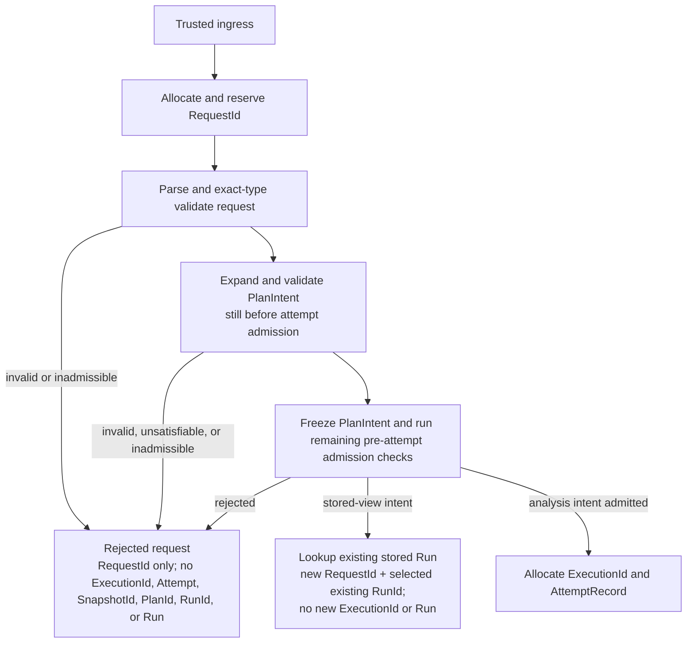
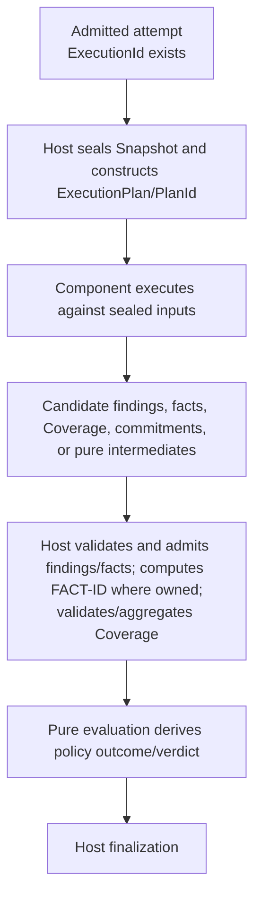
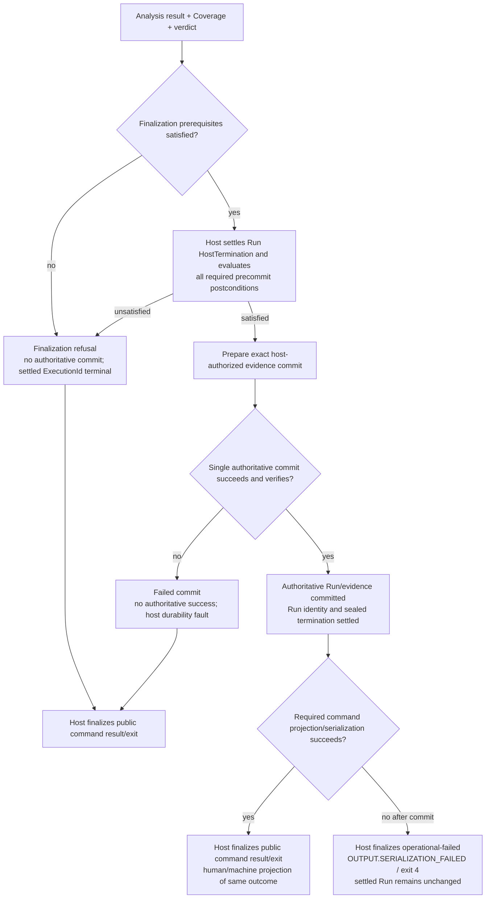

# Semantic Model and Host Authority

> **Status:** DRAFT — preserved structural V1 laws; identity/proof/replay recipes
> remain subject to exact V1 standing
> **Authority:** Resolve [V1 matrix rows](09-v1-to-v2-claim-matrix.md) before use.
> **Readiness:** [DR-002 through DR-009, DR-122, DR-123, DR-129, and DR-201](08-decision-and-readiness-register.md)

## What is preserved, and what is not settled

**Preserved V1 structural law.** The host owns Snapshot/Plan construction, fact
admission, Coverage validation, policy/verdict derivation, finalization, durable
authority, and D9 mapping. Components return candidates or pure intermediates.

**V1 unset/blocking.** Exact `RunId`, `EvidenceDigest`, sealed-Run identity,
finding fingerprint, `FactViewId`, subject-set/outcome commitments, and related
recipes are governed by freeze §7.1. `operability.v10` explicitly says no exact
RunId recipe is binding. `evidence.v10` is passed but not applied and EVIDENCE is
`UNSET — BLOCKS FREEZE`. V2 therefore states only structural constraints until
the owning V1 successors are applied.

## Lifecycle before admission

The first trusted host ingress allocates and reserves a host-owned `RequestId`
before parsing or validation. It is correlation metadata, not an analysis
identity.

Before analysis-attempt admission there is no `ExecutionId`, AttemptRecord,
`SnapshotId`, `PlanId`, new `RunId`, or Run. The frozen `PlanIntent` and its
commitment precede the attempt; substitution rejects. Every closed scalar is
validated by exact JSON type before any identity, reference, commitment, or
fingerprint derivation (freeze law 18).
Failure to allocate/reserve `RequestId` is an exceptional ingress failure before
a Request exists; it does not mint a partial Request or any later identity.

## Admitted analysis and host-only admission

After admission, the host captures the sealed Snapshot/read set, constructs the
ExecutionPlan and Plan identity under the effective C-2/resolved-input rules,
and invokes bounded producers.

Components never admit a finding or fact, mint authoritative `FACT-ID`, choose
Coverage sufficiency, set policy, seal a Run, or choose a public outcome. A
component crash or malformed result discards uncommitted candidates.

## Finalization branches and D9 ordering

Verdict is an analysis result axis. `HostTermination` is the host-finalized
operational/public outcome. They are not aliases: a policy failure is not a host
fault, a provider fault is not a finding, and durability failure cannot report
authoritative success (freeze law 14).

The ordering is exact: Run `HostTermination` and required precommit
postconditions settle before the finalization commit; command/public output
handling follows the commit. D9 v1.14 golden
`$.goldenCases[?id=="machine-output-serialization-failed"]` requires a post-commit
serialization/atomic-write failure to preserve the settled Run while the public
command ends `operational-failed` with `OUTPUT.SERIALIZATION_FAILED` and exit 4.
Components cannot select either the sealed termination or this host output
failure. Required output handling therefore precedes final public exit mapping;
the earlier diagram's D9-before-output ordering was incorrect.

The exact authoritative records, digest recipes, replay result, retention-loss
vocabulary, and retention-specific typed exit integration remain blocked by
DR-002, DR-006, DR-007, and DR-008. The diagram asserts ordering and authority,
plus the settled D9 output golden; it does not invent those missing schemas or
recipes.

## Output projections, including SARIF

**Preserved V1 output-surface contract.** Output surfaces are host-owned
projections over the same canonical result; they do not participate in analysis,
policy, evidence authority, finalization, or D9. For applicable findings/results,
SARIF 2.1.0 remains an optional projection. This does not require every command
to offer SARIF, and SARIF is not OpenSIP's native result or evidence format.

When a command or installed reporting capability advertises SARIF, its serialized
projection preserves the canonical Run and Finding IDs, Coverage, verdict,
truncation state, and artifact references. It uses SARIF-native typed fields where
available and a stable namespaced property contract otherwise. A consumer may
hide extension properties in its display, but that does not permit the serialized
artifact to discard them. Human, JSON, SARIF, and other applicable projections
must describe the same result; rendering success or failure cannot rewrite a
committed Run or change policy, evidence, or its sealed `HostTermination`.
A renderer never chooses public termination or exit; if a required host
serialization/atomic-write operation fails, the host applies the exact D9 output
fault and exit-4 golden described above.

**V2 readiness extension.** DR-122 and DR-G17 require the V1 projection contract
to be carried into the component architecture through a stable host-owned machine
surface, explicit command/capability applicability, schema/version behavior, and
parity/loss conformance goldens. This is readiness evidence for the V2 packaging
and host boundary, not a new semantic authority or a universal SARIF command
requirement.

The baseline UX is a standard command-oriented CLI with stable human-readable
and machine-readable projections that work non-interactively in CI. A future TUI
may be an optional host-owned projection for progress, exploration, and guided
remediation. It cannot be required for core commands, package or replace the CLI,
change semantic results/evidence/D9/exits, or remove non-interactive output.
Concrete TUI framework choices remain implementation design under DR-129; its
offline/core-footprint and doctor effects remain subject to DR-G01–G05 and
DR-G12.

## Closed structural responsibility boundary

| Surface | Host/core must own | Component may return | Component must never do | V1 standing note |
|---|---|---|---|---|
| Request/admission | RequestId allocation, exact-type validation, PlanIntent freeze, admission | declared requirements | allocate RequestId/ExecutionId or bypass admission | operability/C-2 candidate heads; exact pins in matrix |
| Snapshot / Plan | sealed read set, Snapshot and ExecutionPlan/PlanId construction | capability negotiation input | read live worktree, widen scope, mint/replace identity | Snapshot/Plan recipes only where exact applied owners map them |
| Findings / facts | candidate validation and host-only admission; authoritative identity | candidates and provenance | admit findings/facts or mint authoritative FACT-ID | fact-plane and fact-identity candidate standings apply |
| Coverage | requested domain, response validation, exact aggregation/sufficiency | candidate domain result | narrow/widen domain or convert unknown to covered | Coverage laws preserved |
| Policy / verdict | pure policy outcome and verdict | findings/scores/intermediates | set thresholds, waivers, verdict, or gate | verdict remains distinct from HostTermination |
| Finalization / D9 | prerequisite check, commit authorization, HostTermination and numeric exit | typed faults/cancellation detail | select public success/error/exit | D9 gaps in DR-007 remain |
| Run / evidence | sole structural seal and commit authority; historical custody | candidate artifacts and mechanical commitments | independently seal/commit, accept peer writer, claim adequacy | exact identities/recipes blocked by §7.1/EVIDENCE |

The boundary is closed for the distribution transition. A process or library
split cannot transfer authority.

## Determinism and semantic inputs

Trusted-code status is not a determinism exception. Components consume only the
host-sealed read set. Ambient `PATH`, loader search, live worktree, unclassified
environment, system runtimes, clock, entropy, and network cannot substitute an
input unless the exact V1 neutralize/key/forbid contract admits it.

The host—not a component—classifies configuration and maps semantic inputs into
existing Plan semantics. Selected component bytes/protocol/toolchain, effective
analysis configuration, sealed inputs, budgets, and grants enter identity only
where the exact applied contract says so. Available catalog rows, UI metadata,
refresh time, unselected components, and telemetry remain operational
provenance. V2 adds no Session or alternate Plan recipe.

Freeze law 3 also remains exact: there is no global ranking of fact kinds,
language layers, or producers. Sufficiency is requirement/profile-specific and
Coverage-aware. A syntactic result is not a generally valid “weaker” fallback
for a required semantic result; missing the required rung remains unavailable or
indeterminate under the owning vocabulary rather than silently degrading.

## Local-first and historical identity

The first useful project interaction remains no-write; tracked adoption is
explicit and identity-preserving. An upgrade never rewrites historical
identities or evidence. Replay/verification/inspection must use the retained
recorded closure or return the future contract-approved typed result. That result
and its exit are open under DR-113; V2 does not invent them.
