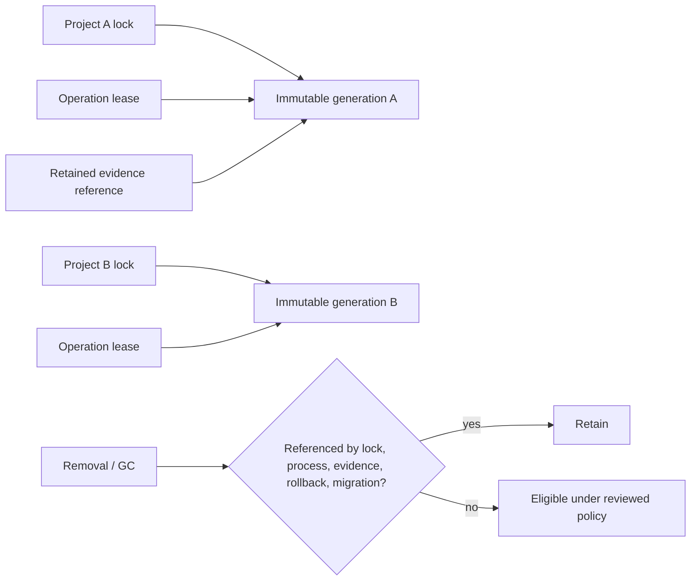

# Lifecycle, Delivery, and Operations

> **Status:** DRAFT — proposed V2 architecture constrained by unresolved V1
> evidence/retention/D9 conditions
> **Authority:** The CD-RT-5 product posture is binding; mechanics and typed
> outcomes require applied successors.
> **Readiness:** [DR-002 through DR-012, DR-106 through DR-115, DR-124/126/127, release gates](08-decision-and-readiness-register.md)

## Retention product posture: decided, not open

`product-dispositions.v1#$.decisions["CD-RT-5"]` is the binding product decision:

- retention is bounded independently by configurable **time, size, and count**;
  disabling one bound cannot disable another;
- a bound firing enters the existing **PURGED** state as degradation, not silent
  deletion;
- the record remains addressable, retains `recordCasRef`, and keeps a tombstone;
- entry into PURGED requires a reason: aged out, size pressure, count pressure,
  or user request;
- default posture is `DURABLE_RETAINED` with
  `implicitDurableRetention: YES`; and
- with no project policy, retention is durable and unbounded and a
  durable-authoritative request **proceeds and writes**.

V2 must not reopen or choose this default. The product decision does not supply
Phase-1A, apply a retention artifact, or add a D9 code. In particular, its own
correction says the reason requirement does **not** close retention-loss D9
residual `RT23-B-RES-01`.

Retention lineage, restated at the applied head: v24 passed review but was
never applied; v25 attempted the decided posture and was rejected at four
blockers; **v28 implements the decided CD-RT-5 posture and is APPLIED
(2026-08-12)**, closing the posture half. Replay, verification, inspection,
purge, degradation, and their typed result/exit remain open pending the
accepted evidence/retention + D9 successor — the integration half. DR-008
(PARTIALLY SATISFIED) and DR-113 own that closure.

## Authoritative storage is mandatory for authoritative analysis closures

Persistence mechanics are mandatory wherever an analysis closure claims
authoritative results. An install whose analysis surfaces are declared
non-authoritative — the management-only core install, or a slice whose
recorded scope disposition defers authoritative closure (see the central
register's first-slice dispositions) — defers storage mechanics by that
recorded disposition, never silently. Every supported authoritative offline
analysis closure includes either:

1. a mandatory verified storage-mechanics component; or
2. a minimal backend inside the signed distribution-core closure and TCB
   inventory.

The semantic host remains sole authority. Storage performs transaction/CAS/
ledger mechanics behind one host-owned commit protocol. Missing, incompatible,
unverified, unavailable, failed, or ambiguously recovered storage produces typed
non-success and cannot silently downgrade durable-authoritative work.

The closure must expose host-owned evidence inventory, custody, recovery, and
doctor surfaces. Exact records and outcomes await DR-002–008; architecture does
not invent them.

## Immutable multi-version generations

V2 architecture requires, rather than defers, these properties:

- installs are immutable and content-addressed/versioned; activation never
  mutates verified bytes in place;
- project locks select exact signed index snapshot, component/artifact closure,
  platform alternative, subprotocol/state formats, and policy constraints;
- each operation pins the project-selected generation for its entire lifetime;
- different projects may concurrently select conflicting component versions;
- active processes hold generation leases/refcounts and open references needed
  for safe completion/recovery;
- remove and GC cannot delete bytes/state referenced by locks, active processes,
  retained evidence, rollback slots, or prepared migrations;
- activation atomically publishes the dependency, permission/confinement,
  executable, schema, state, and migration closure; observers see old or new,
  never a mixture; and
- trust roots, revocation observations, expiry floors, and anti-rollback counters
  are separate monotonic state and never roll back with executable pointers.

The concrete lock/journal/lease mechanism is open, but a successor that cannot
prove every property fails DR-107.

## Crash safety, migration, and repair

Every lifecycle operation is journaled and lease-scoped. Publication requires
durable staged files/directories/journal, same-filesystem atomic rename or a
reviewed equivalent, and recovery at each write/fsync/rename/pointer transition.
After a crash, ambiguous bytes or state fail closed and quarantine; recovery may
resume or restore only an exact verified generation permitted by current trust.

Migrations use `prepare → commit | abort`:

- prepare builds and verifies complete target state without changing authority;
- commit atomically publishes the new generation/schema after required readers
  and custody are available;
- abort leaves old authoritative state intact and inventories/cleans target;
- each migration declares backward-read support, write format, rollback window,
  and any no-return boundary; and
- repair media is signed and checked against current roots/revocation/expiry;
  repair never rolls security state backward.

The named DR-G18 lifecycle-generation harness injects faults at every journal
write/fsync/rename/pointer transition and every migration
`prepare/commit/abort/no-return` boundary. It covers atomic activation/rollback,
complete dependency/state/permission closure, conflicting project locks,
leases/refcounts, process death, reference-safe removal, and retained-evidence
reachability. Clean-machine and revocation-aware repair remain joined through
DR-G06, DR-G08, and DR-G11.

## Retained replay references and safe removal

Retained evidence records the exact executable/artifact, protocol, schema,
configuration-provenance, and grant references required by the future accepted
contract. Promised replay/verification/inspection pins those bytes and readers.
Removal deactivates but retains user data and referenced closure. GC computes
reachability from:

- project/operation locks and active generation leases;
- retained authoritative evidence and custody records;
- active/provisional generations and rollback slots;
- prepared migrations and repair state; and
- binding retention policy/tombstones.

If the future V1 successor permits degradation, only its exact typed transition,
result, and exit may be used. V2 does not invent a loss code or claim that an
absent executable remains reproducible.

## Exact-byte delivery

The verified artifact is the executed artifact. A reviewed successor must bind:

- private restrictive staging and safe archive extraction;
- no traversal/absolute/device/FIFO/socket hazards and explicit symlink,
  hard-link, sparse, case-folding, and Unicode rules;
- canonical manifest/index/lock serialization with duplicate/unknown/type/path
  rejection;
- signed full-tree path/type/mode/length/digest closure;
- entrypoint and runtime-library resolution inside that tree;
- no `PATH`, loader, shell, live-project, system-runtime, or install-time
  substitution; and
- descriptor/identity/open-handle or digest recheck that binds verification to
  spawn.

DR-G07 must cover hostile extraction, case/Unicode/link aliases, loader and
entrypoint replacement, directory/inode swaps, concurrent update/remove, and
TOCTOU across supported platforms/filesystems.

The signed closure also declares the platform base/host-ABI TCB. A closed
allowlist and identity/version rule covers every permitted OS ABI, loader, libc,
framework, certificate store, font, ICU, and comparable system-class dependency.
Loader traces are retained at qualification. Undeclared library/framework/tool
resolution, alternate loader search, or identity drift refuses; hostile clean
machines prove no ambient system dependency can enter silently.

## Separate compatibility matrices

There is no shared `N/N-1/N-2` promise and no common version number. DR-111 must
set a separate read/write/migration/refusal matrix for each surface:

- distribution core and core state;
- signed root/index/manifest/lock schemas;
- common control protocol;
- TypeScript provider protocol major 1;
- Rust merged provider protocol major 2;
- each other component role API/subprotocol;
- component-owned state schema; and
- evidence/custody/replay formats.

Each matrix declares current writer, supported readers, migrations/bridges,
future-major refusal, downgrade/no-return, and test evidence. A bundle selects
compatible independent releases; it cannot force same-version coupling.

Resolution is deterministic over the exact signed snapshot, lock constraints,
platform, requested profile, capabilities, compatibility matrices, pins/holds,
and policy. Candidate ordering and tie-breaks are canonical; cycles/conflicts
refuse. The concrete solver/lock encoding remains DR-103/107.

Anti-lockstep acceptance explicitly tests component N+1 with an unchanged
supported core, core N+1 with unchanged supported components, independent core
and component rollback, concurrent declared generations with incompatible
private dependencies, and bundle selection that does not become a hidden
promotion gate. An aggregate convenience bundle may qualify a selection; it
cannot be the only route by which independently compatible releases work.

## State classes and authority

| State class | Owner / sole writer | Plan/Run consequence | Custody, purge, migration, and test rule |
|---|---|---|---|
| Authoritative evidence | Semantic host through host-owned commit; storage is mechanics | Sealed Run/evidence only through accepted recipes | Durable custody, backup/restore disclosure, retention/tombstone/purge authority, atomic migration and recovery; no component writer |
| Analysis-affecting durable state | Owning host semantic surface under strict config/lock | Enters Plan/Run identity only where the applied contract requires | Versioned/migrated under host authority; mutation and rollback cannot rewrite history |
| Rebuildable cache/index | Declared host or component mechanic under a host namespace | Never changes semantic result; a cache hit equals recomputation | May be discarded/rebuilt; provenance and corruption tests prove no authority or hidden input |
| Operational metadata | Core lifecycle/audit/doctor owner | Excluded from Plan/Run unless an applied owner explicitly promotes a field | Journaled/redacted/bounded; backup/purge scope disclosed; never a peer evidence writer |

Every component manifest declares its state class, owner, writer, schema,
migration, retention, backup, purge, and recovery contract. Cross-class writes,
cache-to-authority promotion, undeclared Plan inputs, and component evidence
commits are negative tests under DR-124 and DR-G19.

## Offline update, trust, and repair

No-network clean-machine use is a first-class test. Air-gap/removable-media input
must carry the root chain, signed index snapshot, last-known revocation state,
expiry information, manifests, payloads, permissions, and repair material. The
policy must define expired metadata, stale last-known revocation, clock limits,
quorum loss, newly revoked running/replay components, and core/index/component/
repair trust separately.

No missing payload triggers download, refresh, or lock mutation. Expired or
future metadata cannot be partially understood. Current verified components may
continue only under the reviewed offline-running policy. DR-112 and DR-G06/G08
are hard blockers.

## Doctor

Doctor defaults to read-only, no component code, no network, and no mutation.
Core mode works without a project; project mode resolves strict config and lock
without admitting analysis. A reviewed contract must define stable machine
schema, D9/exit semantics, redaction, and named consent for component/customer
tool execution, probes, or egress. Every consented action reports scope,
endpoint/bytes where relevant, result, and residual limitation. DR-114 owns the
open contract.

## Purge

Purge is explicit, previewed, audited, journaled, idempotent, and
crash-recoverable. It names OpenSIP-controlled evidence, state, caches, and
closures and honestly excludes backups, filesystem snapshots, dumps, swap,
external/remote stores, and user copies. The settled PURGED product posture is
preserved; the exact transition, result, and exit wait for DR-008/113.

## Delivery gates and assurance

The only active gate inventory is the
[release gate registry](08-decision-and-readiness-register.md#release-gate-registry).
It maps claims to platforms, harnesses, evidence, owner, assurance stage,
threshold, and waiver expiry. `IMPLEMENTABLE`, `QUALIFIED`, and `DEMONSTRATED`
remain distinct. V2 architecture work demonstrates none of them, and current
product standing remains not release-qualified.
