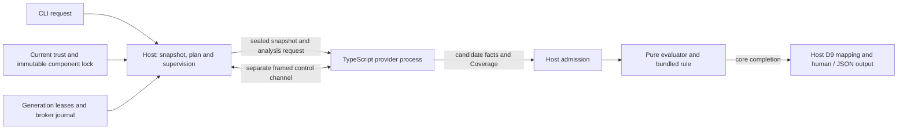

# Reference architecture and implementation handoff

Status: PROPOSED, frozen for independent review; acceptance and readiness remain
in architecture file 08. The application manifest pins the exact independently
accepted completion decisions. It is
an architecture document, not product implementation authorization.

## Product boundary

The agreed preview supplies `analyze`, read-only `doctor` with explicit consent
for active probes, and compile-time help/version. Human and JSON projections
share the existing semantic outcome and D9 termination rules. The useful install
includes the distribution core, semantic host, one selected TypeScript provider
closure, and the host-owned `opensip.preview.typescript.pack` version 1.

The pack detects project module import cycles from resolved semantic facts. The
pure core evaluates its threshold and returns policyOutcome. Missing required
Coverage is indeterminate. The provider emits facts and Coverage; the host owns
admission, rules, findings, policy and output. A provider cannot assign an exit,
HostTermination, finding or policy verdict.

Supported platforms remain macOS arm64/x86_64 and Linux arm64/x86_64. Core and
components release independently. There is no supported Windows or Rust analysis
role in this preview. The Rust substrate is retained for a later supported role.
SARIF, authoritative sealed Runs, baseline ratchets, third-party components,
credentials, marketplace/TUI and core self-update retain their existing scope
and re-entry dispositions. Preview output has no invented stable finding or Run
identity and promises no upgrade continuity to an authoritative product.

## Runtime boundaries

The diagram's sealed snapshot is the existing provider transaction boundary;
it does not assert that the preview creates an authoritative sealed Run.

The reference core and host share a Rust 2024 executable. The evaluator is a
pure library: data in, data out, with no I/O capabilities. TypeScript analysis
runs in an external independently versioned worker carrying its Node 24 and
TypeScript tool closure. Help/version print compile-time embedded release metadata
without opening project or component state, trust databases or inventory files.
State-using operations verify current trust and the exact executable closure on
opened files before admitting or launching a worker; read-only doctor reports
its observations without updating trust floors or reconciling journals.

Provider traffic is opaque to the common control transport and uses the existing
V1 TypeScript CBOR protocol. Control messages use their own framed JSON channel,
sequence and state machine. A fault triggers the defined supervision transition;
its diagnostic prose is opaque, redacted and never interpreted as semantics.
EOF, cancellation, drain and process death retain the owning protocol's ordered
termination rules. Candidate facts are admitted only after complete validated
transaction commitments, successful completion, zero exit and EOF.

Host-issued broker handles identify one prebound grant for one spawn. A child
can have several handles for its single selected operation; the host checks both
the broker permission and the underlying effect permission on every request.
Handles arrive through the declared structural environment, are consumed by the
SDK, and cannot be reused by another child. Journal locators stay host-internal.
The initial TypeScript profile has no broker handles. The separate effect-result
courier preserves the sealed-input boundary and never promotes a receipt into
provider authority.

The SDK exposes typed requests/responses from these existing schemas and the
limited `readProject`/`writeHostState` broker methods. It
owns serialization, backpressure and cancellation. Host validation is mandatory
even when the peer uses the SDK. There is no generic provider plugin API for
policy, findings, exits, admission or trust.

## Distribution and state

A strict manifest, signed release catalog, host-written admitted registry and
complete resolved lock bind exact component bytes. The catalog is publisher
authority; the per-project registry view is local custody. A lock pins both
separately and cannot make either trustworthy by carrying its digest. Release SemVer and each protocol/schema/state
major are separate. The lock records every resolution-affecting input, including
scope, project selection, declared profile/capabilities and pins/holds. The
reference solver backtracks deterministically and refuses incomplete, cyclic,
untrusted or incompatible closure; it never publishes a partial resolution.

Immutable generation directories are published on one filesystem. One host-owned
SQLite lifecycle database and lock coordinate generation selection. Monotonic
trust uses separate trust.sqlite; per-project grant journals use their own
carriers. The security contract supplies their ordered witness and recovery
protocol, with a nonblocking project-lease handoff under the lifecycle fence; no cross-database atomic commit is assumed. Files are verified and durably published
before one database transaction changes project selection. Existing operations
retain their leased generation. Recovery accepts an intact committed selection
under current trust, otherwise refuses or quarantines; it never guesses from a
directory name. Garbage collection requires every project, operation, migration
and rollback reference to release its root. Trust floors do not roll back with a
generation.

The packaging adapter consumes a pinned offline tool closure and emits the exact
archive profile, manifests and declarations on all four platforms. CI invokes
the same adapter and deterministic ownership selector. The committed ownership
record determines impact; YAML filters do not. A complete conflict selects the
full comparison universe, missing data refuses, and all shared lanes retain an
explicit result or scoped disposition. Component-only and core-only compatible
releases are required acceptance scenarios.

## Installation and configuration

The immutable core payload and mutable user state have separate owners. A macOS
package installs the core below `/Library/OpenSIP/core`; each account has its own
operational root under `~/Library/Application Support/OpenSIP/preview-v1`.
Linux uses `~/.local/state/opensip/preview-v1`. The home directory comes from the
OS account record, never an inherited environment variable. Operational state
is private to the account; a shared core grants no shared component or project
authority. Preview state and project roots require local APFS on macOS or ext4
on Linux with the specified stable file identity observations. Unsupported
project identity refuses explicitly; doctor reports it as undetermined.

Configuration is data only. Defaults, private global settings, tracked
`opensip.json`, interactive local `.opensip/local.json`, and explicit CLI flags
have a fixed precedence. CI never opens the local layer. Semantic environment
configuration is empty. Arrays replace as a whole; null and unknown members
refuse; source provenance is retained before canonical resolver projection.
Permission policies live only in private host-owned state. Repository settings
cannot grant permissions. The effective policy combines both private sources,
with denials winning and the project layer only narrowing global authority;
its exact digest binds selection, trust epochs and grants. Replacing policy
bytes invalidates the old binding even when a timestamp is unchanged.

## Doctor, compatibility and cache boundaries

Doctor core mode reads host metadata without opening a project. Project mode
reads strict configuration and the selected lock, preserving UNDETERMINED
checks if resolution fails. Neither loads provider code or analyzes source.
Both read-only modes retain the 60 MB steady/100 MB peak RSS budget; consented
probes have their own declared limits. Doctor report schema major1 is an
independent compatibility surface, with the same minimum90day-and-one-host-minor
retention rule as other supported major1 readers. Time passing does not itself
remove support.

No durable analysis-result cache is reused by the preview. Each analysis
recomputes native facts, Coverage and host evaluation. Download caches still
verify exact artifact bytes and current trust. State classes are SC-CACHE,
SC-OPS and SC-TRUST in preview, with SC-EVIDENCE and SC-ANALYSIS retained as
explicit future classes. Deferred positive operations have reviewed re-entry
triggers; current refusal and non-promotion tests remain required.

## Implementation sequence after authorization

1. Build metadata parsing, canonical signatures, immutable admission and the
   offline adapter. Exercise exact bytes, paths, identity collisions and
   incompatible closure before admitting any executable.
2. Implement the durable carriers and their ordered writer protocol, generation publication, leases,
   recovery, current-trust checks and grant transitions. Inject death around
   every actual durability boundary, not only the abstract phases in examples.
3. Implement supervision and the complete closed control state machine. Connect
   the opaque provider carrier and run retained hostile frames and event traces.
4. Connect the existing TypeScript protocol, host fact admission, pure cycle
   rule and human/JSON output. Execute native semantic corpus and authority
   refusal cases through actual product input paths.
5. Run all required qualification gates on each supported platform, including
   actual signed inventories, process failure containment, size/startup/resource budgets,
   performance baseline and independent-release scenarios.

This is the scoped D-036 successor for the preview's implementation partial
order: distribution/admission and durable selection precede connecting and
shipping the analyzer. Independent design/reference experiments may proceed
without pretending they are installed product paths. D-036's earlier draft
lanes remain history; its statement that scheduling authorizes no blueprint
stands. The five steps above add no new readiness row or second checklist.

These dependencies order implementation; they do not authorize it. A later
implementation plan should estimate and assign work against the accepted
contracts rather than reopen settled interfaces by default.

## Qualification and support

The qualification fleet preserves the four named D-102 classes: `macos-15`,
`macos-15-intel`, `ubuntu-24.04` and `ubuntu-24.04-arm`. Release profiles are
measured on their actual image; development profile examples cannot admit a
release. OS baseline observations are distinct from exact component-byte
verification and do not claim detection of a compromised kernel.

G13 measures the retained 1,000-module chain independently on each class:
p95 cold at most 10 seconds, p95 warm at most 5 seconds, peak RSS at most 1 GiB,
and at most 10% regression against the matching class and measurement environment.
Small cyclic projects separately exercise correctness. The linear benchmark
makes no worst-case large-cycle performance promise. Size, startup and doctor
resource gates retain their own thresholds and exact populations.

## Evidence interpretation

Retained parsers, reference models and compiler checks demonstrate consistency
of concrete design examples. They are useful executable specifications. They do
not assert a shipping implementation, four-platform confinement, power-loss
safety, performance or release qualification. Each of those remaining executions
has a named gate and owner in the final readiness record.

The completion manifest must pin every normative source, exact successor,
fixture set, checker, independent verdict, per-row disposition and register
edit. File 08 remains the sole readiness checklist; historical drafts and working
blocker files cannot override its accepted design links.
