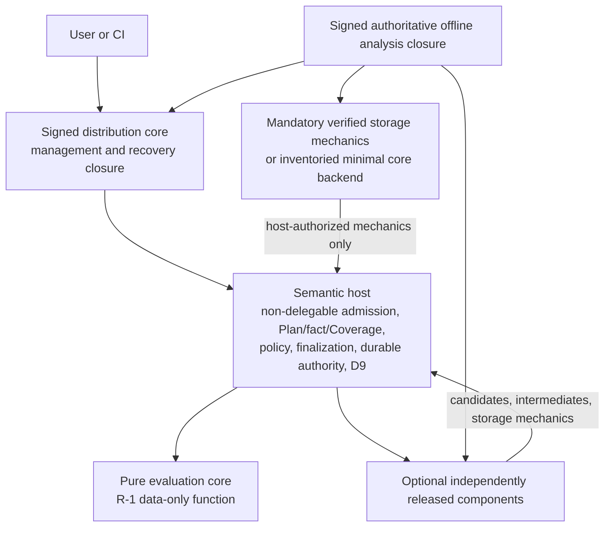

# OpenSIP V2 Architecture

> **Status:** DRAFT — active human-readable V2 working surface, non-binding
> **Authority:** Exact V1 sources under [`docs/coop`](../../coop/) remain authoritative.
> **Blueprint readiness:** **BLOCKED**; see the central register.

This directory explains the proposed OpenSIP V2 architecture without replacing
V1 status authority. It separates preserved structural laws, accepted-but-
unapplied material, inherited blockers, binding product decisions, and proposed
V2 changes.

## Start here

1. [Status and authority](00-status-and-authority.md) — exact resolution and
   stop-on-conflict rule.
2. [V1-to-V2 claim matrix](09-v1-to-v2-claim-matrix.md) — exact heads,
   derivations, digests, checker/claim/freeze/product standing, and V2 mapping.
3. [OpenSIP V2 Decision and Readiness Register](08-decision-and-readiness-register.md)
   — the **only active checklist** for inherited blockers, V2 decisions, review
   dispositions, release gates, owners, evidence, and blueprint impact.

The reproducible review inputs are
[`v1-authority-baseline.json`](v1-authority-baseline.json) and
[`v1-status-evidence.json`](v1-status-evidence.json). Prototype lessons use the
[clean pinned prototype reference](prototype-evidence-reference.md).

## Read by purpose

| Purpose | Document |
|---|---|
| Request/admission branches, host semantic authority, facts/Coverage/Plan/Run/evidence/D9 boundaries | [Semantic model and host authority](01-semantic-model-and-host-authority.md) |
| Distribution core, semantic host, pure evaluation core, components, provider protocol demarcation, product boundary | [Distribution and components](02-distribution-and-components.md) |
| CFG-9, six layers, provenance, secret scope, trust, permissions, confinement | [Configuration and security](03-configuration-and-security.md) |
| Retention posture, authoritative storage, generations, migration/recovery, exact bytes, compatibility, offline, doctor/purge | [Lifecycle, delivery, and operations](04-lifecycle-delivery-and-operations.md) |
| V1 relationship, migration constraints, and prototype lessons | [V1-to-V2 relationship](05-v1-to-v2-relationship.md) |
| Findings and correction disposition from the five independent reviews | [Review record](07-review-record.md) |
| MVP commitments, deferred directions, and rejected shapes | [MVP and future scope](10-mvp-and-future-scope.md) |

Topic documents link to register IDs for decisions and blockers. They do not
contain competing readiness checklists.

## Architecture at a glance

Core-only is management/recovery, not the supported authoritative analysis
product. The latter requires a signed offline closure with durable storage that
satisfies the binding retention posture and the still-missing V1 integration.

## Claim labels

- **Preserved V1 structural law** — exact status-resolved V1 source owns it.
- **Accepted but unapplied V1 material** — useful shape, not settled authority.
- **V1 unset/blocking** — hard prerequisite recorded in the central register.
- **Binding product decision** — settled product posture; integration may remain
  blocked.
- **Proposed V2 direction** — requires reviewed successor and disposition.
- **Open V2 decision** — lives only in the central register.

Normative words in proposed sections are future acceptance criteria, not applied
decisions.

## Stable terms

| Term | Meaning |
|---|---|
| Signed distribution core | Proposed small native executable plus mandatory runtime/data closure |
| Semantic host | Non-delegable host authority; may initially share the distribution-core process |
| Pure evaluation core | R-1 deterministic data-only evaluation function, not the distribution package |
| Component | Optional independently versioned role implementation admitted through the common architecture |
| Authoritative offline analysis closure | Signed exact core+component+storage selection that supports offline authoritative work |
| Management-only core | Core distribution without analysis/storage capability claims |
| System generation | Proposed immutable lock-selected dependency/permission/executable/schema/state closure |
| Snapshot / Plan / Fact / Coverage / Run | Existing V1 concepts; exact identity standing comes from the claim matrix |
| Trust | Publisher, bytes, channel, authorization, permissions, confinement, and evidence authority as separate dimensions |

## Directory boundary

This directory contains architecture and review state only. It does not select
code layout, concrete wire/storage schemas, algorithms, or rollout tasks.
`docs/v2/implementation/` remains reserved and absent until the central register
explicitly reaches blueprint-ready and product/architecture authorities approve.
